# GRPO训练框架

<cite>
**本文档中引用的文件**
- [mlx-grpo.py](file://mlx-grpo.py)
- [README.md](file://README.md)
- [configs/nanochat_grpo.toml](file://configs/nanochat_grpo.toml)
- [configs/prod.toml](file://configs/prod.toml)
- [configs/smoke_test.toml](file://configs/smoke_test.toml)
- [utils/README.md](file://utils/README.md)
- [utils/convert_model.py](file://utils/convert_model.py)
- [utils/inference.py](file://utils/inference.py)
</cite>

## 目录
1. [简介](#简介)
2. [项目结构](#项目结构)
3. [核心组件](#核心组件)
4. [架构概览](#架构概览)
5. [MLXGRPOTrainer类详细分析](#mlxgrpotrainer类详细分析)
6. [数据流分析](#数据流分析)
7. [奖励函数系统](#奖励函数系统)
8. [模型加载与分词器支持](#模型加载与分词器支持)
9. [配置管理系统](#配置管理系统)
10. [性能考虑](#性能考虑)
11. [故障排除指南](#故障排除指南)
12. [结论](#结论)

## 简介

MLX-GRPO是一个基于Apple MLX框架的大型语言模型训练框架，专门实现了基于组的相对策略优化（Group-based Relative Policy Optimization，GRPO）算法。该框架完全运行在Apple Silicon上，利用Metal后端实现高效的GPU加速训练。

### 主要特性

- **纯MLX集成**：仅使用Apple的MLX框架，无需CUDA支持
- **GRPO训练管道**：实现多种奖励函数（正确性、格式检查、XML计数等）优化思维链响应
- **通用模型支持**：通过内置转换工具支持任何Hugging Face模型
- **数据集预处理**：使用GSM8K数据集测试多步推理能力
- **现代Python打包**：通过`pyproject.toml`管理依赖关系
- **推理工具**：提供生成、聊天和流式模式的测试功能

## 项目结构

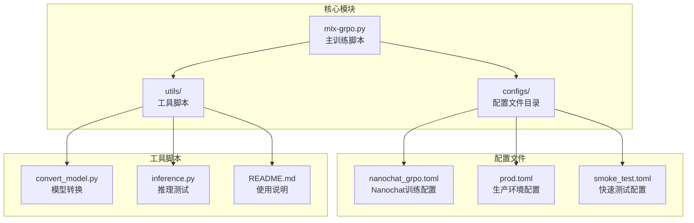

**图表来源**
- [mlx-grpo.py](file://mlx-grpo.py#L1-L50)
- [configs/nanochat_grpo.toml](file://configs/nanochat_grpo.toml#L1-L45)
- [utils/convert_model.py](file://utils/convert_model.py#L1-L30)

**章节来源**
- [README.md](file://README.md#L1-L180)
- [mlx-grpo.py](file://mlx-grpo.py#L1-L100)

## 核心组件

### 数据集准备与格式化

框架使用GSM8K数学问题数据集进行训练，采用特定的提示格式：

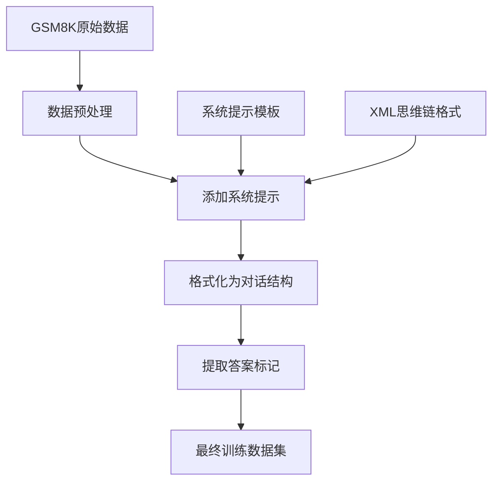

**图表来源**
- [mlx-grpo.py](file://mlx-grpo.py#L25-L50)
- [mlx-grpo.py](file://mlx-grpo.py#L52-L80)

### 奖励函数系统

框架实现了多个奖励函数来评估生成的回答质量：

| 奖励函数 | 功能描述 | 应用场景 |
|----------|----------|----------|
| correctness_reward_func | 检查回答的数值正确性 | 数学推理任务 |
| xmlcount_reward_func | 评估XML标签完整性 | 思维链格式验证 |
| soft_format_reward_func | 软格式检查 | 结构化输出验证 |
| int_reward_func | 整数格式验证 | 数值输出格式 |

**章节来源**
- [mlx-grpo.py](file://mlx-grpo.py#L85-L150)

## 架构概览

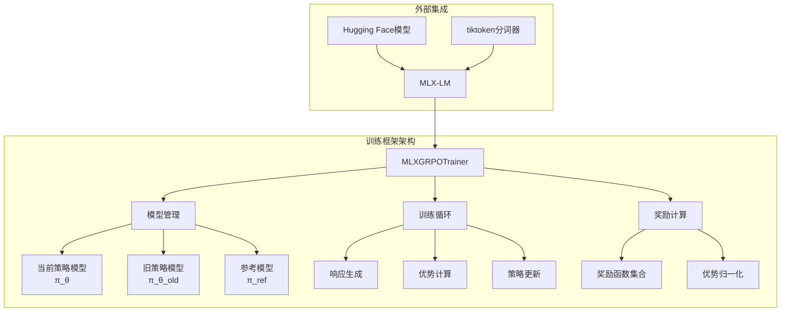

**图表来源**
- [mlx-grpo.py](file://mlx-grpo.py#L300-L400)
- [mlx-grpo.py](file://mlx-grpo.py#L1100-L1200)

## MLXGRPOTrainer类详细分析

### 类初始化与模型管理

`MLXGRPOTrainer`类是整个训练框架的核心，负责管理三个关键模型实例：

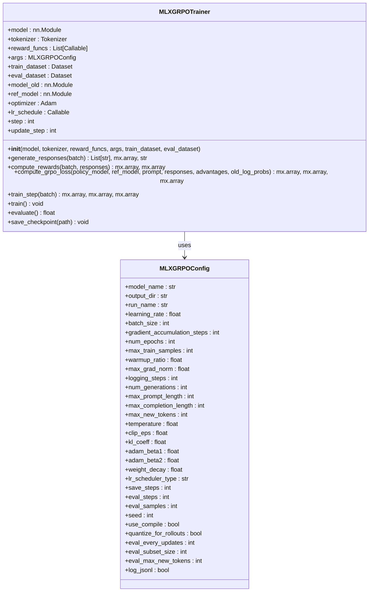

**图表来源**
- [mlx-grpo.py](file://mlx-grpo.py#L300-L450)
- [mlx-grpo.py](file://mlx-grpo.py#L250-L300)

### 关键模型实例管理

训练器维护三个相互关联的模型：

1. **当前策略模型（π_θ）**：可训练的政策网络
2. **旧策略模型（π_θ_old）**：用于生成rollout的冻结政策
3. **参考模型（π_ref）**：原始预训练模型，永不更新

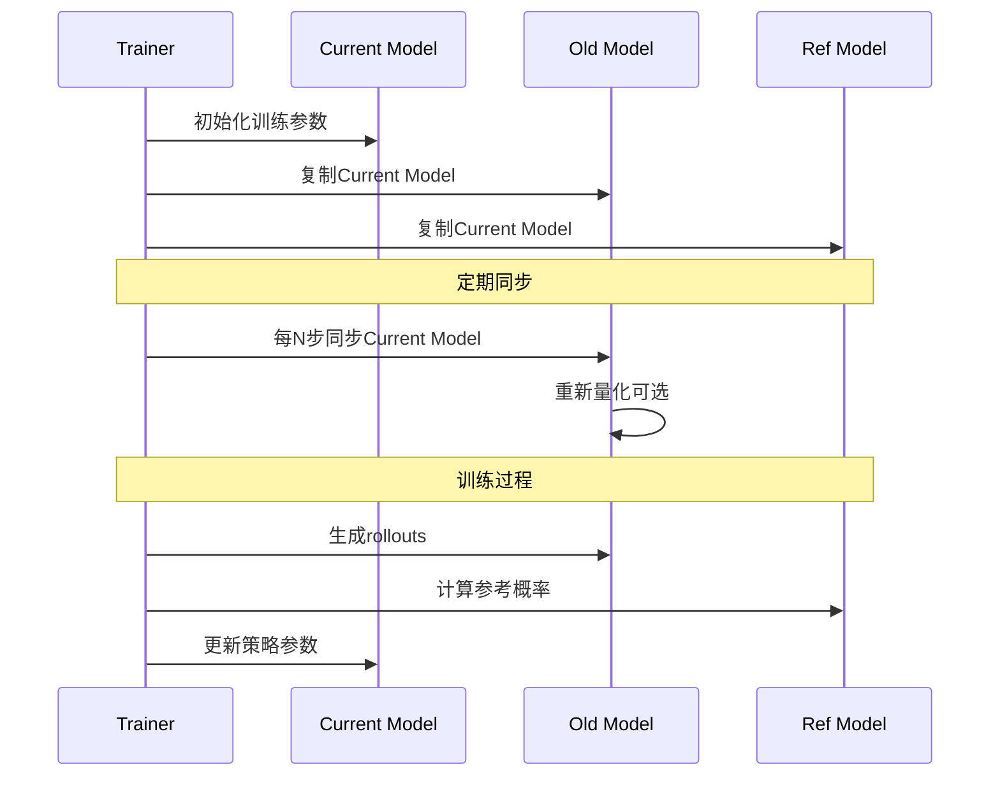

**图表来源**
- [mlx-grpo.py](file://mlx-grpo.py#L350-L400)
- [mlx-grpo.py](file://mlx-grpo.py#L1150-L1200)

### GRPO训练循环详解

训练循环遵循GRPO算法的核心步骤：

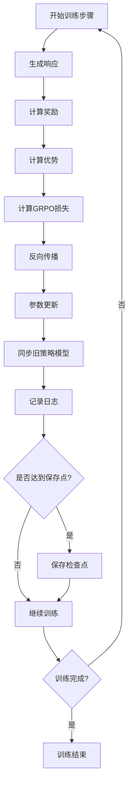

**图表来源**
- [mlx-grpo.py](file://mlx-grpo.py#L900-L1000)
- [mlx-grpo.py](file://mlx-grpo.py#L1200-L1247)

**章节来源**
- [mlx-grpo.py](file://mlx-grpo.py#L300-L500)
- [mlx-grpo.py](file://mlx-grpo.py#L900-L1247)

## 数据流分析

### 用户输入到检查点保存的完整路径

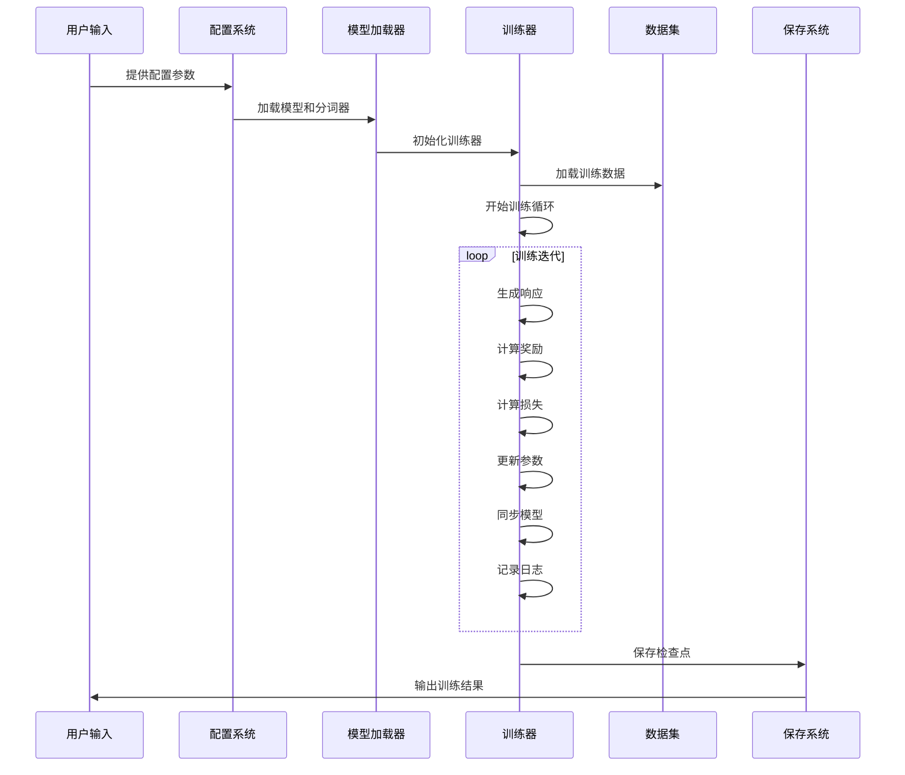

**图表来源**
- [mlx-grpo.py](file://mlx-grpo.py#L1100-L1247)
- [utils/convert_model.py](file://utils/convert_model.py#L100-L200)

### 提示格式化流程

提示格式化是训练过程中的关键步骤：

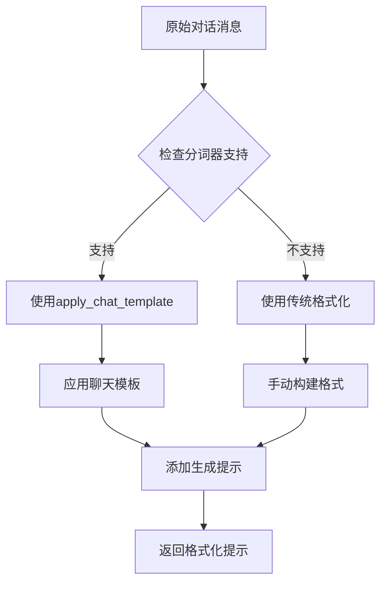

**图表来源**
- [mlx-grpo.py](file://mlx-grpo.py#L400-L450)

**章节来源**
- [mlx-grpo.py](file://mlx-grpo.py#L400-L500)
- [mlx-grpo.py](file://mlx-grpo.py#L900-L1000)

## 奖励函数系统

### 奖励函数架构

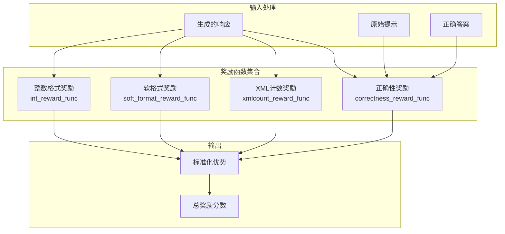

**图表来源**
- [mlx-grpo.py](file://mlx-grpo.py#L85-L150)
- [mlx-grpo.py](file://mlx-grpo.py#L600-L700)

### 奖励计算机制

每个奖励函数都经过精心设计以评估不同方面的生成质量：

| 函数类型 | 计算方式 | 正则表达式模式 | 权重 |
|----------|----------|----------------|------|
| 正确性奖励 | 数值匹配检查 | 无 | 最高 |
| XML计数奖励 | 标签存在性评分 | `<reasoning>.*?</reasoning>` 和 `<answer>.*?</answer>` | 中等 |
| 软格式奖励 | 基本格式检查 | `<reasoning>.*?</reasoning>\s*<answer>.*?</answer>` | 中等 |
| 整数奖励 | 数字格式验证 | 尝试转换为整数 | 较低 |

**章节来源**
- [mlx-grpo.py](file://mlx-grpo.py#L85-L150)
- [mlx-grpo.py](file://mlx-grpo.py#L600-L700)

## 模型加载与分词器支持

### Tiktoken分词器特殊支持

框架提供了对tiktoken分词器的特殊支持，这对于某些模型（如Nanochat）至关重要：

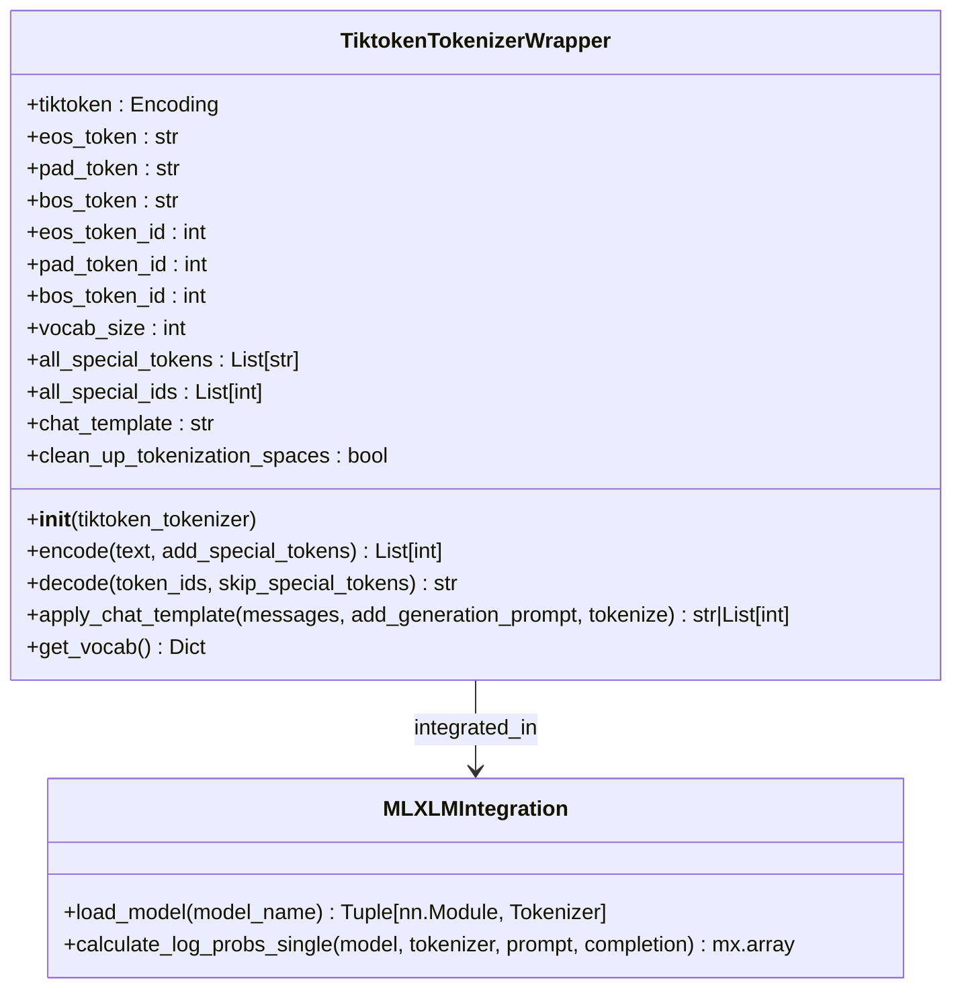

**图表来源**
- [mlx-grpo.py](file://mlx-grpo.py#L150-L250)

### 模型加载流程

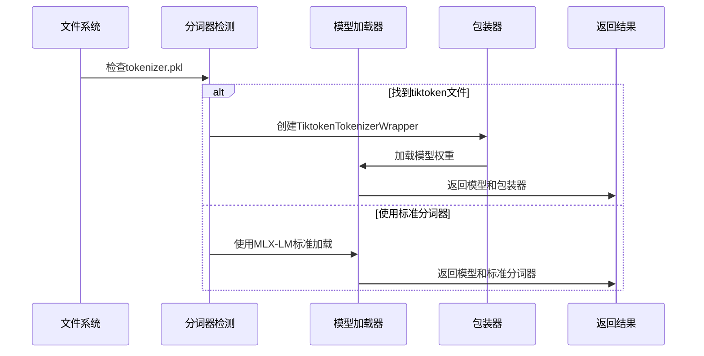

**图表来源**
- [mlx-grpo.py](file://mlx-grpo.py#L250-L350)

**章节来源**
- [mlx-grpo.py](file://mlx-grpo.py#L150-L350)
- [utils/convert_model.py](file://utils/convert_model.py#L100-L200)

## 配置管理系统

### 配置层次结构

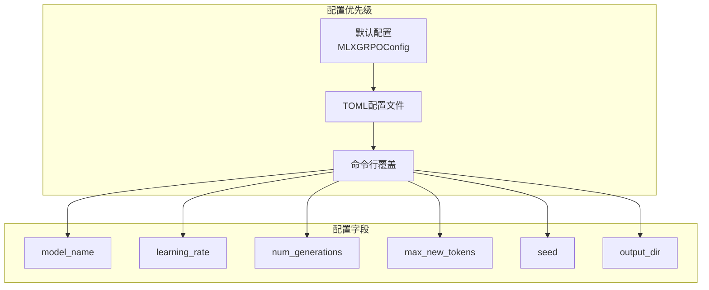

**图表来源**
- [mlx-grpo.py](file://mlx-grpo.py#L250-L300)
- [configs/prod.toml](file://configs/prod.toml#L1-L40)

### 种子参数的作用

`seed`参数在确保实验可复现性中起着关键作用：

```mermaid
flowchart TD
A[设置种子] --> B[mx.random.seed(seed)]
A --> C[random.seed(seed)]
B --> D[确保MLX操作可复现]
C --> E[确保Python随机操作可复现]
D --> F[生成相同的响应序列]
E --> F
F --> G[实验结果可复现]
```

**图表来源**
- [mlx-grpo.py](file://mlx-grpo.py#L1200-L1247)

**章节来源**
- [mlx-grpo.py](file://mlx-grpo.py#L250-L350)
- [configs/nanochat_grpo.toml](file://configs/nanochat_grpo.toml#L40-L45)

## 性能考虑

### 内存优化策略

1. **量化支持**：可选的4位量化用于rollout模型
2. **梯度累积**：减少内存峰值使用
3. **编译优化**：可选的`mx.compile`加速

### 计算效率优化

1. **批量生成**：尝试批量生成多个响应
2. **异步处理**：非阻塞的日志记录
3. **增量保存**：定期保存检查点避免数据丢失

## 故障排除指南

### 常见问题与解决方案

| 问题类型 | 症状 | 可能原因 | 解决方案 |
|----------|------|----------|----------|
| 模型加载失败 | FileNotFoundError | 模型路径错误或格式不兼容 | 检查模型路径，使用convert_model.py转换 |
| 内存不足 | OOM错误 | 模型过大或批处理设置过高 | 减少batch_size或启用量化 |
| 训练不稳定 | 损失震荡 | 学习率过高或梯度裁剪不当 | 降低学习率或调整max_grad_norm |
| 分词器问题 | 编码解码错误 | 分词器不兼容 | 使用trust_remote_code标志或转换模型 |

### 调试建议

1. **启用详细日志**：设置`verbose=True`查看详细输出
2. **简化配置**：使用smoke_test.toml快速验证
3. **检查硬件**：确保macOS版本和GPU内存足够
4. **验证模型**：使用inference.py测试模型加载

**章节来源**
- [utils/README.md](file://utils/README.md#L400-L531)
- [mlx-grpo.py](file://mlx-grpo.py#L1200-L1247)

## 结论

MLX-GRPO训练框架为研究人员提供了一个强大而灵活的平台，专门针对Apple Silicon进行了优化。通过其独特的三模型架构、全面的奖励函数系统和易于使用的配置管理，该框架使得在本地Apple设备上进行大规模语言模型训练成为可能。

### 主要优势

1. **硬件优化**：充分利用Apple Silicon的GPU加速能力
2. **算法完整性**：完整实现了GRPO算法的所有关键组件
3. **易用性**：提供丰富的工具和详细的文档
4. **可扩展性**：支持自定义奖励函数和配置选项

### 未来发展方向

- 支持更多类型的视觉-语言模型
- 实现分布式训练能力
- 添加更多的奖励函数类型
- 优化内存使用和训练速度

该框架为研究人员提供了一个坚实的基础，可以在此基础上进行算法改进和实验设计，推动大语言模型训练技术的发展。