# GRPO训练流程详细文档

<cite>
**本文档中引用的文件**
- [mlx-grpo.py](file://mlx-grpo.py)
- [configs/nanochat_grpo.toml](file://configs/nanochat_grpo.toml)
- [configs/smoke_test.toml](file://configs/smoke_test.toml)
- [configs/prod.toml](file://configs/prod.toml)
- [README.md](file://README.md)
</cite>

## 目录
1. [简介](#简介)
2. [项目结构概览](#项目结构概览)
3. [核心组件分析](#核心组件分析)
4. [训练架构总览](#训练架构总览)
5. [详细组件分析](#详细组件分析)
6. [训练循环实现机制](#训练循环实现机制)
7. [梯度累积与优化器更新](#梯度累积与优化器更新)
8. [学习率调度机制](#学习率调度机制)
9. [日志记录与监控](#日志记录与监控)
10. [性能考虑](#性能考虑)
11. [故障排除指南](#故障排除指南)
12. [结论](#结论)

## 简介

MLX-GRPO是一个基于Apple MLX框架的Group-based Relative Policy Optimization训练框架，专为在Apple Silicon上运行大型语言模型而设计。该框架实现了纯MLX环境下的GRPO算法，无需CUDA支持，通过链式思维提示结构优化模型性能。

本文档深入分析了`MLXGRPOTrainer`类中的训练循环实现机制，详细阐述了从数据加载、提示格式化、响应生成到奖励计算和策略更新的完整流程，为研究人员提供了技术深度和实践指导。

## 项目结构概览

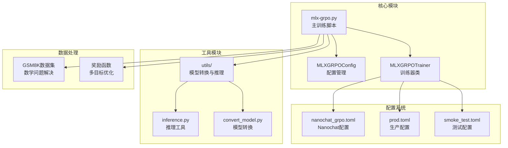

**图表来源**
- [mlx-grpo.py](file://mlx-grpo.py#L1-L50)
- [configs/nanochat_grpo.toml](file://configs/nanochat_grpo.toml#L1-L45)

**章节来源**
- [README.md](file://README.md#L1-L50)
- [mlx-grpo.py](file://mlx-grpo.py#L1-L100)

## 核心组件分析

### MLXGRPOConfig配置类

`MLXGRPOConfig`是整个训练系统的配置中心，定义了所有训练参数和超参数：

| 参数类别 | 关键参数 | 默认值 | 说明 |
|---------|---------|--------|------|
| 模型参数 | model_name | "Qwen/Qwen2.5-1.5B-Instruct" | 基础模型名称 |
| 训练参数 | learning_rate | 1e-6 | 初始学习率 |
| 训练参数 | batch_size | 1 | 批次大小 |
| 训练参数 | gradient_accumulation_steps | 4 | 梯度累积步数 |
| 训练参数 | num_epochs | 1 | 训练轮数 |
| 采样参数 | num_generations | 64 | 每个提示生成的响应数量 |
| 采样参数 | max_new_tokens | 512 | 最大新令牌数 |
| 采样参数 | temperature | 0.7 | 采样温度 |
| 优化参数 | clip_eps | 0.2 | PPO裁剪参数 |
| 优化参数 | kl_coeff | 0.0 | KL散度系数 |
| 调度参数 | warmup_ratio | 0.1 | 预热比例 |

### MLXGRPOTrainer训练器类

`MLXGRPOTrainer`是训练流程的核心控制器，负责协调各个组件的工作：

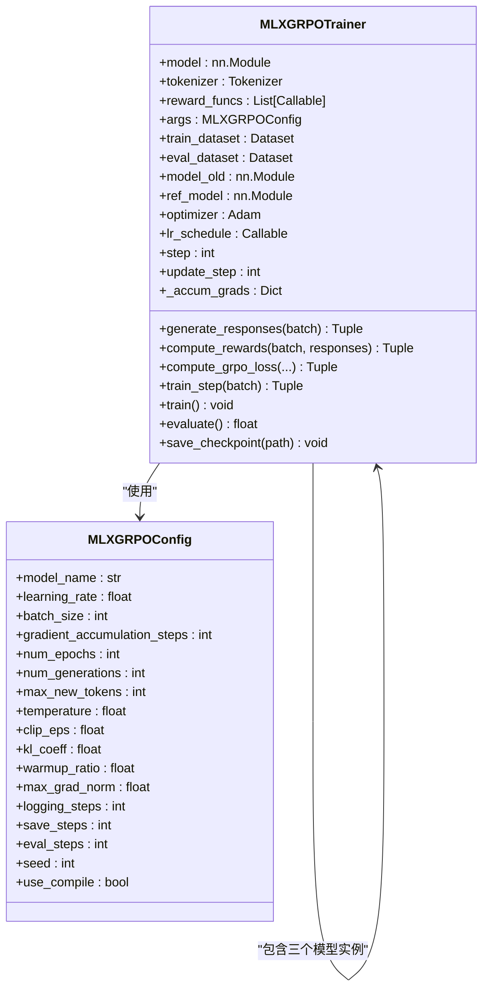

**图表来源**
- [mlx-grpo.py](file://mlx-grpo.py#L320-L450)
- [mlx-grpo.py](file://mlx-grpo.py#L450-L500)

**章节来源**
- [mlx-grpo.py](file://mlx-grpo.py#L320-L500)

## 训练架构总览

GRPO训练采用三模型架构，每个模型在训练过程中承担不同角色：

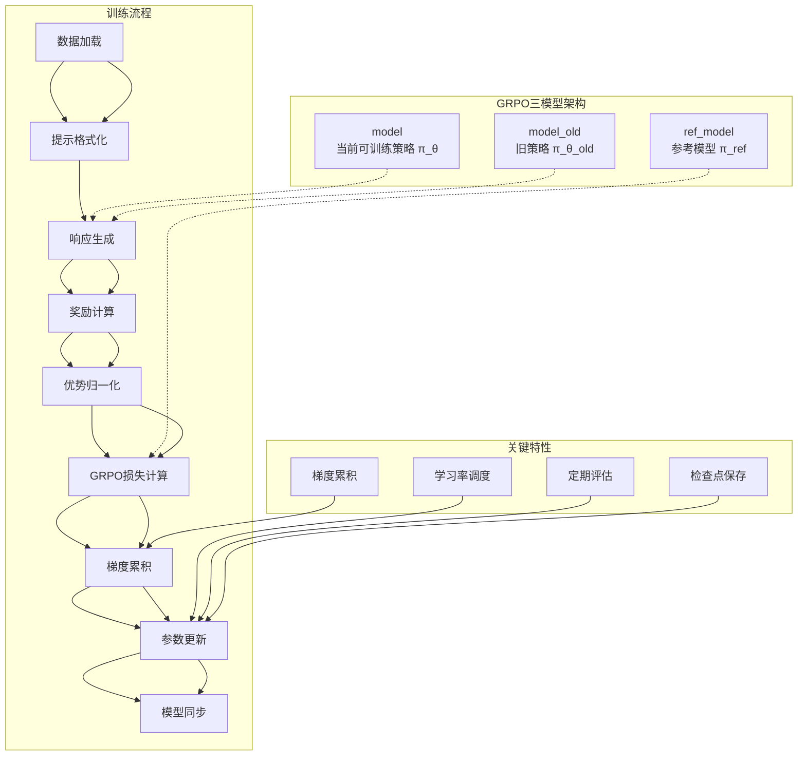

**图表来源**
- [mlx-grpo.py](file://mlx-grpo.py#L450-L500)
- [mlx-grpo.py](file://mlx-grpo.py#L933-L1090)

## 详细组件分析

### 数据加载与预处理

训练数据来源于GSM8K数学问题数据集，经过专门的格式化处理：

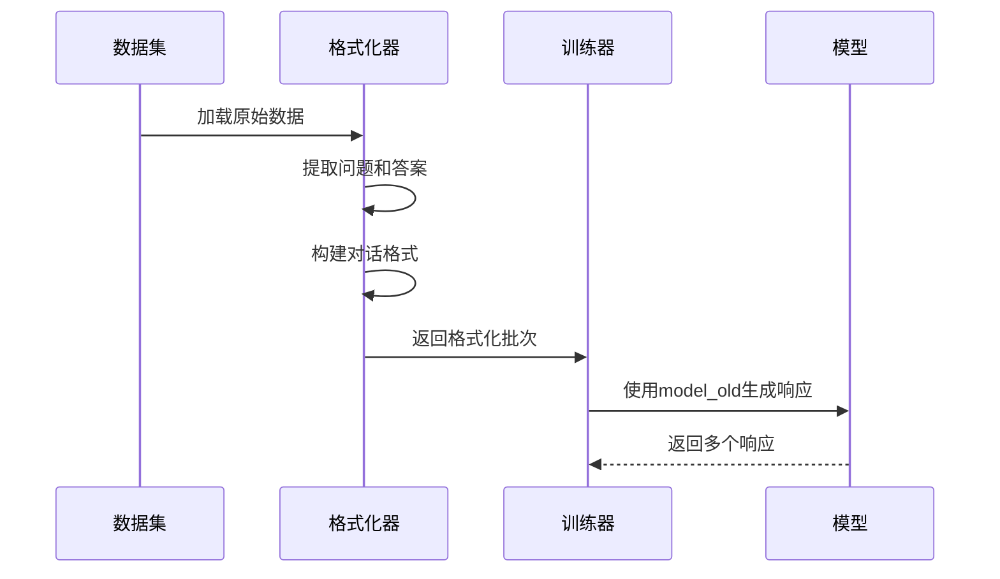

**图表来源**
- [mlx-grpo.py](file://mlx-grpo.py#L40-L80)
- [mlx-grpo.py](file://mlx-grpo.py#L933-L980)

### 响应生成机制

`generate_responses`方法负责使用旧策略模型生成多个响应：

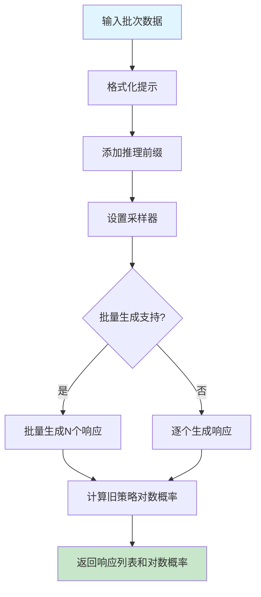

**图表来源**
- [mlx-grpo.py](file://mlx-grpo.py#L500-L600)

### 奖励计算与优势归一化

奖励函数系统支持多种评估指标：

| 奖励函数 | 功能 | 权重 | 计算方式 |
|---------|------|------|----------|
| correctness_reward_func | 正确性奖励 | 主要 | 匹配提取的答案 |
| xmlcount_reward_func | XML格式计分 | 中等 | 标签完整性检查 |
| soft_format_reward_func | 软格式奖励 | 中等 | 基本格式验证 |
| int_reward_func | 整数奖励 | 辅助 | 数值有效性检查 |

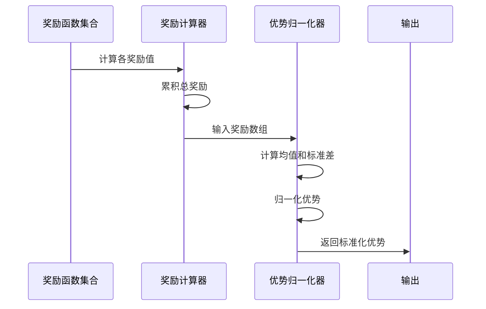

**图表来源**
- [mlx-grpo.py](file://mlx-grpo.py#L600-L650)

**章节来源**
- [mlx-grpo.py](file://mlx-grpo.py#L40-L100)
- [mlx-grpo.py](file://mlx-grpo.py#L500-L700)

## 训练循环实现机制

### train_step方法详解

`train_step`方法是单次训练迭代的核心，遵循GRPO算法的五个主要步骤：

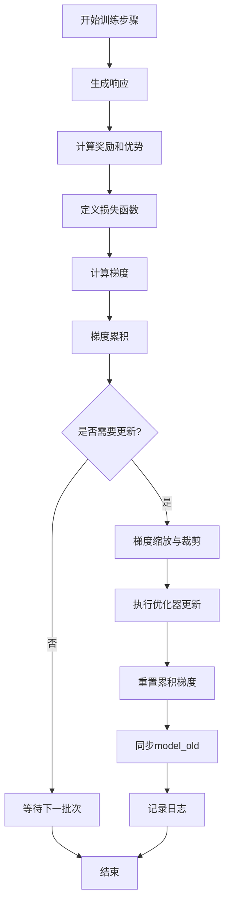

**图表来源**
- [mlx-grpo.py](file://mlx-grpo.py#L933-L1090)

### step与update_step的区别

在GRPO训练中，`step`和`update_step`代表不同的计数器：

| 计数器 | 类型 | 用途 | 更新频率 |
|--------|------|------|----------|
| step | batch步数 | 记录批次进度 | 每个批次+1 |
| update_step | 优化器更新步数 | 控制学习率调度 | 梯度累积完成后+1 |

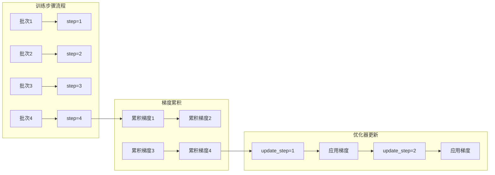

**图表来源**
- [mlx-grpo.py](file://mlx-grpo.py#L431-L435)
- [mlx-grpo.py](file://mlx-grpo.py#L1013-L1040)

**章节来源**
- [mlx-grpo.py](file://mlx-grpo.py#L933-L1090)

## 梯度累积与优化器更新

### 梯度累积机制

`gradient_accumulation_steps`参数控制梯度累积策略：

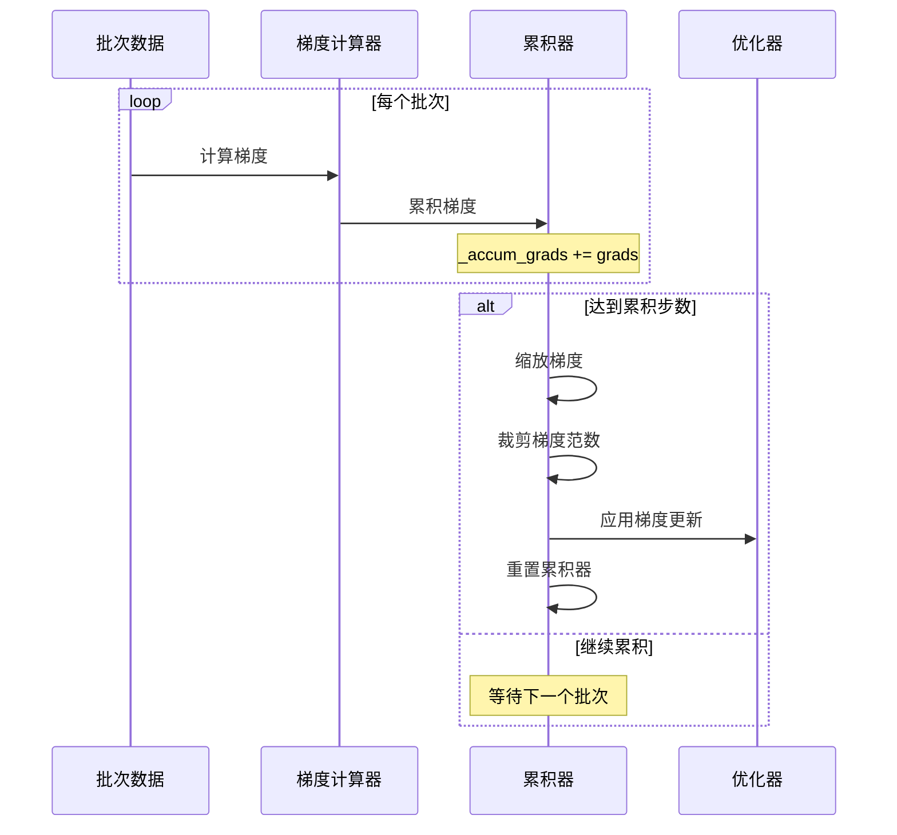

**图表来源**
- [mlx-grpo.py](file://mlx-grpo.py#L1013-L1030)

### 优化器配置

训练器使用Adam优化器，支持以下特性：

| 特性 | 实现方式 | 参数 |
|------|----------|------|
| 学习率调度 | 余弦衰减+预热 | `cosine_decay` + `warmup_ratio` |
| 梯度裁剪 | L2范数裁剪 | `max_grad_norm` |
| 动量参数 | Adam变体 | `adam_beta1=0.9`, `adam_beta2=0.999` |
| 权重衰减 | 可选正则化 | `weight_decay` |

**章节来源**
- [mlx-grpo.py](file://mlx-grpo.py#L437-L457)
- [mlx-grpo.py](file://mlx-grpo.py#L1013-L1040)

## 学习率调度机制

### 余弦衰减+预热调度器

学习率调度器采用复合策略：

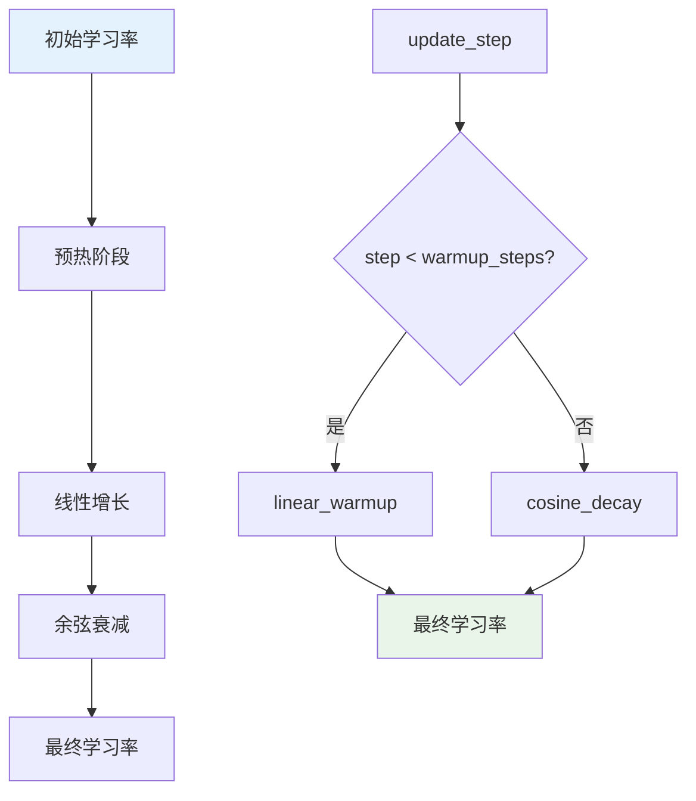

**图表来源**
- [mlx-grpo.py](file://mlx-grpo.py#L437-L445)

### 调度器参数配置

| 参数 | 默认值 | 计算方式 | 作用 |
|------|--------|----------|------|
| warmup_steps | 总更新步数×0.1 | `max(1, int(total_updates × warmup_ratio))` | 预热步数 |
| base_lr | 1e-6 | 用户指定 | 基础学习率 |
| final_lr | 0 | `cosine_decay(final_lr, total_updates)` | 最终学习率 |

**章节来源**
- [mlx-grpo.py](file://mlx-grpo.py#L437-L445)

## 日志记录与监控

### JSONL日志系统

训练过程采用JSONL格式进行详细日志记录：

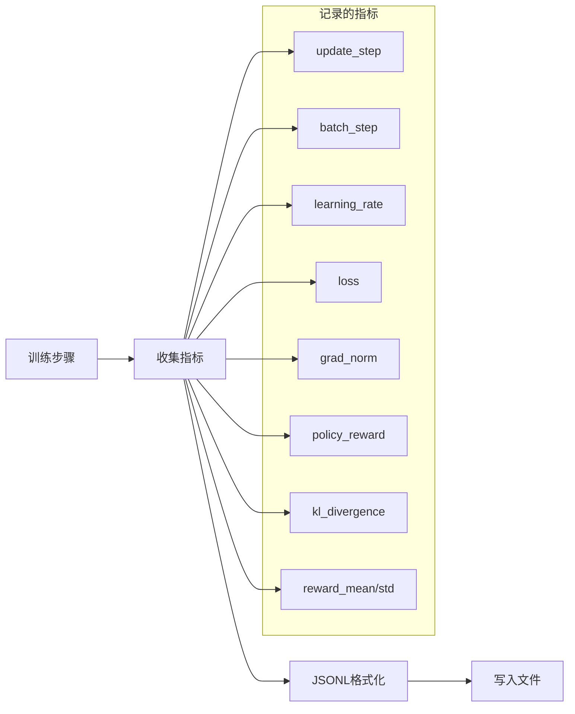

**图表来源**
- [mlx-grpo.py](file://mlx-grpo.py#L457-L465)
- [mlx-grpo.py](file://mlx-grpo.py#L1031-L1045)

### 评估指标跟踪

训练器持续监控多个性能指标：

| 指标类型 | 监控频率 | 计算方式 | 用途 |
|---------|----------|----------|------|
| 奖励统计 | 每次生成 | 均值和标准差 | 性能评估 |
| 精确匹配分数 | 定期 | 数值匹配检查 | 模型准确性 |
| 梯度范数 | 每次更新 | L2范数计算 | 梯度稳定性 |
| 损失值 | 每次更新 | GRPO损失计算 | 收敛监控 |

**章节来源**
- [mlx-grpo.py](file://mlx-grpo.py#L1031-L1060)

## 性能考虑

### 内存优化策略

1. **量化支持**: `quantize_for_rollouts`参数启用4位量化
2. **模型同步**: 定期同步减少内存占用
3. **梯度累积**: 减少峰值内存需求
4. **编译优化**: `use_compile`参数启用JIT编译

### 计算效率优化

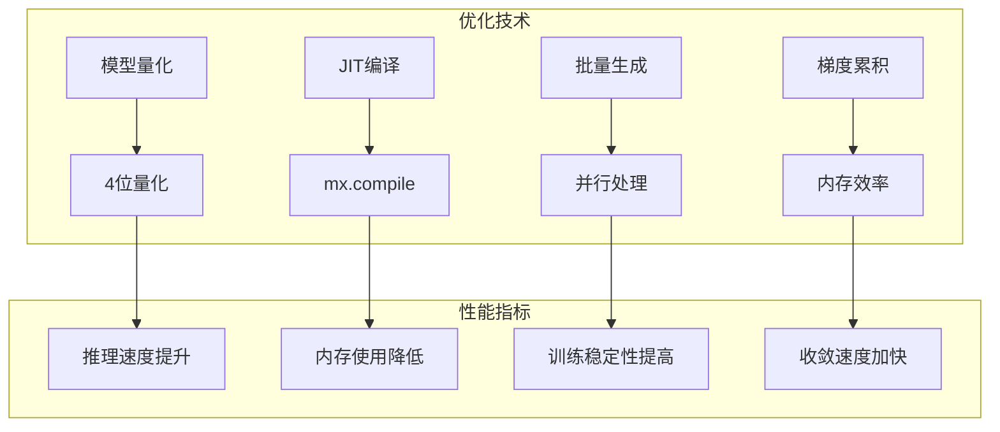

**图表来源**
- [configs/nanochat_grpo.toml](file://configs/nanochat_grpo.toml#L30-L40)

## 故障排除指南

### 常见问题与解决方案

| 问题类型 | 症状 | 可能原因 | 解决方案 |
|---------|------|----------|----------|
| 内存不足 | OOM错误 | 批次大小过大 | 减少`batch_size`或启用量化 |
| 训练不收敛 | 损失不下降 | 学习率过高 | 降低`learning_rate` |
| 梯度爆炸 | 梯度范数过大 | 梯度未裁剪 | 调整`max_grad_norm` |
| 生成质量差 | 回答格式错误 | 温度过高 | 降低`temperature` |

### 调试技巧

1. **启用详细日志**: 设置`logging_steps=1`
2. **禁用编译**: 设置`use_compile=false`用于调试
3. **减少样本**: 使用`smoke_test.toml`快速验证
4. **检查量化**: 确保量化不会影响模型性能

**章节来源**
- [mlx-grpo.py](file://mlx-grpo.py#L1062-L1070)

## 结论

MLX-GRPO训练框架提供了一个完整、高效的GRPO训练解决方案，具有以下特点：

1. **完整的GRPO实现**: 从数据准备到模型训练的全流程覆盖
2. **灵活的配置系统**: 支持多种训练场景和超参数调整
3. **优化的性能表现**: 通过量化、累积梯度等技术提升效率
4. **完善的监控体系**: 详细的日志记录和评估指标跟踪
5. **易于使用的接口**: 简洁的API设计便于研究和部署

该框架为研究人员提供了一个强大的工具，可以在Apple Silicon平台上高效地进行GRPO训练，推动链式思维提示优化的研究进展。通过深入理解训练循环的实现机制，研究人员可以更好地调整参数、诊断问题，并根据具体需求定制训练策略。