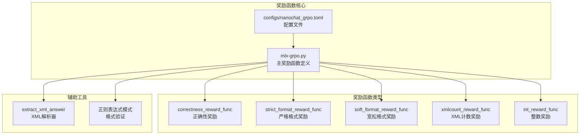
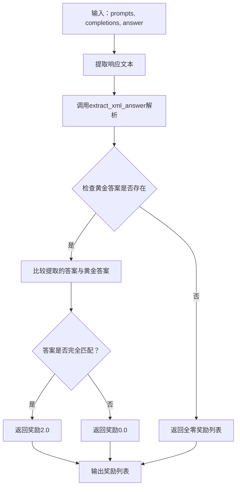
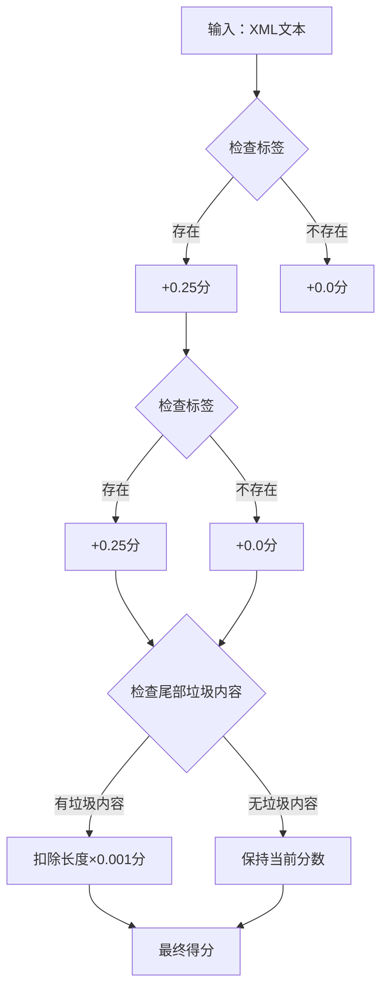
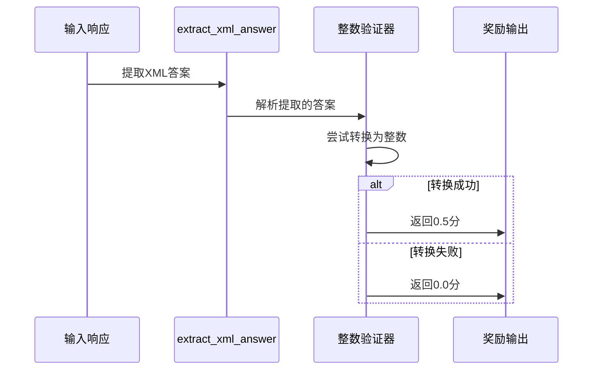
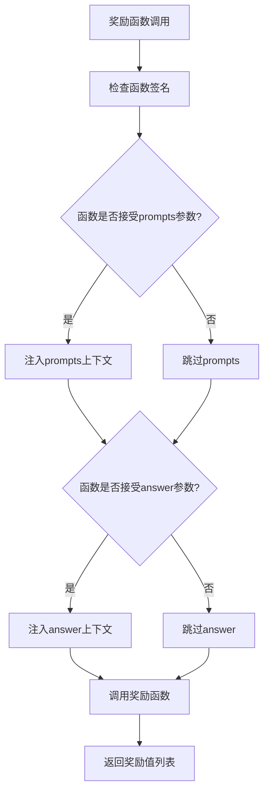
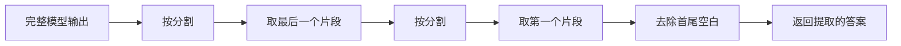
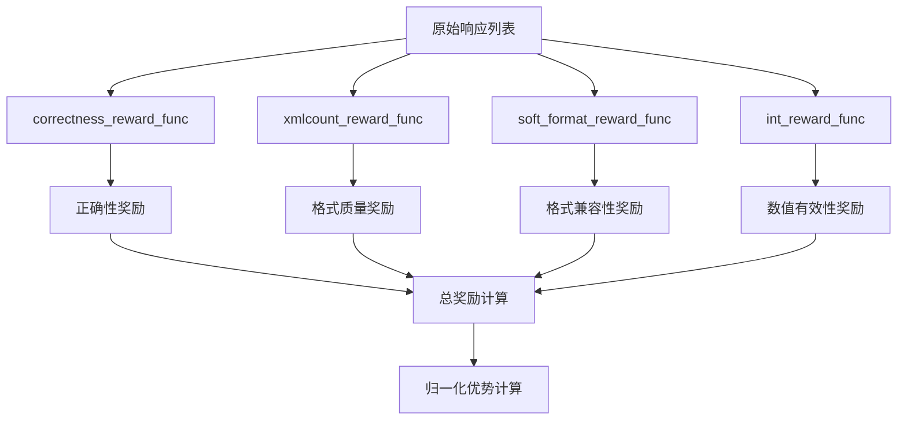

# 奖励函数系统详细文档

<cite>
**本文档中引用的文件**
- [mlx-grpo.py](file://mlx-grpo.py)
- [configs/nanochat_grpo.toml](file://configs/nanochat_grpo.toml)
- [README.md](file://README.md)
</cite>

## 目录
1. [简介](#简介)
2. [项目结构概览](#项目结构概览)
3. [核心奖励函数](#核心奖励函数)
4. [奖励函数架构](#奖励函数架构)
5. [XML格式解析机制](#xml格式解析机制)
6. [复合奖励信号](#复合奖励信号)
7. [GRPO算法中的奖励归一化](#grpo算法中的奖励归一化)
8. [自定义奖励函数指南](#自定义奖励函数指南)
9. [性能考虑](#性能考虑)
10. [故障排除指南](#故障排除指南)
11. [总结](#总结)

## 简介

MLX-GRPO奖励函数系统是一个专为链式思维（Chain-of-Thought）推理任务设计的多维度奖励评估框架。该系统通过组合多个专门化的奖励函数，为大型语言模型提供精确的反馈信号，以优化其推理能力和输出质量。系统支持从简单的正确性验证到复杂的格式检查等多种评估维度。

## 项目结构概览

奖励函数系统的核心组件分布在以下关键文件中：



**图表来源**
- [mlx-grpo.py](file://mlx-grpo.py#L72-L131)
- [configs/nanochat_grpo.toml](file://configs/nanochat_grpo.toml#L1-L45)

**章节来源**
- [mlx-grpo.py](file://mlx-grpo.py#L1-L50)
- [configs/nanochat_grpo.toml](file://configs/nanochat_grpo.toml#L1-L45)

## 核心奖励函数

### correctness_reward_func（正确性奖励函数）

正确性奖励函数是系统中最重要且最严格的奖励机制，专门用于评估模型输出与标准答案的精确匹配度。

#### 实现逻辑



**图表来源**
- [mlx-grpo.py](file://mlx-grpo.py#L75-L83)

#### 应用场景
- **数学问题求解**：验证计算结果的准确性
- **事实性问答**：确保提供的信息与标准答案一致
- **逻辑推理**：确认推理过程和结论的正确性

**章节来源**
- [mlx-grpo.py](file://mlx-grpo.py#L75-L83)

### strict_format_reward_func（严格格式奖励函数）

严格格式奖励函数采用最严格的XML格式验证标准，要求完整的XML结构和精确的标签顺序。

#### 正则表达式模式
```python
pattern = r"^\s*<reasoning>.*?</reasoning>\s*<answer>.*?</answer>\s*$"
```

#### 验证规则
- **完整XML壳**：必须包含完整的`<reasoning>`和`<answer>`标签
- **任意换行符/空白**：允许任意数量的空白字符
- **精确匹配**：整个字符串必须完全符合模式

#### 奖励机制
- **完全匹配**：奖励0.5分
- **部分匹配或不匹配**：奖励0.0分

**章节来源**
- [mlx-grpo.py](file://mlx-grpo.py#L97-L102)

### soft_format_reward_func（宽松格式奖励函数）

宽松格式奖励函数采用更灵活的XML格式验证策略，允许一定程度的格式变体。

#### 正则表达式模式
```python
pattern = r"<reasoning>.*?</reasoning>\s*<answer>.*?</answer>"
```

#### 验证特点
- **标签存在性**：只要包含必要的标签即可
- **标签顺序**：允许标签顺序略有变化
- **空白处理**：允许标签之间的空白字符

#### 奖励机制
- **有效格式**：奖励0.5分
- **无效格式**：奖励0.0分

**章节来源**
- [mlx-grpo.py](file://mlx-grpo.py#L104-L109)

### xmlcount_reward_func（XML计数奖励函数）

XML计数奖励函数通过统计XML标签的数量和质量来评估输出格式。

#### 评分机制



**图表来源**
- [mlx-grpo.py](file://mlx-grpo.py#L111-L120)

#### 具体规则
1. **标签检测**：
   - `<reasoning>`标签：+0.25分
   - `<answer>`标签：+0.25分
2. **垃圾内容惩罚**：
   - 检查`</answer>`后的多余内容
   - 按字符长度线性惩罚（每字符-0.001分）

**章节来源**
- [mlx-grpo.py](file://mlx-grpo.py#L111-L120)

### int_reward_func（整数奖励函数）

整数奖励函数专门用于验证模型输出是否可以转换为有效的整数。

#### 验证流程



**图表来源**
- [mlx-grpo.py](file://mlx-grpo.py#L85-L95)

#### 应用场景
- **数值计算**：验证数学运算结果
- **计数任务**：确认统计类问题的答案
- **边界值测试**：检查特殊数值情况

**章节来源**
- [mlx-grpo.py](file://mlx-grpo.py#L85-L95)

## 奖励函数架构

### 函数签名标准化

所有奖励函数都遵循统一的函数签名规范：

```python
def reward_function_name(completions, **kwargs) -> list[float]:
    # 实现逻辑
    return reward_scores
```

### 参数注入机制

系统通过`inspect.signature`实现智能的参数注入：



**图表来源**
- [mlx-grpo.py](file://mlx-grpo.py#L615-L630)

### 上下文参数使用

#### prompts参数
- **用途**：提供原始对话历史和问题上下文
- **格式**：`[batch["prompt"]]`，包含完整的对话消息列表
- **应用场景**：需要理解问题背景的奖励函数

#### answer参数
- **用途**：提供标准答案或参考答案
- **格式**：`[batch.get("answer", "")]`，单元素列表
- **应用场景**：需要与标准答案比较的奖励函数

**章节来源**
- [mlx-grpo.py](file://mlx-grpo.py#L615-L630)

## XML格式解析机制

### extract_xml_answer函数

`extract_xml_answer`函数是奖励系统的核心解析器，负责从模型输出中提取`<answer>`标签内的内容。

#### 解析算法



**图表来源**
- [mlx-grpo.py](file://mlx-grpo.py#L45-L48)

#### 实现细节
- **鲁棒性设计**：即使标签不完整也能提取部分内容
- **空白处理**：自动去除提取结果的首尾空白字符
- **错误容忍**：不会因格式错误而抛出异常

### 正则表达式模式匹配

系统广泛使用正则表达式进行格式验证：

#### 格式验证模式对比

| 奖励函数 | 正则表达式模式 | 验证严格度 | 奖励值 |
|---------|---------------|-----------|--------|
| strict_format | `^\s*<reasoning>.*?</reasoning>\s*<answer>.*?</answer>\s*$` | 最严格 | 0.5 |
| soft_format | `<reasoning>.*?</reasoning>\s*<answer>.*?</answer>` | 宽松 | 0.5 |
| xmlcount | 多个独立模式 | 中等 | 动态 |

#### 模式特性
- **DOTALL标志**：`.`匹配包括换行符在内的所有字符
- **非贪婪匹配**：`.*?`避免过度匹配
- **边界控制**：`^`和`$`确保完整匹配（严格模式）

**章节来源**
- [mlx-grpo.py](file://mlx-grpo.py#L97-L120)

## 复合奖励信号

### 奖励函数组合策略

系统通过组合多个奖励函数来构建全面的奖励信号：



**图表来源**
- [mlx-grpo.py](file://mlx-grpo.py#L1222-L1225)

### 组合权重分配

系统推荐的奖励函数优先级顺序：

1. **correctness_reward_func**（最高优先级）
   - 最重要的奖励信号
   - 直接反映答案正确性
   - 应该放在组合列表首位

2. **xmlcount_reward_func**
   - 格式质量评估
   - 提供额外的格式反馈

3. **soft_format_reward_func**
   - 格式兼容性检查
   - 平衡严格性和灵活性

4. **int_reward_func**
   - 数值有效性验证
   - 特定场景下的补充奖励

### 总奖励计算

```python
total_rewards = mx.zeros((len(responses),))
for reward_fn in self.reward_funcs:
    reward_values = reward_fn(completions=completions, **kwargs)
    reward_array = mx.array(reward_values)
    total_rewards = total_rewards + reward_array
```

**章节来源**
- [mlx-grpo.py](file://mlx-grpo.py#L620-L640)

## GRPO算法中的奖励归一化

### 归一化原理

GRPO算法采用组均值归一化来稳定训练过程：

```mermaid
flowchart TD
A[总奖励向量] --> B[计算组平均值]
A --> C[计算组标准差]
B --> D[减去平均值]
C --> E[除以标准差]
D --> F[优势计算 A_i = (R_i - μ_R) / σ_R]
E --> F
F --> G[归一化优势]
```

**图表来源**
- [mlx-grpo.py](file://mlx-grpo.py#L645-L650)

### 数学公式

优势计算公式：
```
A_i = (R_i - μ_R) / (σ_R + ε)
```

其中：
- `A_i`：第i个响应的优势值
- `R_i`：第i个响应的总奖励
- `μ_R`：所有响应的奖励均值
- `σ_R`：所有响应的奖励标准差
- `ε = 1e-8`：防止除零的小常数

### 归一化作用

1. **稳定性提升**：减少奖励范围波动
2. **梯度控制**：防止梯度爆炸或消失
3. **公平比较**：消除不同批次间的奖励差异
4. **收敛加速**：提供更稳定的训练信号

### 实现细节

```python
mean_reward = mx.mean(total_rewards)
std_reward = mx.std(total_rewards)
advantages = (total_rewards - mean_reward) / (std_reward + 1e-8)
```

**章节来源**
- [mlx-grpo.py](file://mlx-grpo.py#L645-L650)

## 自定义奖励函数指南

### 函数签名要求

创建自定义奖励函数时必须遵循以下规范：

#### 基本签名
```python
def custom_reward_func(completions, **kwargs) -> list[float]:
    # 必须返回浮点数列表
    return [score1, score2, ..., scoreN]
```

#### 可选参数支持
```python
def custom_reward_func(completions, prompts=None, answer=None, **kwargs) -> list[float]:
    # prompts: 原始对话历史
    # answer: 标准答案
    # kwargs: 其他上下文参数
    return reward_scores
```

### 参数访问模式

#### 1. 基础参数访问
```python
def basic_reward_func(completions, **kwargs):
    responses = [completion[0]['content'] for completion in completions]
    # 处理响应并返回奖励
    return [0.5, 0.5, 0.0]
```

#### 2. 上下文参数访问
```python
def context_reward_func(completions, prompts=None, answer=None, **kwargs):
    if prompts is not None:
        question = prompts[0][-1]['content']
    if answer is not None:
        gold_answer = answer[0]
    
    responses = [completion[0]['content'] for completion in completions]
    # 基于上下文计算奖励
    return reward_scores
```

### 上下文参数使用方法

#### prompts参数使用
```python
def question_complexity_reward(completions, prompts=None, **kwargs):
    if prompts is not None:
        question = prompts[0][-1]['content']
        word_count = len(question.split())
        # 根据问题复杂度调整奖励
        base_reward = 0.5
        complexity_bonus = min(word_count * 0.01, 0.3)
        return [base_reward + complexity_bonus] * len(completions)
```

#### answer参数使用
```python
def partial_match_reward(completions, answer=None, **kwargs):
    if answer is None:
        return [0.0] * len(completions)
    
    gold = answer[0].lower().strip()
    responses = [completion[0]['content'] for completion in completions]
    extracted = [extract_xml_answer(r).lower().strip() for r in responses]
    
    rewards = []
    for resp in extracted:
        if resp.startswith(gold):
            rewards.append(0.3)  # 部分匹配奖励
        elif gold.startswith(resp):
            rewards.append(0.2)  # 子串匹配奖励
        else:
            rewards.append(0.0)  # 不匹配
    return rewards
```

### 安全的参数注入

系统通过`inspect.signature`实现安全的参数注入：

```python
sig = inspect.signature(reward_fn)
kwargs = {}
if "prompts" in sig.parameters:
    kwargs["prompts"] = reward_context["prompts"]
if "answer" in sig.parameters:
    kwargs["answer"] = reward_context["answer"]
```

#### 优势特性
- **向后兼容**：现有函数无需修改即可使用
- **可选参数**：只注入函数声明所需的参数
- **类型安全**：确保参数类型正确传递
- **错误隔离**：单个奖励函数失败不影响整体训练

### 错误处理最佳实践

#### 1. 异常捕获
```python
def robust_reward_func(completions, **kwargs):
    try:
        # 主要逻辑
        return reward_scores
    except Exception as e:
        print(f"Reward function error: {e}")
        return [0.0] * len(completions)
```

#### 2. 输入验证
```python
def validated_reward_func(completions, **kwargs):
    if not completions or len(completions) == 0:
        return []
    
    # 验证completions格式
    if not all(isinstance(c, list) and len(c) > 0 for c in completions):
        return [0.0] * len(completions)
    
    responses = [c[0]['content'] for c in completions]
    # 继续处理
    return reward_scores
```

#### 3. 默认值处理
```python
def defensive_reward_func(completions, prompts=None, answer=None, **kwargs):
    responses = [c[0]['content'] for c in completions]
    
    # 提供默认值
    prompts = prompts or [[]]
    answer = answer or [""]
    
    # 安全访问
    question = prompts[0][-1]['content'] if prompts and prompts[0] else ""
    gold = answer[0] if answer else ""
    
    return reward_scores
```

### 测试自定义奖励函数

#### 单元测试示例
```python
def test_custom_reward_func():
    # 测试基本功能
    completions = [[{"content": "<answer>42</answer>"}]]
    result = custom_reward_func(completions)
    assert len(result) == 1
    assert isinstance(result[0], float)
    
    # 测试边界情况
    empty_completions = []
    result = custom_reward_func(empty_completions)
    assert result == []
    
    # 测试错误处理
    broken_completions = [{"invalid": "format"}]
    result = custom_reward_func(broken_completions)
    assert all(isinstance(x, float) for x in result)
```

#### 集成测试
```python
def test_with_trainer():
    # 创建测试环境
    trainer = MLXGRPOTrainer(...)
    
    # 添加自定义奖励函数
    trainer.reward_funcs.append(custom_reward_func)
    
    # 运行训练步骤
    batch = {"prompt": [...], "answer": ["42"]}
    responses = ["<answer>42</answer>"]
    
    advantages, rewards = trainer.compute_rewards(batch, responses)
    
    # 验证结果
    assert len(advantages) == len(rewards)
    assert all(isinstance(x, mx.array) for x in advantages)
```

**章节来源**
- [mlx-grpo.py](file://mlx-grpo.py#L615-L650)

## 性能考虑

### 计算效率优化

#### 1. 批处理优化
```python
# 推荐：批量处理多个响应
def efficient_reward_func(completions, **kwargs):
    responses = [completion[0]['content'] for completion in completions]
    # 使用向量化操作处理所有响应
    return reward_scores
```

#### 2. 缓存机制
```python
# 对于重复计算的奖励，实现缓存
class CachedRewardFunc:
    def __init__(self):
        self.cache = {}
    
    def __call__(self, completions, **kwargs):
        # 基于响应内容生成唯一键
        cache_key = hash(tuple(c[0]['content'] for c in completions))
        
        if cache_key in self.cache:
            return self.cache[cache_key]
        
        result = self.compute_reward(completions, **kwargs)
        self.cache[cache_key] = result
        return result
```

#### 3. 内存管理
```python
# 避免大对象创建
def memory_efficient_func(completions, **kwargs):
    # 使用生成器表达式而非列表推导
    responses = (c[0]['content'] for c in completions)
    
    # 分批处理大型数据集
    batch_size = 100
    results = []
    for i in range(0, len(completions), batch_size):
        batch = list(completions[i:i+batch_size])
        batch_results = self.process_batch(batch)
        results.extend(batch_results)
    
    return results
```

### 并行处理策略

#### 1. 多进程处理
```python
from multiprocessing import Pool

def parallel_reward_func(completions, **kwargs):
    with Pool() as pool:
        # 并行处理每个响应
        results = pool.map(process_single_response, completions)
    return results
```

#### 2. 向量化操作
```python
import mlx.core as mx

def vectorized_reward_func(completions, **kwargs):
    # 将所有响应转换为张量
    texts = mx.array([c[0]['content'] for c in completions])
    
    # 使用向量化操作
    lengths = mx.array([len(t) for t in texts])
    rewards = 0.5 * (lengths > 10).astype(float)
    
    return rewards.tolist()
```

### 内存使用监控

#### 1. 内存使用跟踪
```python
import psutil
import os

def monitor_memory(func):
    def wrapper(*args, **kwargs):
        process = psutil.Process(os.getpid())
        mem_before = process.memory_info().rss / 1024 / 1024  # MB
        
        result = func(*args, **kwargs)
        
        mem_after = process.memory_info().rss / 1024 / 1024
        print(f"Memory change: {mem_after - mem_before:.2f} MB")
        
        return result
    return wrapper
```

#### 2. 垃圾回收优化
```python
import gc

def optimized_reward_func(completions, **kwargs):
    # 清理不需要的对象
    gc.collect()
    
    # 执行主要逻辑
    result = compute_rewards(completions, **kwargs)
    
    # 强制垃圾回收
    del completions
    gc.collect()
    
    return result
```

## 故障排除指南

### 常见问题及解决方案

#### 1. 奖励函数返回空列表

**症状**：训练过程中出现`ValueError: operands could not be broadcast together`错误

**原因**：某些奖励函数返回了空列表或长度不匹配的结果

**解决方案**：
```python
def fixed_reward_func(completions, **kwargs):
    responses = [c[0]['content'] for c in completions]
    if not responses:
        return []
    
    # 确保返回与输入相同长度的结果
    return [0.5] * len(responses)
```

#### 2. XML解析失败

**症状**：`extract_xml_answer`无法正确提取答案

**原因**：模型输出格式不符合预期

**解决方案**：
```python
def robust_xml_parser(text: str) -> str:
    try:
        answer = text.split("<answer>")[-1]
        answer = answer.split("</answer>")[0]
        return answer.strip()
    except Exception:
        # 回退到简单提取
        if "####" in text:
            return text.split("####")[-1].strip()
        return text.strip()
```

#### 3. 正则表达式匹配失败

**症状**：格式奖励函数总是返回0.0

**原因**：正则表达式模式过于严格或过于宽松

**解决方案**：
```python
def debug_regex_pattern(pattern: str, text: str):
    """调试正则表达式匹配"""
    match = re.search(pattern, text, flags=re.DOTALL)
    print(f"Pattern: {pattern}")
    print(f"Text: {text}")
    print(f"Match: {bool(match)}")
    if match:
        print(f"Matched: {match.group(0)}")
```

#### 4. 归一化数值不稳定

**症状**：训练过程中出现NaN或Inf值

**原因**：奖励分布过于集中或标准差接近零

**解决方案**：
```python
def stable_normalization(rewards):
    mean_reward = mx.mean(rewards)
    std_reward = mx.std(rewards)
    
    # 添加稳定性检查
    if std_reward < 1e-6:
        # 如果标准差太小，使用固定奖励
        return mx.zeros_like(rewards)
    
    advantages = (rewards - mean_reward) / (std_reward + 1e-8)
    return advantages
```

### 调试工具和技巧

#### 1. 奖励函数调试器
```python
class RewardDebugger:
    def __init__(self, reward_func):
        self.func = reward_func
        self.logs = []
    
    def __call__(self, completions, **kwargs):
        result = self.func(completions, **kwargs)
        
        # 记录调试信息
        self.logs.append({
            'timestamp': time.time(),
            'completions_count': len(completions),
            'rewards': result,
            'avg_reward': sum(result) / len(result) if result else 0
        })
        
        return result
    
    def get_stats(self):
        return {
            'total_calls': len(self.logs),
            'avg_rewards': [log['avg_reward'] for log in self.logs],
            'reward_distribution': self._analyze_distribution()
        }
```

#### 2. 性能分析器
```python
import time
from functools import wraps

def profile_reward_func(func):
    @wraps(func)
    def wrapper(*args, **kwargs):
        start_time = time.time()
        start_memory = psutil.Process(os.getpid()).memory_info().rss
        
        result = func(*args, **kwargs)
        
        end_time = time.time()
        end_memory = psutil.Process(os.getpid()).memory_info().rss
        
        print(f"Reward func {func.__name__}:")
        print(f"  Time: {end_time - start_time:.4f}s")
        print(f"  Memory: {(end_memory - start_memory) / 1024 / 1024:.2f}MB")
        print(f"  Results: {result}")
        
        return result
    return wrapper
```

#### 3. 可视化工具
```python
import matplotlib.pyplot as plt

def visualize_reward_distribution(rewards_list, labels):
    """可视化多个奖励函数的分布"""
    fig, axes = plt.subplots(len(rewards_list), 1, figsize=(10, 5*len(rewards_list)))
    
    for i, (rewards, label) in enumerate(zip(rewards_list, labels)):
        if len(rewards_list) == 1:
            ax = axes
        else:
            ax = axes[i]
        
        ax.hist(rewards, bins=20)
        ax.set_title(f"{label} Distribution")
        ax.set_xlabel("Reward Value")
        ax.set_ylabel("Frequency")
    
    plt.tight_layout()
    plt.savefig("reward_distribution.png")
    plt.close()
```

**章节来源**
- [mlx-grpo.py](file://mlx-grpo.py#L620-L650)

## 总结

MLX-GRPO奖励函数系统提供了一个强大而灵活的框架，用于评估和优化链式思维推理任务中的模型表现。通过精心设计的五个核心奖励函数，系统能够从多个维度评估模型输出的质量：

### 核心优势

1. **多维度评估**：结合正确性、格式、质量和数值有效性等多个维度
2. **灵活组合**：支持多种奖励函数的自由组合和权重调整
3. **智能归一化**：采用GRPO算法的组均值归一化技术，确保训练稳定性
4. **安全扩展**：通过`inspect.signature`实现安全的参数注入机制
5. **易于定制**：提供清晰的接口和丰富的上下文参数

### 最佳实践建议

1. **奖励函数选择**：根据具体任务需求选择合适的奖励函数组合
2. **参数调优**：合理设置奖励函数的优先级和权重
3. **监控指标**：定期监控奖励分布和训练稳定性
4. **错误处理**：实现健壮的错误处理和调试机制
5. **性能优化**：关注计算效率和内存使用

### 发展方向

随着研究的深入，奖励函数系统可以进一步扩展：
- **领域特定奖励**：针对特定应用领域的奖励函数
- **动态权重调整**：基于训练进度的奖励权重自适应调整
- **多模态奖励**：支持文本以外的其他模态输入
- **强化学习集成**：更深度地集成强化学习算法

这个奖励函数系统为MLX-GRPO提供了坚实的基础，使其能够在各种推理任务中取得优异的表现，同时为未来的改进和扩展留下了充足的空间。