# 模型管理

<cite>
**本文档中引用的文件**
- [mlx-grpo.py](file://mlx-grpo.py)
- [README.md](file://README.md)
- [NANOCHAT_GRPO_GUIDE.md](file://NANOCHAT_GRPO_GUIDE.md)
- [configs/nanochat_d32.toml](file://configs/nanochat_d32.toml)
- [configs/prod.toml](file://configs/prod.toml)
- [utils/README.md](file://utils/README.md)
</cite>

## 目录
1. [引言](#引言)
2. [项目结构概述](#项目结构概述)
3. [核心模型架构](#核心模型架构)
4. [模型初始化与同步机制](#模型初始化与同步机制)
5. [量化优化策略](#量化优化策略)
6. [检查点保存与恢复](#检查点保存与恢复)
7. [内存管理最佳实践](#内存管理最佳实践)
8. [性能优化建议](#性能优化建议)
9. [故障排除指南](#故障排除指南)
10. [总结](#总结)

## 引言

MLX-GRPO是一个基于Apple MLX框架的大型语言模型训练系统，专门实现了Group-based Relative Policy Optimization (GRPO)算法。该系统的核心创新在于其独特的三模型管理机制，通过精确控制三个关键模型实例的协同工作，实现了高效的强化学习训练过程。

本文档深入解析了GRPO算法中三个关键模型实例的管理机制，包括当前策略模型(`model`)、旧策略模型(`model_old`)和参考模型(`ref_model`)的协同工作机制，以及相关的量化优化、内存管理和检查点恢复策略。

## 项目结构概述

MLX-GRPO项目采用模块化设计，主要包含以下核心组件：

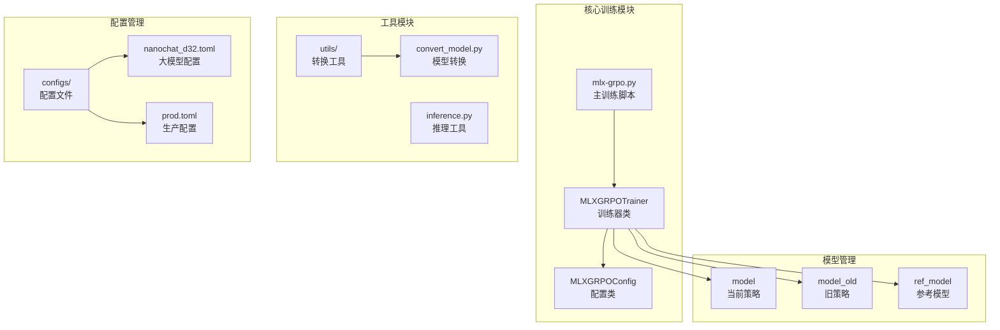

**图表来源**
- [mlx-grpo.py](file://mlx-grpo.py#L1-L50)
- [configs/nanochat_d32.toml](file://configs/nanochat_d32.toml#L1-L20)
- [configs/prod.toml](file://configs/prod.toml#L1-L20)

**章节来源**
- [mlx-grpo.py](file://mlx-grpo.py#L1-L100)
- [README.md](file://README.md#L1-L50)

## 核心模型架构

### 三模型协同机制

GRPO算法的核心创新在于其三模型架构，每个模型都有明确的职责分工：

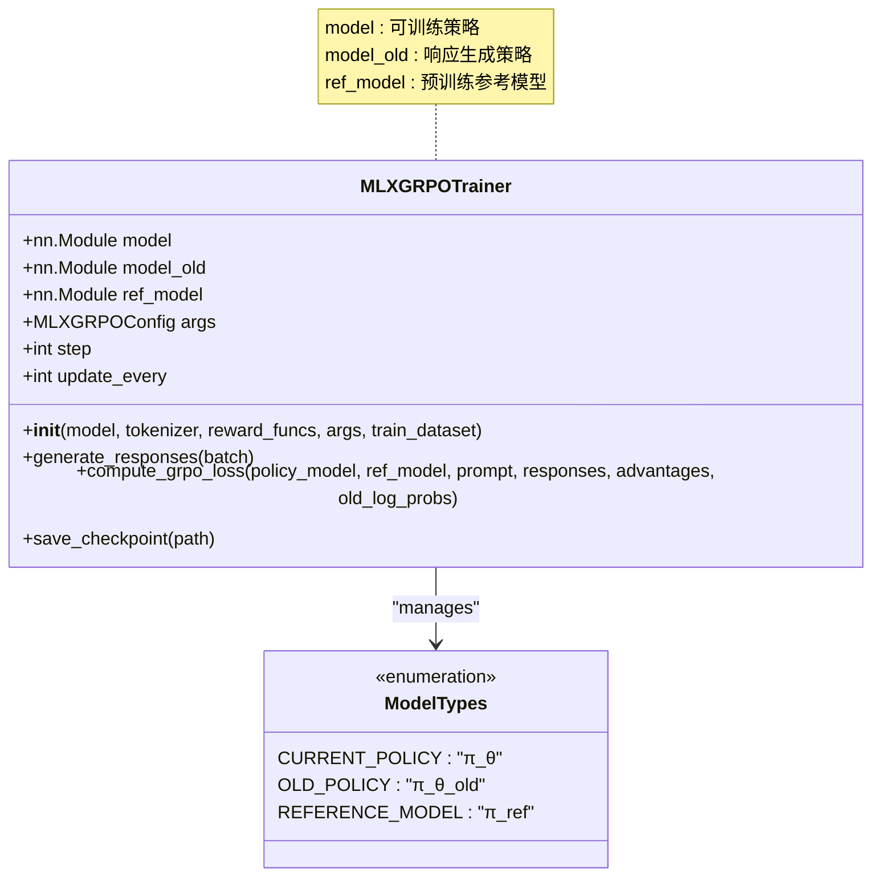

**图表来源**
- [mlx-grpo.py](file://mlx-grpo.py#L403-L457)
- [mlx-grpo.py](file://mlx-grpo.py#L411-L435)

### 模型角色定义

| 模型类型 | 数学表示 | 主要功能 | 更新策略 | 内存占用 |
|---------|---------|---------|---------|---------|
| 当前策略模型 | `π_θ` | 训练目标，参数可更新 | 每个训练步骤更新 | 最高 |
| 旧策略模型 | `π_θ_old` | 生成rollout响应，定期同步 | 每N步深拷贝 | 中等 |
| 参考模型 | `π_ref` | 提供初始策略，保持不变 | 不更新 | 最低 |

**章节来源**
- [mlx-grpo.py](file://mlx-grpo.py#L411-L435)

## 模型初始化与同步机制

### 深拷贝初始化策略

系统使用`copy.deepcopy`进行模型初始化，确保三个模型完全独立：

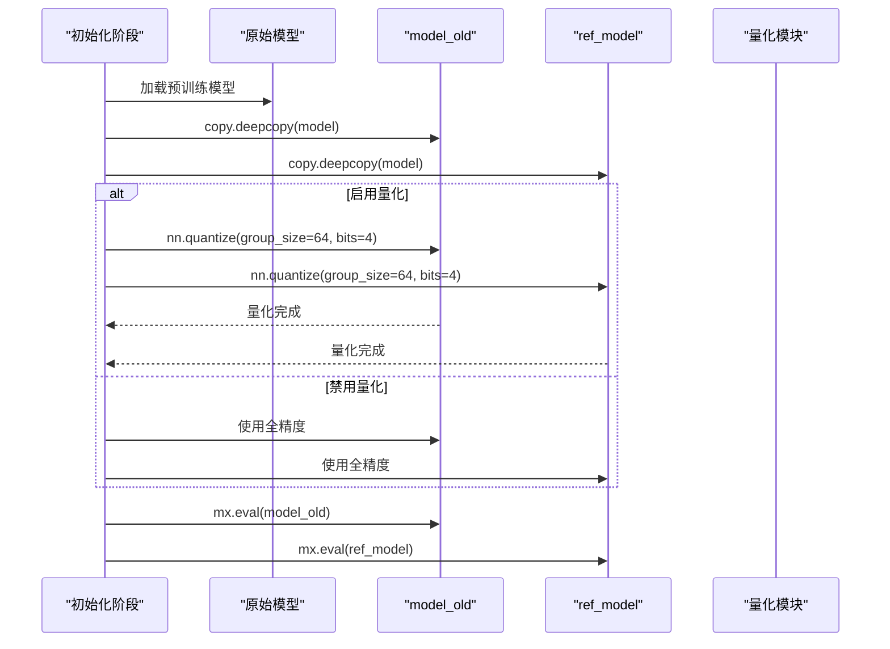

**图表来源**
- [mlx-grpo.py](file://mlx-grpo.py#L415-L435)

### 定期同步策略

`model_old`的同步频率通过`update_every`参数控制，默认每10个批次同步一次：

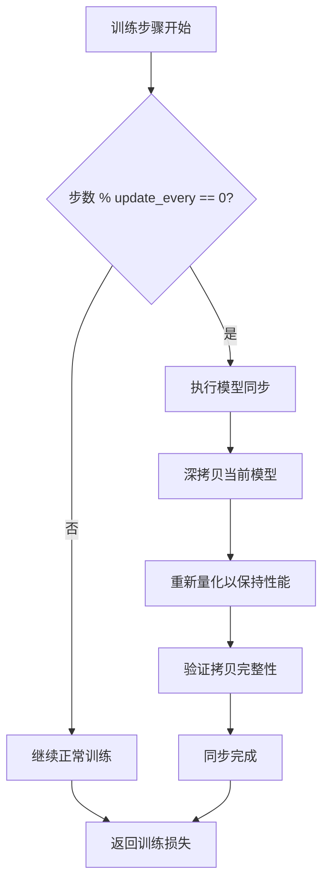

**图表来源**
- [mlx-grpo.py](file://mlx-grpo.py#L1073-L1092)

**章节来源**
- [mlx-grpo.py](file://mlx-grpo.py#L415-L435)
- [mlx-grpo.py](file://mlx-grpo.py#L1073-L1092)

## 量化优化策略

### 4位量化原理

量化技术通过降低模型权重的精度来显著减少内存占用和加速推理：

| 量化级别 | 参数数量 | 内存节省 | 性能提升 | 质量影响 |
|---------|---------|---------|---------|---------|
| 32位浮点 | 100% | 0% | 1.0x | 无 |
| 16位浮点 | 50% | 50% | 1.5x | 微小 |
| 8位整数 | 25% | 75% | 2.0x | 显著 |
| 4位整数 | 12.5% | 87.5% | 3.0x | 较大 |

### 量化应用策略

系统采用选择性量化策略，仅对rollout模型应用量化：

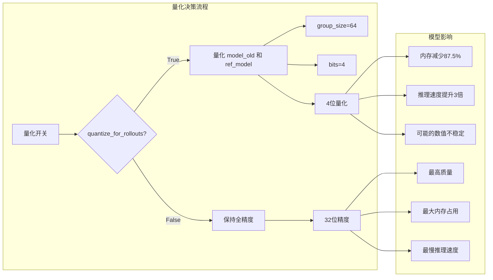

**图表来源**
- [mlx-grpo.py](file://mlx-grpo.py#L419-L430)

### 大模型量化注意事项

对于大型模型（如32层模型），量化可能导致数值不稳定：

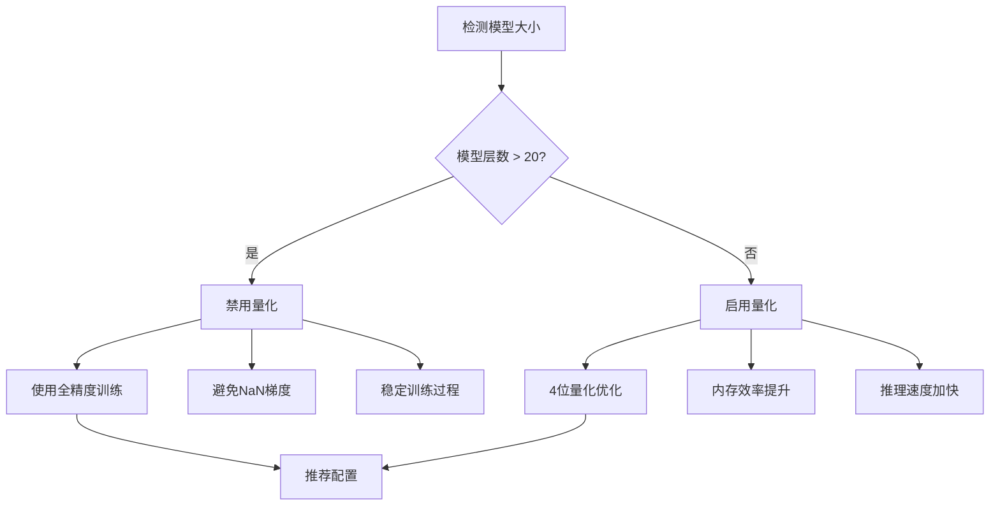

**图表来源**
- [configs/nanochat_d32.toml](file://configs/nanochat_d32.toml#L38-L40)

**章节来源**
- [mlx-grpo.py](file://mlx-grpo.py#L419-L430)
- [configs/nanochat_d32.toml](file://configs/nanochat_d32.toml#L38-L40)

## 检查点保存与恢复

### 检查点完整性保证

系统设计了全面的检查点保存机制，确保训练状态的完整保存：

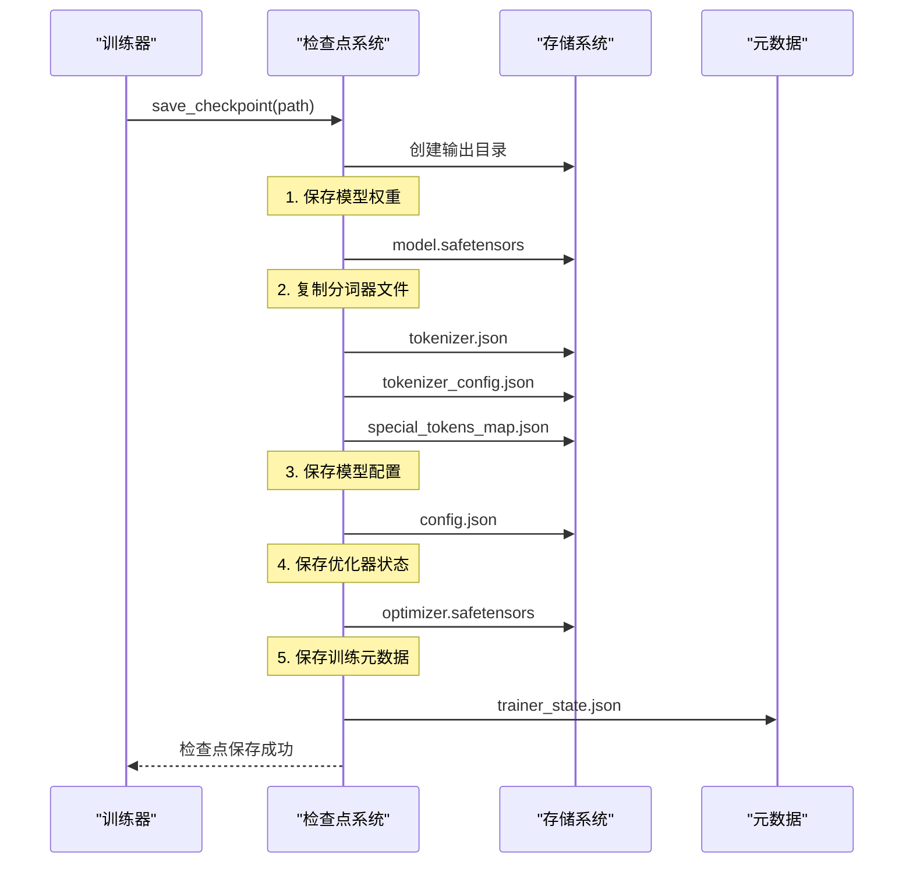

**图表来源**
- [mlx-grpo.py](file://mlx-grpo.py#L711-L796)

### 文件组成详解

| 文件类型 | 文件名 | 用途 | 必需性 |
|---------|-------|------|-------|
| 模型权重 | `model.safetensors` | 存储训练后的模型参数 | 必需 |
| 分词器配置 | `tokenizer.json` | 保存分词器配置 | 推荐 |
| 特殊标记 | `special_tokens_map.json` | 定义特殊token映射 | 推荐 |
| 模型配置 | `config.json` | 存储模型架构参数 | 推荐 |
| 优化器状态 | `optimizer.safetensors` | 保存优化器状态 | 可选 |
| 训练元数据 | `trainer_state.json` | 记录训练进度信息 | 推荐 |

### 恢复机制

检查点系统支持完整的训练恢复：

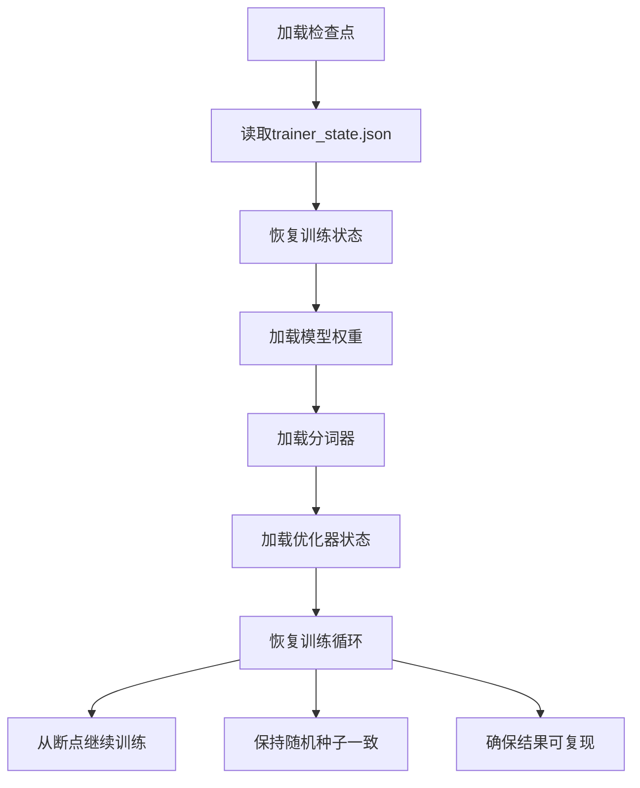

**图表来源**
- [mlx-grpo.py](file://mlx-grpo.py#L778-L796)

**章节来源**
- [mlx-grpo.py](file://mlx-grpo.py#L711-L796)

## 内存管理最佳实践

### 内存使用模式分析

不同模型配置下的内存使用情况：

| 配置类型 | 模型大小 | 内存峰值 | 量化效果 | 推荐场景 |
|---------|---------|---------|---------|---------|
| 小模型(20L) | 1.9GB | 2.2GB | 87.5%减少 | 快速实验 |
| 大模型(32L) | 6.8GB | 8-10GB | 87.5%减少 | 生产训练 |
| 全精度 | 7.6GB | 15-18GB | 无 | 高质量训练 |

### 内存优化策略

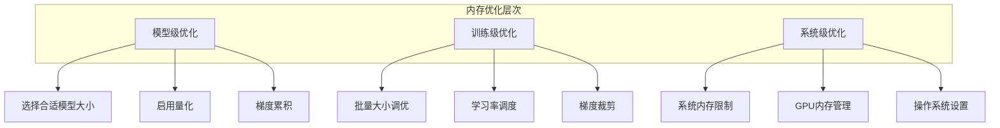

### 内存监控指标

关键内存使用指标的监控建议：

| 指标 | 正常范围 | 警告阈值 | 优化措施 |
|------|---------|---------|---------|
| GPU内存使用率 | < 80% | > 90% | 减少批量大小 |
| 系统内存使用率 | < 70% | > 85% | 增加虚拟内存 |
| 交换空间使用 | < 10% | > 30% | 扩展内存容量 |

**章节来源**
- [utils/README.md](file://utils/README.md#L265-L331)
- [configs/nanochat_d32.toml](file://configs/nanochat_d32.toml#L1-L20)

## 性能优化建议

### 训练性能调优

针对不同硬件配置的性能优化建议：

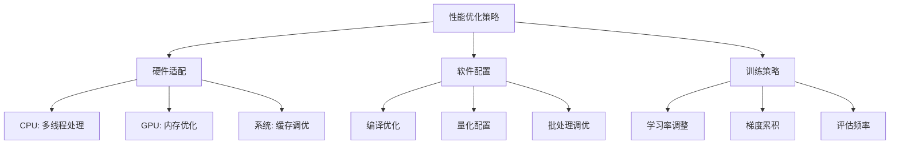

### 关键参数调优

| 参数类别 | 关键参数 | 推荐值 | 影响因素 |
|---------|---------|-------|---------|
| 模型配置 | `quantize_for_rollouts` | 小模型: True | 模型大小 |
| 训练配置 | `gradient_accumulation_steps` | 4-8 | GPU内存 |
| 采样配置 | `num_generations` | 4-16 | 计算资源 |
| 评估配置 | `eval_steps` | 25-100 | 训练时间 |

### 性能基准测试

不同配置下的性能对比：

| 配置组合 | 训练速度 | 内存效率 | 质量指标 | 推荐度 |
|---------|---------|---------|---------|-------|
| 小模型+量化 | 极快 | 优秀 | 中等 | ⭐⭐⭐⭐⭐ |
| 大模型+量化 | 快 | 优秀 | 优秀 | ⭐⭐⭐⭐ |
| 小模型+全精度 | 中等 | 一般 | 优秀 | ⭐⭐⭐ |
| 大模型+全精度 | 慢 | 差 | 优秀 | ⭐⭐ |

**章节来源**
- [configs/prod.toml](file://configs/prod.toml#L1-L40)
- [configs/nanochat_d32.toml](file://configs/nanochat_d32.toml#L1-L47)

## 故障排除指南

### 常见问题诊断

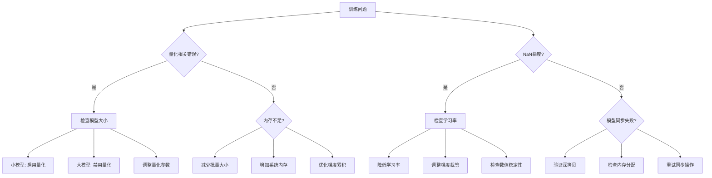

### 错误代码对照表

| 错误类型 | 可能原因 | 解决方案 | 预防措施 |
|---------|---------|---------|---------|
| 量化失败 | 模型过大 | 禁用量化或使用更大内存 | 预先测试模型大小 |
| 内存溢出 | 批量过大 | 减少批量大小或启用梯度累积 | 监控内存使用 |
| NaN梯度 | 学习率过高 | 降低学习率或调整KL系数 | 设置合理的超参数 |
| 同步失败 | 内存不足 | 增加系统内存或减少同步频率 | 定期检查系统状态 |

### 调试工具和技巧

系统提供了多种调试和监控工具：

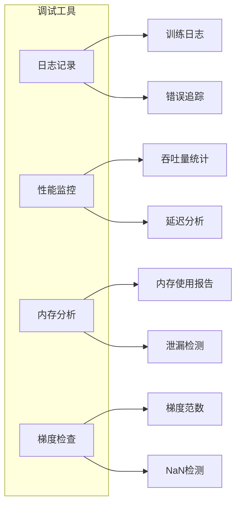

**章节来源**
- [mlx-grpo.py](file://mlx-grpo.py#L1062-L1092)

## 总结

MLX-GRPO的模型管理机制体现了现代深度学习训练系统的复杂性和精密性。通过精心设计的三模型架构、智能的量化策略和完善的检查点管理，系统实现了高效、稳定且可复现的训练过程。

### 关键优势

1. **三模型协同**：通过明确的角色分工和同步机制，确保训练的稳定性和效率
2. **智能量化**：选择性量化策略在性能和质量之间取得平衡
3. **完整恢复**：全面的检查点系统确保训练过程的可靠性和可复现性
4. **灵活配置**：丰富的配置选项适应不同的硬件环境和训练需求

### 最佳实践总结

- **模型选择**：根据可用内存选择合适的模型规模
- **量化策略**：小模型可启用量化，大模型应禁用以保证稳定性
- **内存管理**：合理配置批量大小和梯度累积步数
- **监控调试**：建立完善的监控体系及时发现和解决问题

这套模型管理机制不仅为GRPO算法的成功实施提供了坚实基础，也为其他强化学习训练系统的设计提供了宝贵的参考经验。随着MLX框架的不断发展和硬件性能的提升，这套机制还有望进一步优化和扩展，为更大规模的语言模型训练提供支持。