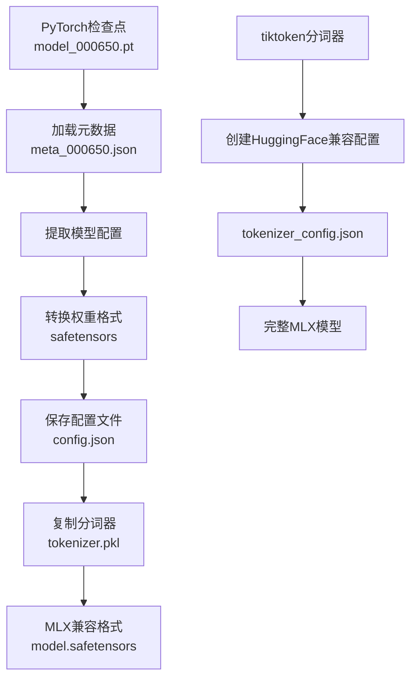

# 安装与环境配置

<cite>
**本文档引用的文件**
- [pyproject.toml](file://pyproject.toml)
- [README.md](file://README.md)
- [QUICK_START.md](file://QUICK_START.md)
- [NANOCHAT_GRPO_GUIDE.md](file://NANOCHAT_GRPO_GUIDE.md)
- [utils/README.md](file://utils/README.md)
- [convert_nanochat.py](file://convert_nanochat.py)
- [configs/nanochat_d32.toml](file://configs/nanochat_d32.toml)
- [configs/prod.toml](file://configs/prod.toml)
- [test_nanochat_direct.py](file://test_nanochat_direct.py)
</cite>

## 目录
1. [系统要求](#系统要求)
2. [环境准备](#环境准备)
3. [Python虚拟环境创建](#python虚拟环境创建)
4. [uv包管理器安装](#uv包管理器安装)
5. [MLX框架安装](#mlx框架安装)
6. [MLX-LM从源码安装](#mlx-lm从源码安装)
7. [依赖项安装](#依赖项安装)
8. [nanochat模型转换](#nanochat模型转换)
9. [验证安装](#验证安装)
10. [常见问题解决](#常见问题解决)
11. [性能优化建议](#性能优化建议)

## 系统要求

### 硬件要求
- **Apple Silicon芯片**：M1、M2、M3、M4系列处理器
- **内存要求**：
  - 最小：8GB RAM（用于小型模型）
  - 推荐：16GB+ RAM（用于大型模型训练）
- **存储空间**：
  - 基础安装：2GB可用空间
  - 大型模型：需要额外10GB+空间

### 软件要求
- **macOS版本**：14.0或更高版本（推荐使用最新版本）
- **Python版本**：3.11或更高版本
- **Xcode命令行工具**：用于编译C++扩展

**节来源**
- [pyproject.toml](file://pyproject.toml#L6)
- [README.md](file://README.md#L1-L50)

## 环境准备

### 检查Python版本

```bash
# 验证Python版本是否符合要求
python3 --version
# 应该输出：Python 3.11.x 或更高版本
```

### 安装Xcode命令行工具

```bash
# 如果尚未安装，运行以下命令
xcode-select --install
```

### 创建项目目录

```bash
# 创建项目工作目录
mkdir mlx-grpo-project
cd mlx-grpo-project

# 克隆项目仓库
git clone https://github.com/Doriandarko/MLX-GRPO.git
cd MLX-GRPO
```

**节来源**
- [README.md](file://README.md#L20-L40)

## Python虚拟环境创建

### 使用venv创建虚拟环境

```bash
# 创建虚拟环境
python3 -m venv venv

# 激活虚拟环境
source venv/bin/activate

# 验证激活状态
which python
# 应该显示：./venv/bin/python
```

### 虚拟环境管理

```bash
# 退出虚拟环境
deactivate

# 重新激活虚拟环境
source venv/bin/activate
```

**节来源**
- [README.md](file://README.md#L42-L50)

## uv包管理器安装

### 安装uv包管理器

uv是该项目推荐的快速包管理器，显著提升依赖安装速度。

```bash
# 使用pip安装uv
pip install uv

# 验证安装
uv --version
# 应该显示：uv 0.x.x
```

### 使用uv同步依赖

```bash
# 同步所有依赖到虚拟环境
uv sync

# 查看当前环境状态
uv venv info
```

### uv的优势

- **安装速度**：比pip快10-100倍
- **缓存机制**：智能缓存避免重复下载
- **兼容性**：完全兼容pip和pyproject.toml

**节来源**
- [README.md](file://README.md#L52-L65)

## MLX框架安装

### 基础MLX安装

根据项目需求，直接安装所需的MLX版本：

```bash
# 安装指定版本的MLX
pip install "mlx>=0.29.3"
```

### 验证MLX安装

```bash
# 测试MLX Metal后端
python -c "
import mlx.core as mx
print('✅ MLX版本:', mx.__version__)
print('✅ Metal可用:', mx.metal.is_available())
print('✅ GPU设备:', mx.device)
"
```

### 常见安装问题

#### Metal后端初始化失败

**症状**：`RuntimeError: Metal device unavailable`

**解决方案**：
```bash
# 清理MLX缓存
rm -rf ~/.cache/mlx/

# 重启终端或重新激活虚拟环境
source venv/bin/activate

# 再次测试
python -c "import mlx.core as mx; print(mx.metal.is_available())"
```

#### 权限问题

**症状**：无法写入系统目录

**解决方案**：
```bash
# 使用用户权限安装
pip install --user "mlx>=0.29.3"

# 或者在虚拟环境中安装
pip install "mlx>=0.29.3"
```

**节来源**
- [README.md](file://README.md#L67-L80)

## MLX-LM从源码安装

### 为什么需要从源码安装？

当前发布的MLX-LM版本（0.28.3）不包含nanochat模型支持。我们需要安装包含nanochat支持的最新版本（v0.28.4）。

### 安装步骤

```bash
# 克隆MLX-LM仓库
git clone https://github.com/ml-explore/mlx-lm
cd mlx-lm

# 使用uv安装（推荐）
uv pip install -e .

# 或使用pip安装
pip install -e .
```

### 验证安装

```bash
# 测试nanochat模型导入
python -c "
from mlx_lm.models import nanochat
print('✅ Nanochat支持可用！')
print('模型类:', nanochat.Model)
"
```

### 源码安装优势

- **最新功能**：获得最新的模型支持
- **调试能力**：可以修改源码进行调试
- **稳定性**：经过社区测试的稳定版本

**节来源**
- [NANOCHAT_GRPO_GUIDE.md](file://NANOCHAT_GRPO_GUIDE.md#L85-L105)

## 依赖项安装

### 标准依赖安装

基于pyproject.toml中的定义，安装所有必需依赖：

```bash
# 使用uv安装完整依赖栈
uv pip install "mlx>=0.29.3" "mlx-lm>=0.28.3" "datasets>=4.2.0" "transformers>=4.56.2" "uv>=0.0.1"
```

### 手动安装依赖

如果需要手动控制每个依赖，可以分别安装：

```bash
# 安装核心MLX依赖
pip install "mlx>=0.29.3" "mlx-lm>=0.28.3"

# 安装数据处理依赖
pip install "datasets>=4.2.0"

# 安装模型转换依赖
pip install "transformers>=4.56.2"

# 安装uv包管理器
pip install "uv>=0.0.1"
```

### 依赖版本兼容性

| 包名 | 最低版本 | 推荐版本 | 用途 |
|------|----------|----------|------|
| `mlx` | 0.29.3 | 0.29.3+ | MLX框架核心 |
| `mlx-lm` | 0.28.3 | 0.28.3+ | 模型加载和推理 |
| `datasets` | 4.2.0 | 4.2.0+ | 数据集处理 |
| `transformers` | 4.56.2 | 4.56.2+ | HuggingFace集成 |

**节来源**
- [pyproject.toml](file://pyproject.toml#L7-L12)
- [README.md](file://README.md#L82-L95)

## nanochat模型转换

### 下载模型文件

支持两个nanochat模型，选择适合您硬件的版本：

#### 小型模型（sdobson/nanochat）
- **层数**：20层
- **隐藏维度**：1,280
- **参数量**：约140M
- **大小**：1.9GB
- **适用场景**：内存有限，快速实验

#### 大型模型（karpathy/nanochat-d32）
- **层数**：32层
- **隐藏维度**：2,048
- **参数量**：约360M
- **大小**：6.8GB
- **适用场景**：高质量训练，更好的基线知识

### 转换脚本使用

使用提供的转换脚本将PyTorch模型转换为MLX格式：

```bash
# 安装转换依赖
uv pip install torch safetensors tiktoken

# 运行转换脚本
uv run python convert_nanochat.py
```

### 自定义转换路径

编辑脚本中的路径设置：

```python
# 对于小型模型
cache_dir = "/Users/YOUR_USER/.cache/huggingface/hub/models--sdobson--nanochat/snapshots/HASH"
output_dir = "models/nanochat-mlx"

# 对于大型模型
cache_dir = "/Users/YOUR_USER/.cache/huggingface/hub/models--karpathy--nanochat-d32/snapshots/HASH"
output_dir = "models/nanochat-d32-mlx"
```

### 转换过程详解



**图表来源**
- [convert_nanochat.py](file://convert_nanochat.py#L15-L80)

### 验证转换结果

```bash
# 检查转换后的模型文件
ls -lh models/nanochat-d32-mlx/

# 应该看到：
# config.json          - 模型配置
# model.safetensors    - 模型权重
# tokenizer.pkl        - 分词器数据
# tokenizer_config.json - 分词器配置
```

**节来源**
- [NANOCHAT_GRPO_GUIDE.md](file://NANOCHAT_GRPO_GUIDE.md#L110-L200)
- [convert_nanochat.py](file://convert_nanochat.py#L1-L116)

## 验证安装

### 基础功能测试

```bash
# 测试MLX基本功能
uv run python -c "
import mlx.core as mx
print('✅ MLX基础功能正常')
print('GPU设备:', mx.device)
print('张量运算:', mx.array([1, 2, 3]) + mx.array([4, 5, 6]))
"

# 测试模型加载
uv run python -c "
from mlx_lm import load, generate
print('✅ 模型加载功能正常')
"
```

### nanochat专用测试

```bash
# 测试nanochat模型加载
uv run python test_nanochat_direct.py --prompt "你好，世界！" --max-tokens=20
```

### 性能基准测试

```bash
# 测试生成速度
uv run python -c "
import time
import mlx.core as mx

# 预热
model = mx.random.normal((1, 1024))

start_time = time.time()
for _ in range(10):
    result = mx.random.normal((1, 1024))
end_time = time.time()

print(f'✅ 10次张量运算耗时: {end_time - start_time:.2f}秒')
"
```

### 端到端训练测试

```bash
# 快速测试训练流程
uv run mlx-grpo.py --config configs/smoke_test.toml --dry-run
```

**节来源**
- [test_nanochat_direct.py](file://test_nanochat_direct.py#L1-L50)
- [README.md](file://README.md#L180-L185)

## 常见问题解决

### 依赖冲突问题

#### 问题描述
安装过程中出现版本冲突错误

#### 解决方案

```bash
# 清理pip缓存
pip cache purge

# 卸载冲突的包
pip uninstall mlx-lm datasets transformers -y

# 强制重新安装
pip install --force-reinstall "mlx>=0.29.3" "mlx-lm>=0.28.3" "datasets>=4.2.0" "transformers>=4.56.2"
```

### 内存不足问题

#### 问题描述
转换大型模型时出现内存不足错误

#### 解决方案

```bash
# 增加macOS内存限制（仅适用于macOS 15+）
sudo sysctl iogpu.wired_limit_mb=32768

# 使用更激进的量化
uv run python utils/convert_model.py \
    --hf-path large-model \
    --quantize \
    --bits 2
```

### 分词器兼容性问题

#### 问题描述
使用非标准分词器导致训练失败

#### 解决方案

```python
# 检查分词器兼容性
import pickle
with open('models/nanochat-mlx/tokenizer.pkl', 'rb') as f:
    tokenizer = pickle.load(f)
    
print(f'词汇表大小: {tokenizer.n_vocab}')
print(f'EOS token ID: {getattr(tokenizer, "eot_token", "未定义")}')
```

### 训练启动问题

#### 问题描述
运行训练时出现模块导入错误

#### 解决方案

```bash
# 确保PYTHONPATH正确
export PYTHONPATH="${PYTHONPATH}:$(pwd)"

# 检查依赖完整性
uv pip list | grep -E "(mlx|mlx-lm|datasets|transformers)"
```

### 性能优化问题

#### 问题描述
训练速度过慢

#### 解决方案

```bash
# 启用模型编译
# 在配置文件中设置：use_compile = true

# 增加批处理大小（如果内存允许）
# 在配置文件中调整：batch_size = 2

# 使用更高效的量化
uv run python utils/convert_model.py \
    --quantize \
    --bits 4 \
    --group-size 64
```

**节来源**
- [utils/README.md](file://utils/README.md#L450-L500)

## 性能优化建议

### 硬件优化

#### 内存管理
- **监控内存使用**：使用`htop`或`Activity Monitor`监控内存占用
- **合理分配**：为不同任务分配合适的内存份额
- **清理缓存**：定期清理系统缓存释放内存

#### 存储优化
- **SSD优先**：确保项目文件存储在SSD上
- **磁盘空间**：保持至少20%的可用磁盘空间
- **临时文件**：定期清理临时文件和缓存

### 软件优化

#### 编译优化
```bash
# 启用模型编译（如果可用）
export MLX_COMPILE=1

# 设置编译缓存目录
export MLX_CACHE_DIR=/tmp/mlx_cache
```

#### 并发控制
```bash
# 控制CPU核心使用
export OMP_NUM_THREADS=4

# 控制GPU内存使用
export MXNET_GPU_MEM_FRACTION=0.8
```

### 训练优化

#### 批处理优化
```toml
# 在配置文件中优化批处理设置
batch_size = 1
gradient_accumulation_steps = 4
max_grad_norm = 1.0
```

#### 学习率调度
```toml
# 使用合适的学习率
learning_rate = 3e-6  # 对于大型模型
# learning_rate = 5e-6  # 对于小型模型
```

### 监控和调试

#### 性能监控
```bash
# 监控GPU使用情况
nvidia-smi  # 如果有GPU（可选）

# 监控系统资源
watch -n 1 'ps aux | grep python'
```

#### 日志分析
```bash
# 启用详细日志
export MLX_DEBUG=1

# 分析训练日志
tail -f outputs/*/logs/train.log
```

**节来源**
- [configs/nanochat_d32.toml](file://configs/nanochat_d32.toml#L35-L47)
- [configs/prod.toml](file://configs/prod.toml#L35-L40)

## 总结

通过本指南，您应该能够成功在Apple Silicon设备上搭建MLX-GRPO的完整运行环境。主要步骤包括：

1. **环境准备**：确保系统满足最低要求
2. **依赖安装**：使用uv管理包依赖
3. **模型转换**：将nanochat模型转换为MLX格式
4. **验证测试**：确认所有组件正常工作

### 下一步

- 参考[快速开始指南](file://QUICK_START.md)进行首次训练
- 浏览[实用工具文档](file://utils/README.md)学习模型转换和推理
- 查看[配置指南](file://NANOCHAT_GRPO_GUIDE.md)深入了解高级设置

### 获取帮助

如果遇到问题，请参考：
- 项目GitHub仓库issues
- MLX官方文档
- 社区论坛和讨论组

**节来源**
- [README.md](file://README.md#L1-L180)