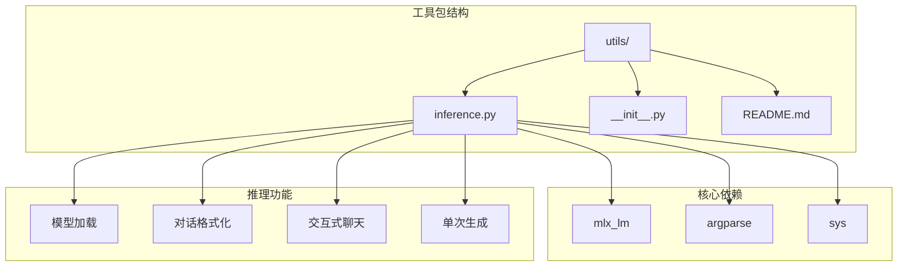
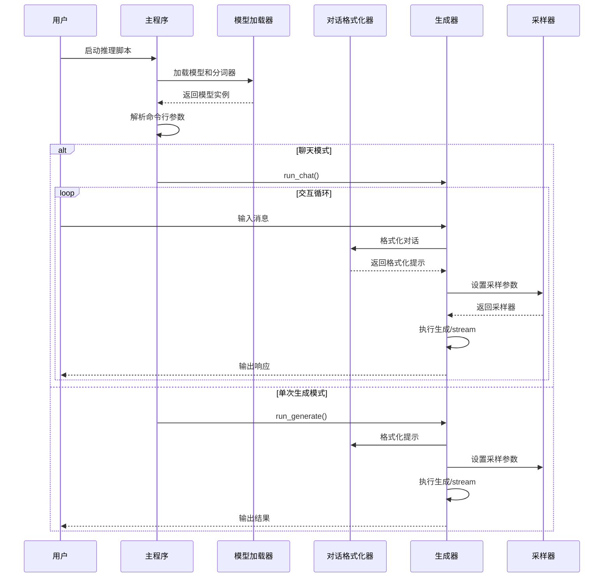
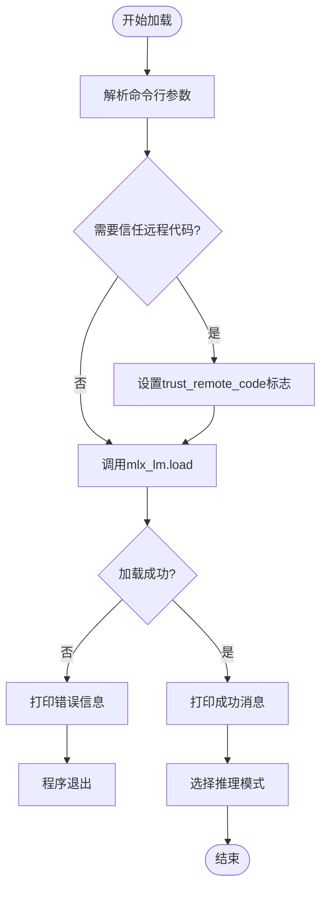
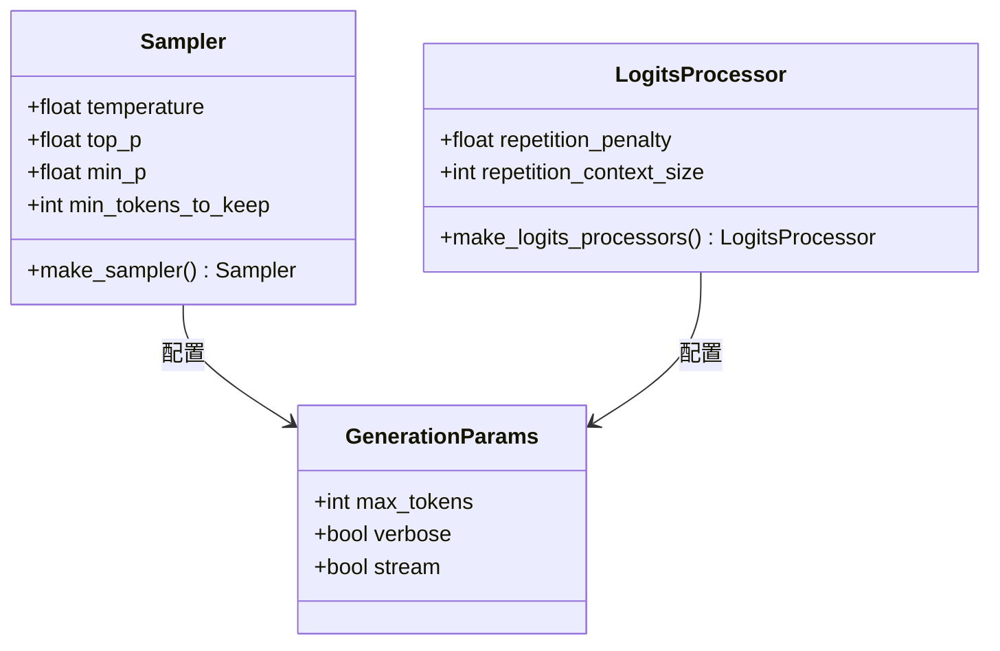
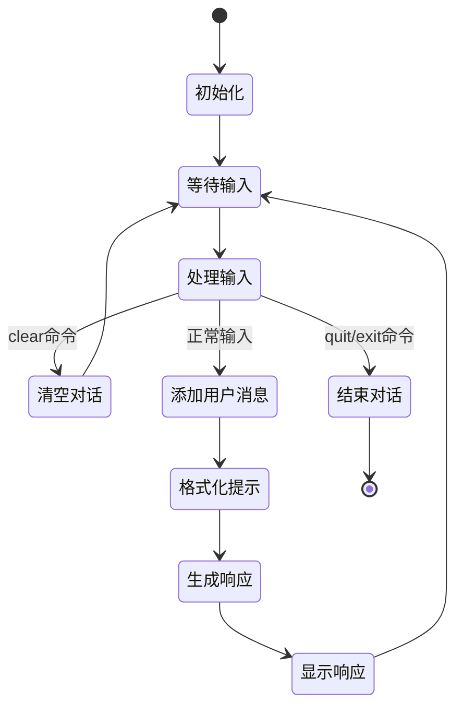
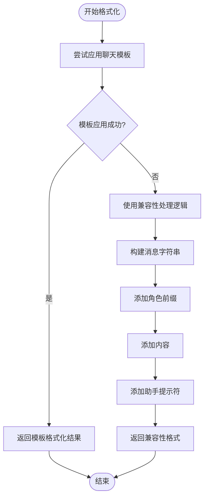

# 模型推理

<cite>
**本文档中引用的文件**
- [utils/inference.py](file://utils/inference.py)
- [utils/__init__.py](file://utils/__init__.py)
- [utils/README.md](file://utils/README.md)
- [README.md](file://README.md)
- [mlx-grpo.py](file://mlx-grpo.py)
</cite>

## 目录
1. [简介](#简介)
2. [项目结构](#项目结构)
3. [核心组件](#核心组件)
4. [架构概览](#架构概览)
5. [详细组件分析](#详细组件分析)
6. [推理模式详解](#推理模式详解)
7. [采样参数配置](#采样参数配置)
8. [对话格式化机制](#对话格式化机制)
9. [性能考虑](#性能考虑)
10. [故障排除指南](#故障排除指南)
11. [结论](#结论)

## 简介

MLX-GRPO项目中的`utils/inference.py`脚本提供了强大的模型推理功能，支持多种运行模式以满足不同的使用场景。该脚本基于Apple的MLX框架，专门设计用于与MLX转换的模型进行交互，提供单次生成、交互式聊天、流式输出等多种推理模式。

该工具的核心优势在于其灵活性和易用性，用户可以通过简单的命令行参数快速切换不同的推理模式，同时提供了丰富的采样参数控制选项，使用户能够精确调整生成行为以满足特定需求。

## 项目结构



**图表来源**
- [utils/inference.py](file://utils/inference.py#L1-L30)
- [utils/__init__.py](file://utils/__init__.py#L1-L14)

**章节来源**
- [utils/inference.py](file://utils/inference.py#L1-L348)
- [utils/__init__.py](file://utils/__init__.py#L1-L14)

## 核心组件

`utils/inference.py`脚本包含以下核心组件：

### 主要模块导入
脚本首先导入必要的Python标准库和MLX相关的依赖模块，包括`argparse`用于命令行解析、`sys`用于系统退出、以及来自`mlx_lm`的模型加载和生成函数。

### 核心函数架构
- **`format_chat_prompt()`**: 对话消息格式化函数，支持模板化和兼容性处理
- **`run_chat()`**: 交互式聊天REPL实现
- **`run_generate()`**: 单次提示生成实现
- **`main()`**: 主入口函数，负责参数解析和模式选择

### 推理引擎
脚本集成了MLX的推理引擎，通过`mlx_lm.load`加载模型和分词器，使用`mlx_lm.generate`和`mlx_lm.stream_generate`执行推理操作。

**章节来源**
- [utils/inference.py](file://utils/inference.py#L24-L348)

## 架构概览



**图表来源**
- [utils/inference.py](file://utils/inference.py#L280-L348)
- [utils/inference.py](file://utils/inference.py#L68-L142)

## 详细组件分析

### 模型加载机制



**图表来源**
- [utils/inference.py](file://utils/inference.py#L311-L345)

模型加载过程采用优雅的错误处理机制，当遇到加载失败时，会提供详细的故障排除指导，帮助用户解决常见的模型加载问题。

### 采样参数系统



**图表来源**
- [utils/inference.py](file://utils/inference.py#L68-L85)
- [utils/inference.py](file://utils/inference.py#L158-L173)

**章节来源**
- [utils/inference.py](file://utils/inference.py#L68-L85)
- [utils/inference.py](file://utils/inference.py#L158-L173)

## 推理模式详解

### 单次生成模式

单次生成模式是最基础的推理模式，适用于一次性文本生成任务。该模式支持系统提示和普通提示两种方式，能够根据用户指定的采样参数生成高质量的文本响应。

**主要特点：**
- 支持系统提示引导模型行为
- 可选的流式和非流式输出
- 完整的采样参数控制
- 错误处理和状态反馈

**使用示例：**
```bash
python inference.py --model mlx_model --prompt "解释量子计算" --temperature 0.7
```

### 交互式聊天模式

交互式聊天模式提供了完整的对话式交互体验，支持多轮对话、会话历史管理和特殊命令处理。



**图表来源**
- [utils/inference.py](file://utils/inference.py#L68-L142)

**特殊命令支持：**
- `clear`: 清空当前对话历史
- `quit`/`exit`/`q`: 退出聊天模式
- 空输入：忽略无效输入

### 流式输出模式

流式输出模式实现了实时的令牌生成和显示，为用户提供即时的生成反馈，特别适合长文本生成和交互式应用。

**技术实现：**
- 基于`stream_generate`函数的增量生成
- 实时文本追加显示
- 内存高效的增量更新

### 带系统提示的生成

系统提示功能允许用户定义模型的行为模式和角色设定，通过预设的系统消息影响模型的输出风格和内容质量。

**章节来源**
- [utils/inference.py](file://utils/inference.py#L145-L219)
- [utils/inference.py](file://utils/inference.py#L68-L142)

## 采样参数配置

### 温度参数（Temperature）

温度参数控制生成文本的随机性和创造性：

| 温度值 | 行为特征 | 适用场景 |
|--------|----------|----------|
| 0.0 | 贪婪解码，确定性最高 | 数学计算、事实问答 |
| 0.3-0.5 | 较低随机性，保持一致性 | 技术文档、代码生成 |
| 0.7-0.8 | 平衡创造性和一致性 | 一般对话、创意写作 |
| 0.9-1.2 | 高度创造性，多样性高 | 创意写作、头脑风暴 |

### Top-P 参数（核采样）

Top-P参数通过概率累积阈值限制候选词汇范围：

- **默认值 0.95**: 在保证质量的同时保持一定多样性
- **较低值（0.8-0.9）**: 更保守的选择，提高质量但降低多样性
- **较高值（0.95-1.0）**: 更开放的选择，增加创造性但可能降低质量

### 重复惩罚参数

重复惩罚参数防止模型生成重复或冗余内容：

- **默认值 1.0**: 不施加惩罚
- **1.1-1.3**: 中等惩罚，减少轻微重复
- **1.5-2.0**: 强烈惩罚，显著减少重复

**章节来源**
- [utils/inference.py](file://utils/inference.py#L68-L85)
- [utils/inference.py](file://utils/inference.py#L158-L173)

## 对话格式化机制

### 分词器模板支持

`format_chat_prompt`函数实现了智能的对话格式化机制，优先使用分词器的内置聊天模板：



**图表来源**
- [utils/inference.py](file://utils/inference.py#L29-L47)

### 兼容性处理逻辑

当分词器不支持聊天模板时，系统自动降级到手动拼接的兼容性处理：

**支持的角色类型：**
- **system**: 系统提示，用于定义模型行为
- **user**: 用户输入消息
- **assistant**: 模型回复消息

**格式化规则：**
- 每个消息块之间添加两个换行符
- 使用"System:"、"User:"、"Assistant:"作为角色标识
- 最后添加"Assistant: "作为生成提示符

这种设计确保了对各种分词器（包括tiktoken等）的广泛兼容性。

**章节来源**
- [utils/inference.py](file://utils/inference.py#L29-L47)

## 性能考虑

### 内存优化策略

- **量化支持**: 默认启用4位量化，显著减少内存占用
- **流式生成**: 避免完整响应缓存，降低内存峰值
- **分批处理**: 支持批量生成多个响应

### 计算效率优化

- **GPU加速**: 充分利用Apple Silicon的Metal后端
- **模型缓存**: 避免重复加载相同模型
- **参数预计算**: 提前配置采样器和处理器

### 网络和存储优化

- **本地模型**: 支持本地模型文件，避免网络传输
- **模型压缩**: 支持多种量化级别
- **增量下载**: 支持Hugging Face仓库的增量下载

## 故障排除指南

### 常见加载问题

**问题**: 模型加载失败
**解决方案**: 
- 确认模型路径存在且可访问
- 检查是否需要`--trust-remote-code`标志
- 验证模型格式与MLX兼容性

**问题**: 内存不足
**解决方案**:
- 使用更激进的量化设置（2位或4位）
- 增加系统内存限制（macOS 15+）
- 减少最大生成长度

### 生成质量问题

**问题**: 生成内容重复
**解决方案**:
- 增加重复惩罚参数（1.2-1.5）
- 调整温度参数（降低到0.5-0.7）
- 检查系统提示是否过于限制

**问题**: 生成内容不连贯
**解决方案**:
- 降低温度参数（0.3-0.5）
- 增加最大令牌数
- 检查系统提示的清晰度

### 性能优化建议

**启动优化**:
- 使用量化模型减少启动时间
- 预加载常用模型
- 配置适当的系统资源限制

**运行时优化**:
- 启用流式输出减少等待时间
- 使用合适的采样参数平衡质量和速度
- 监控内存使用情况

**章节来源**
- [utils/inference.py](file://utils/inference.py#L325-L345)

## 结论

`utils/inference.py`脚本为MLX-GRPO项目提供了功能完备、易于使用的模型推理接口。通过支持多种推理模式、灵活的采样参数配置和智能的对话格式化机制，该工具能够满足从简单文本生成到复杂交互式应用的各种需求。

**主要优势总结：**
- **多功能性**: 支持单次生成、交互式聊天、流式输出等多种模式
- **易用性**: 直观的命令行接口和详细的帮助信息
- **灵活性**: 丰富的采样参数和配置选项
- **兼容性**: 广泛支持各种分词器和模型格式
- **性能**: 优化的内存使用和计算效率

该工具的设计充分体现了MLX框架的优势，为研究人员和开发者提供了一个强大而灵活的模型推理平台，有助于推动大语言模型在Apple Silicon上的广泛应用和发展。