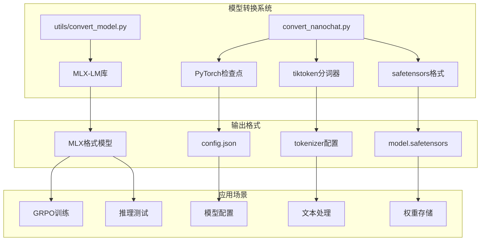
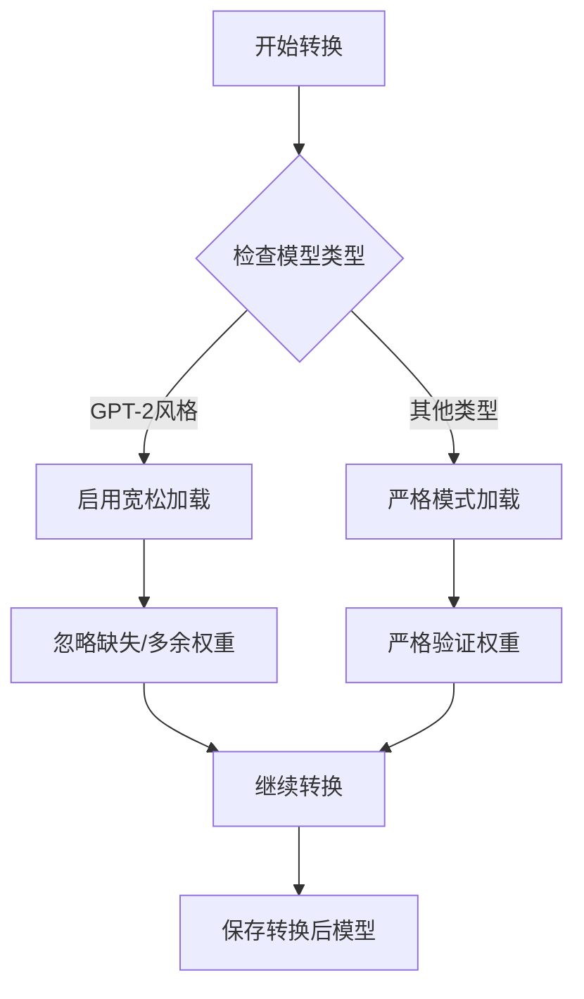
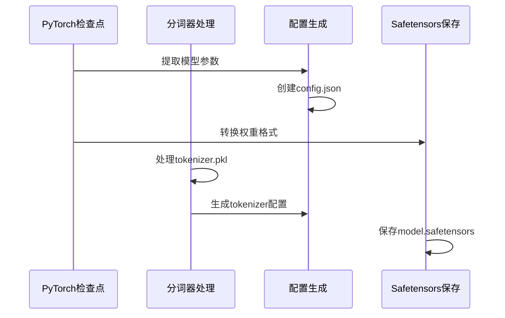

# 模型转换功能详细说明

<cite>
**本文档中引用的文件**
- [utils/convert_model.py](file://utils/convert_model.py)
- [convert_nanochat.py](file://convert_nanochat.py)
- [utils/README.md](file://utils/README.md)
- [README.md](file://README.md)
- [NANOCHAT_GRPO_GUIDE.md](file://NANOCHAT_GRPO_GUIDE.md)
- [test_nanochat_direct.py](file://test_nanochat_direct.py)
- [mlx-grpo.py](file://mlx-grpo.py)
</cite>

## 目录
1. [简介](#简介)
2. [项目架构概览](#项目架构概览)
3. [通用模型转换功能](#通用模型转换功能)
4. [NanoChat专用转换功能](#nanochat专用转换功能)
5. [命令行参数详解](#命令行参数详解)
6. [使用示例与最佳实践](#使用示例与最佳实践)
7. [故障排除指南](#故障排除指南)
8. [性能优化建议](#性能优化建议)
9. [总结](#总结)

## 简介

MLX-GRPO项目提供了强大的模型转换功能，支持将任意Hugging Face模型转换为Apple MLX框架兼容的格式。该系统包含两个核心转换脚本：`utils/convert_model.py`用于通用Hugging Face模型转换，`convert_nanochat.py`专门处理sdobson/nanochat项目的PyTorch检查点转换。

这些转换工具不仅简化了模型部署流程，还通过量化技术显著优化了内存占用，使得大型语言模型能够在Apple Silicon设备上高效运行。

## 项目架构概览



**图表来源**
- [utils/convert_model.py](file://utils/convert_model.py#L15-L16)
- [convert_nanochat.py](file://convert_nanochat.py#L10-L12)

**章节来源**
- [utils/convert_model.py](file://utils/convert_model.py#L1-L237)
- [convert_nanochat.py](file://convert_nanochat.py#L1-L116)

## 通用模型转换功能

### 核心实现机制

`utils/convert_model.py`基于MLX-LM库实现了通用的模型转换功能，支持以下核心特性：

#### 1. 量化支持
- **4位量化**（默认）：平衡质量和性能的最佳选择
- **2位和8位量化**：分别提供更激进的压缩和更高精度
- **可调组大小**：通过`--group-size`参数控制量化粒度

#### 2. 松散加载机制
系统实现了特殊的松散加载功能，允许转换不完全匹配的模型权重：



**图表来源**
- [utils/convert_model.py](file://utils/convert_model.py#L16-L28)
- [utils/convert_model.py](file://utils/convert_model.py#L162-L175)

#### 3. 自动化配置生成
转换过程自动为不同模型类型生成相应的配置文件，确保MLX框架能够正确识别和加载模型。

**章节来源**
- [utils/convert_model.py](file://utils/convert_model.py#L15-L237)

## NanoChat专用转换功能

### 特殊用途设计

`convert_nanochat.py`专门针对sdobson/nanochat项目的PyTorch检查点进行转换，具有以下特点：

#### 1. 处理非标准格式
NanoChat项目使用自定义的PyTorch检查点格式，包含：
- `.pt`格式的模型权重
- `meta_000650.json`元数据文件
- `tokenizer.pkl`分词器文件

#### 2. 权重映射机制
脚本实现了从PyTorch命名约定到MLX-LM预期格式的自动映射：



**图表来源**
- [convert_nanochat.py](file://convert_nanochat.py#L14-L116)

#### 3. 完整的配置文件生成
转换过程生成完整的MLX兼容配置，包括：
- 模型架构参数
- 分词器配置
- 特殊token处理

**章节来源**
- [convert_nanochat.py](file://convert_nanochat.py#L1-L116)
- [NANOCHAT_GRPO_GUIDE.md](file://NANOCHAT_GRPO_GUIDE.md#L170-L280)

## 命令行参数详解

### utils/convert_model.py 参数说明

| 参数 | 类型 | 默认值 | 描述 |
|------|------|--------|------|
| `--hf-path` | 字符串 | 必需 | Hugging Face模型仓库路径 |
| `-q, --quantize` | 布尔 | False | 启用量化（默认4位） |
| `--bits` | 整数 | 4 | 量化位数（2, 4, 或 8） |
| `--group-size` | 整数 | 64 | 量化组大小 |
| `--output-dir` | 字符串 | "mlx_model" | 输出目录 |
| `--upload-repo` | 字符串 | None | 上传到Hugging Face仓库 |
| `--trust-remote-code` | 布尔 | False | 信任远程代码 |
| `--eos-token` | 字符串 | None | EOS token |
| `--dtype` | 字符串 | "float16" | 权重数据类型 |
| `--verbose` | 布尔 | False | 详细进度输出 |

### convert_nanochat.py 参数说明

| 参数 | 类型 | 默认值 | 描述 |
|------|------|--------|------|
| `--cache-dir` | 字符串 | 标准缓存路径 | 包含PyTorch检查点的目录 |
| `--output-dir` | 字符串 | "models/nanochat-mlx" | 输出目录 |

**章节来源**
- [utils/convert_model.py](file://utils/convert_model.py#L48-L123)
- [convert_nanochat.py](file://convert_nanochat.py#L95-L116)

## 使用示例与最佳实践

### 通用模型转换示例

#### 基础转换
```bash
# 4位量化转换（推荐）
uv run python utils/convert_model.py \
    --hf-path mistralai/Mistral-7B-Instruct-v0.3 \
    --quantize

# 无量化转换（完整精度）
uv run python utils/convert_model.py \
    --hf-path meta-llama/Llama-2-7b-hf
```

#### 高级配置
```bash
# 8位量化
uv run python utils/convert_model.py \
    --hf-path Qwen/Qwen2.5-7B-Instruct \
    --quantize \
    --bits 8

# 自定义输出目录
uv run python utils/convert_model.py \
    --hf-path deepseek-ai/deepseek-coder-6.7b-instruct \
    --output-dir models/deepseek-coder-mlx \
    --quantize

# 上传到Hugging Face
uv run python utils/convert_model.py \
    --hf-path mistralai/Mistral-7B-v0.3 \
    --quantize \
    --upload-repo mlx-community/my-mistral-4bit
```

#### 特殊模型处理
```bash
# Qwen模型需要额外参数
uv run python utils/convert_model.py \
    --hf-path Qwen/Qwen2.5-7B-Instruct \
    --trust-remote-code \
    --eos-token "<|im_end|>" \
    --quantize

# 模型配置示例
uv run python utils/convert_model.py \
    --hf-path 01-ai/Yi-6B-Chat \
    --trust-remote-code \
    --quantize
```

### NanoChat转换示例

#### 下载模型文件
```python
from huggingface_hub import hf_hub_download

# 下载小模型（sdobson/nanochat）
repo_id = 'sdobson/nanochat'
model_file = hf_hub_download(repo_id=repo_id, filename='model_000650.pt')
meta_file = hf_hub_download(repo_id=repo_id, filename='meta_000650.json')
tokenizer_file = hf_hub_download(repo_id=repo_id, filename='tokenizer.pkl')

# 下载大模型（karpathy/nanochat-d32）
repo_id = 'karpathy/nanochat-d32'
model_file = hf_hub_download(repo_id=repo_id, filename='model_000650.pt')
meta_file = hf_hub_download(repo_id=repo_id, filename='meta_000650.json')
tokenizer_file = hf_hub_download(repo_id=repo_id, filename='tokenizer.pkl')
```

#### 执行转换
```bash
# 安装依赖
uv pip install torch safetensors tiktoken

# 运行转换
uv run python convert_nanochat.py \
    --cache-dir "/Users/YOUR_USER/.cache/huggingface/hub/models--karpathy--nanochat-d32/snapshots/HASH" \
    --output-dir "models/nanochat-d32-mlx"
```

#### 验证转换结果
```bash
# 检查输出文件
ls -lh models/nanochat-d32-mlx/

# 应该包含：
# - config.json          # 模型配置
# - model.safetensors    # 权重文件
# - tokenizer_config.json # 分词器配置
```

**章节来源**
- [utils/README.md](file://utils/README.md#L55-L173)
- [NANOCHAT_GRPO_GUIDE.md](file://NANOCHAT_GRPO_GUIDE.md#L138-L280)

## 故障排除指南

### 常见问题及解决方案

#### 1. 模型不兼容错误
**症状**：出现`FileNotFoundError`或模型格式不兼容提示

**解决方案**：
- 确认使用标准的Hugging Face格式模型
- 尝试推荐的工作模型列表
- 检查模型路径是否正确

#### 2. 内存不足问题
**症状**：转换过程中出现内存溢出

**解决方案**：
```bash
# 使用更激进的量化
uv run python utils/convert_model.py \
    --hf-path large/model \
    --quantize \
    --bits 2

# 增加系统内存限制（macOS 15+）
sudo sysctl iogpu.wired_limit_mb=32768
```

#### 3. Qwen模型特殊要求
**症状**：Qwen模型转换失败

**解决方案**：
```bash
uv run python utils/convert_model.py \
    --hf-path Qwen/Qwen2.5-7B-Instruct \
    --trust-remote-code \
    --eos-token "<|im_end|>" \
    --quantize
```

#### 4. NanoChat转换问题
**症状**：无法找到PyTorch检查点

**解决方案**：
- 确保正确下载所有必需文件
- 验证缓存目录路径
- 检查文件权限

**章节来源**
- [utils/convert_model.py](file://utils/convert_model.py#L192-L237)
- [utils/README.md](file://utils/README.md#L332-L384)

## 性能优化建议

### 量化策略优化

#### 内存使用对比
| 量化方案 | 内存占用 | 质量损失 | 推荐场景 |
|----------|----------|----------|----------|
| 无量化 | 原始大小 | 无 | 测试环境 |
| 4位量化 | 50%减少 | 极小 | 生产环境 |
| 2位量化 | 75%减少 | 可接受 | 资源受限 |
| 8位量化 | 25%减少 | 很小 | 高精度需求 |

#### 大模型转换优化
```bash
# 对于大型模型（>10GB）
uv run python utils/convert_model.py \
    --hf-path meta-llama/Llama-2-70b-hf \
    --quantize \
    --bits 4 \
    --group-size 64 \
    --output-dir models/llama-70b-4bit
```

### 系统资源管理
- **macOS 15+**：推荐使用，更好的GPU内存管理
- **内存限制**：根据模型大小调整`iogpu.wired_limit_mb`
- **并发处理**：避免同时转换多个大型模型

**章节来源**
- [utils/README.md](file://utils/README.md#L332-L384)

## 总结

MLX-GRPO的模型转换功能提供了完整的解决方案，支持从任意Hugging Face模型到MLX格式的无缝转换。通过量化技术和自动化配置生成，系统显著降低了部署大型语言模型的技术门槛。

### 主要优势
1. **通用性**：支持数千种Hugging Face模型
2. **灵活性**：多种量化选项适应不同需求
3. **易用性**：简洁的命令行接口和自动化流程
4. **专业性**：针对特定项目（如NanoChat）的专门优化

### 应用场景
- **研究开发**：快速测试新模型
- **生产部署**：优化后的模型部署
- **教育学习**：降低大型模型使用门槛
- **定制开发**：支持非标准模型格式

通过合理使用这些转换工具，开发者可以充分利用Apple Silicon的强大性能，在本地高效运行各种规模的语言模型。