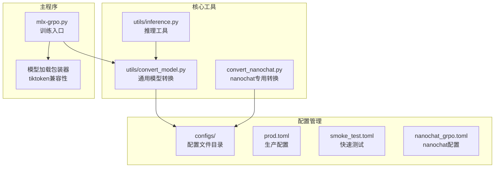
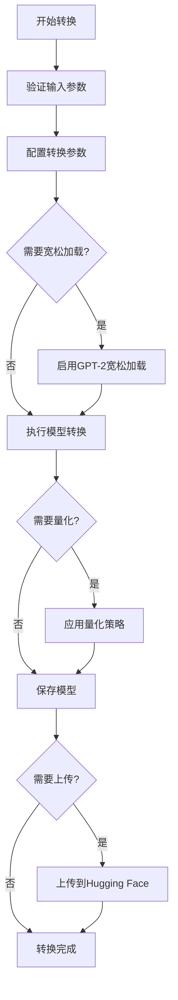
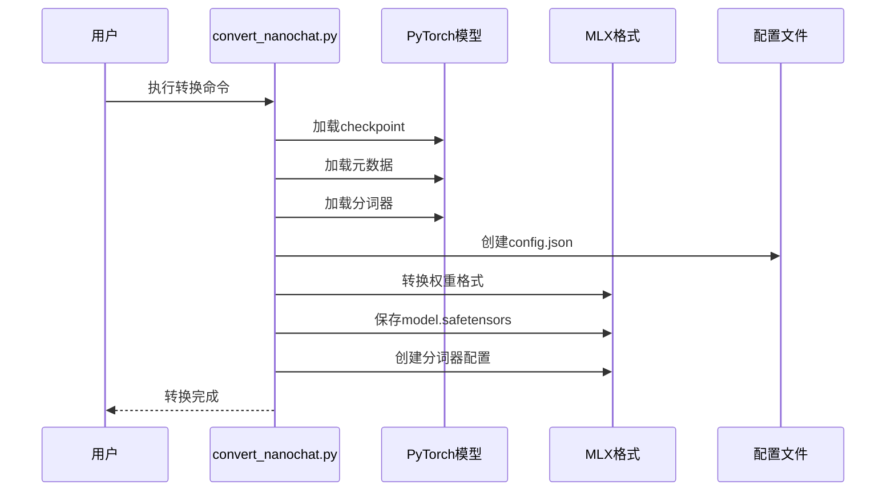
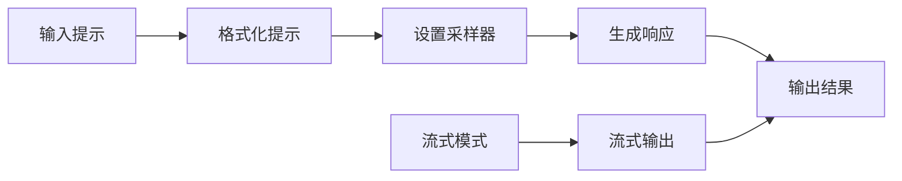
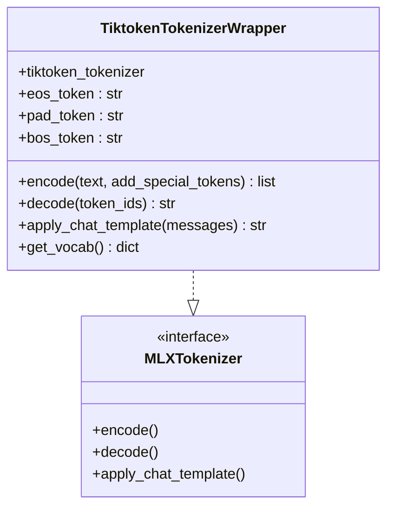
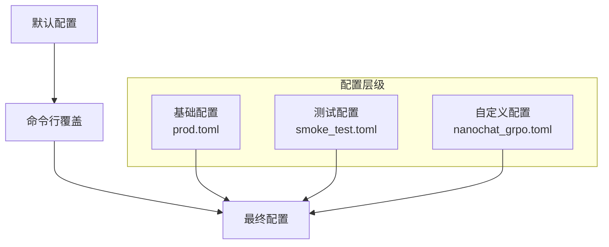
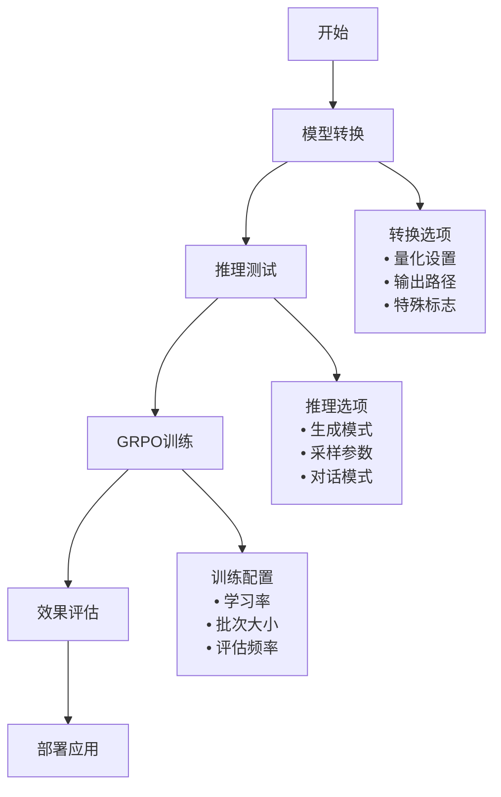

# 模型转换与推理

<cite>
**本文档中引用的文件**
- [utils/convert_model.py](file://utils/convert_model.py)
- [convert_nanochat.py](file://convert_nanochat.py)
- [utils/inference.py](file://utils/inference.py)
- [configs/nanochat_d32.toml](file://configs/nanochat_d32.toml)
- [configs/nanochat_grpo.toml](file://configs/nanochat_grpo.toml)
- [configs/prod.toml](file://configs/prod.toml)
- [configs/smoke_test.toml](file://configs/smoke_test.toml)
- [README.md](file://README.md)
- [utils/README.md](file://utils/README.md)
- [mlx-grpo.py](file://mlx-grpo.py)
</cite>

## 目录
1. [简介](#简介)
2. [项目结构概览](#项目结构概览)
3. [模型转换功能](#模型转换功能)
4. [推理功能](#推理功能)
5. [配置管理](#配置管理)
6. [工具集成与使用流程](#工具集成与使用流程)
7. [性能优化建议](#性能优化建议)
8. [故障排除指南](#故障排除指南)
9. [总结](#总结)

## 简介

MLX-GRPO是一个专为Apple Silicon设计的大语言模型训练框架，提供了完整的模型转换与推理工具集。该系统支持将任何Hugging Face模型转换为MLX格式，并提供多种推理模式来测试和使用这些模型。

核心特性：
- **通用模型支持**：支持数千个Hugging Face模型的转换
- **多级量化**：支持2位、4位和8位量化以优化内存使用
- **多种推理模式**：单次生成、交互式聊天、流式输出
- **特殊模型处理**：针对nanochat等特殊模型的专门转换脚本
- **兼容性保证**：通过tiktoken分词器兼容性处理

## 项目结构概览



**图表来源**
- [utils/convert_model.py](file://utils/convert_model.py#L1-L237)
- [convert_nanochat.py](file://convert_nanochat.py#L1-L116)
- [utils/inference.py](file://utils/inference.py#L1-L348)

**章节来源**
- [README.md](file://README.md#L1-L180)
- [utils/README.md](file://utils/README.md#L1-L531)

## 模型转换功能

### 通用模型转换器 (convert_model.py)

通用模型转换器是系统的核心组件，能够将任何Hugging Face模型转换为MLX格式。

#### 核心功能特性



**图表来源**
- [utils/convert_model.py](file://utils/convert_model.py#L162-L193)

#### 量化支持

系统支持三种量化级别：

| 量化类型 | 内存节省 | 质量损失 | 推荐场景 |
|----------|----------|----------|----------|
| 2位量化 | 75% | 显著 | 极限内存环境 |
| 4位量化 | 50% | 轻微 | 生产环境推荐 |
| 8位量化 | 25% | 很小 | 高精度需求 |

#### 特殊模型处理

**GPT-2风格模型修复**：
系统自动检测GPT-2风格的模型重打包，并启用宽松加载机制，允许缺失或额外的权重被静默忽略。

**章节来源**
- [utils/convert_model.py](file://utils/convert_model.py#L162-L193)

### nanochat专用转换器 (convert_nanochat.py)

nanochat转换器专门处理PyTorch格式的nanochat模型，这是系统的一个独特功能。

#### 转换流程



**图表来源**
- [convert_nanochat.py](file://convert_nanochat.py#L15-L115)

#### 关键转换步骤

1. **检查点加载**：从PyTorch格式加载模型权重
2. **元数据提取**：解析模型配置信息
3. **分词器处理**：提取和转换分词器数据
4. **权重映射**：将PyTorch命名空间映射到MLX格式
5. **配置生成**：创建符合nanochat架构的配置文件

**章节来源**
- [convert_nanochat.py](file://convert_nanochat.py#L15-L115)

## 推理功能

### 多模式推理系统

推理工具提供四种主要模式来满足不同的使用需求：

#### 单次生成模式

适用于简单的文本生成任务，支持系统提示和采样参数调整。



**图表来源**
- [utils/inference.py](file://utils/inference.py#L145-L219)

#### 交互式聊天模式

提供完整的对话界面，支持会话历史管理和实时交互。

#### 流式输出模式

实时显示生成的令牌，提供即时反馈体验。

#### 批量生成模式

支持对多个提示并行生成响应。

**章节来源**
- [utils/inference.py](file://utils/inference.py#L145-L348)

### 采样参数控制

| 参数 | 默认值 | 描述 | 使用场景 |
|------|--------|------|----------|
| temperature | 0.7 | 控制随机性 | 0.0=确定性，0.7=平衡，1.0=创造性 |
| top_p | 0.95 | 核采样阈值 | 控制词汇选择范围 |
| repetition_penalty | 1.0 | 重复惩罚系数 | 减少重复内容 |
| max_tokens | 512 | 最大生成长度 | 根据任务调整 |

### 分词器兼容性处理

系统通过`tiktoken`包装器解决特殊分词器的兼容性问题：



**图表来源**
- [mlx-grpo.py](file://mlx-grpo.py#L133-L226)

**章节来源**
- [mlx-grpo.py](file://mlx-grpo.py#L133-L226)

## 配置管理

### 配置文件体系

系统采用多层次配置管理：



**图表来源**
- [configs/prod.toml](file://configs/prod.toml#L1-L40)
- [configs/smoke_test.toml](file://configs/smoke_test.toml#L1-L38)

### 主要配置模板

#### 生产环境配置 (prod.toml)

适合完整训练流程，提供最佳质量和稳定性：

- 学习率：1e-6（保守）
- 批次大小：1
- 生成数量：16
- 训练样本：2000

#### 快速测试配置 (smoke_test.toml)

用于快速迭代和调试：

- 训练样本：50（极小）
- 生成数量：2（最小）
- 评估频率：高

#### nanochat专用配置

针对nanochat模型优化的配置：

- 层数：32层（更大模型）
- 隐藏维度：2048
- 量化禁用：避免敏感性

**章节来源**
- [configs/prod.toml](file://configs/prod.toml#L1-L40)
- [configs/smoke_test.toml](file://configs/smoke_test.toml#L1-L38)
- [configs/nanochat_grpo.toml](file://configs/nanochat_grpo.toml#L1-L45)

## 工具集成与使用流程

### 完整工作流程



### 命令行示例

#### 模型转换示例

```bash
# 基础转换（4位量化）
uv run python utils/convert_model.py \
    --hf-path mistralai/Mistral-7B-Instruct-v0.3 \
    --quantize

# 高质量转换（8位量化）
uv run python utils/convert_model.py \
    --hf-path Qwen/Qwen2.5-7B-Instruct \
    --quantize \
    --bits 8

# 特殊模型处理
uv run python utils/convert_model.py \
    --hf-path Qwen/Qwen2.5-7B-Instruct \
    --trust-remote-code \
    --eos-token "" \
    --quantize
```

#### 推理测试示例

```bash
# 单次生成
uv run python utils/inference.py \
    --model mlx_model \
    --prompt "解释量子计算的基本原理"

# 交互式聊天
uv run python utils/inference.py \
    --model mlx_model \
    --chat \
    --system "你是一位经验丰富的AI助手"

# 流式输出
uv run python utils/inference.py \
    --model mlx_model \
    --prompt "写一个关于人工智能的短故事" \
    --stream
```

#### 训练配置示例

```bash
# 使用自定义配置
uv run mlx-grpo.py \
    --config configs/prod.toml \
    --set model_name="models/custom-model-mlx" \
    --set learning_rate=5e-7

# 快速测试
uv run mlx-grpo.py \
    --config configs/smoke_test.toml \
    --set max_train_samples=100
```

**章节来源**
- [utils/README.md](file://utils/README.md#L265-L331)

## 性能优化建议

### 内存优化策略

1. **量化优先**：始终使用4位量化进行训练
2. **批次调优**：根据GPU内存调整批次大小
3. **梯度累积**：在内存受限时增加累积步数

### 生成性能优化

1. **温度调节**：平衡质量和速度
2. **top_p设置**：减少不必要的词汇探索
3. **流式输出**：对于长文本生成提升用户体验

### 系统要求

- **macOS版本**：15+（推荐）或14+
- **内存限制**：大型模型需要增加wired_limit_mb
- **存储空间**：量化后模型显著减小存储需求

## 故障排除指南

### 常见转换问题

#### 模型不兼容错误
**症状**：FileNotFoundError异常
**解决方案**：
- 检查Hugging Face模型路径
- 确认模型格式为标准transformers格式
- 尝试预转换的MLX模型

#### 内存不足问题
**症状**：OOM错误或转换失败
**解决方案**：
- 使用更激进的量化（2位或4位）
- 增加系统内存限制
- 分批处理大型模型

#### 分词器兼容性
**症状**：分词器加载失败
**解决方案**：
- 添加`--trust-remote-code`标志
- 检查特殊token配置
- 使用tiktoken包装器

### 推理问题诊断

#### 模型加载失败
**症状**：无法加载转换后的模型
**解决方案**：
- 验证模型路径正确性
- 检查量化设置匹配
- 确认分词器文件存在

#### 生成质量问题
**症状**：输出不连贯或重复
**解决方案**：
- 调整温度参数
- 启用重复惩罚
- 检查系统提示设置

**章节来源**
- [utils/convert_model.py](file://utils/convert_model.py#L192-L221)
- [utils/README.md](file://utils/README.md#L332-L384)

## 总结

MLX-GRPO的模型转换与推理工具集提供了完整的解决方案，从通用模型转换到特殊模型处理，从基础推理到高级训练配置。系统的主要优势包括：

1. **广泛的兼容性**：支持数千个Hugging Face模型
2. **灵活的量化选项**：适应不同硬件条件
3. **多样化的推理模式**：满足各种使用场景
4. **完善的配置管理**：支持快速实验和生产部署
5. **robust的错误处理**：提供详细的故障排除指导

通过合理使用这些工具，用户可以高效地在Apple Silicon平台上进行大语言模型的开发、测试和部署，充分发挥MLX框架的性能优势。