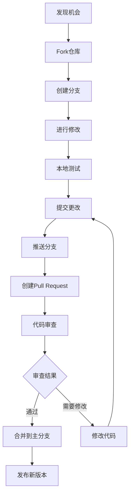

# 贡献指南与许可证

<cite>
**本文档中引用的文件**
- [README.md](file://README.md)
- [pyproject.toml](file://pyproject.toml)
- [NANOCHAT_GRPO_GUIDE.md](file://NANOCHAT_GRPO_GUIDE.md)
- [QUICK_START.md](file://QUICK_START.md)
- [utils/README.md](file://utils/README.md)
- [configs/prod.toml](file://configs/prod.toml)
- [configs/smoke_test.toml](file://configs/smoke_test.toml)
- [utils/convert_model.py](file://utils/convert_model.py)
</cite>

## 目录
1. [项目简介](#项目简介)
2. [MIT许可证概述](#mit许可证概述)
3. [如何贡献项目](#如何贡献项目)
4. [代码风格与规范](#代码风格与规范)
5. [测试要求](#测试要求)
6. [文档更新规范](#文档更新规范)
7. [问题报告流程](#问题报告流程)
8. [拉取请求指南](#拉取请求指南)
9. [开发环境设置](#开发环境设置)
10. [社区支持与联系方式](#社区支持与联系方式)
11. [开源最佳实践](#开源最佳实践)

## 项目简介

MLX-GRPO是一个基于Apple MLX框架的大型语言模型训练框架，专门设计用于在Apple Silicon上运行。该项目实现了基于组的相对策略优化（GRPO），采用思维链提示结构，包含数据集准备、奖励函数定义和GRPO训练等完整管道。

### 核心特性
- **纯MLX集成**：仅在Apple Silicon上通过MLX‑LM和Metal后端运行
- **GRPO训练管道**：实现多种奖励函数优化思维链响应
- **通用模型支持**：内置转换工具支持任何Hugging Face模型
- **数据集预处理**：使用GSM8K数据集测试多步推理
- **现代Python打包**：通过`pyproject.toml`管理依赖关系
- **推理工具**：支持生成、聊天和流式模式测试模型

**章节来源**
- [README.md](file://README.md#L1-L50)
- [pyproject.toml](file://pyproject.toml#L1-L13)

## MIT许可证概述

### 许可证条款

本项目采用MIT许可证，这是一个宽松的开源许可证，允许用户在几乎不受限制的情况下使用、修改和分发代码。

#### 用户权利
- **使用权限**：可以在商业和非商业项目中自由使用代码
- **修改权限**：可以修改源代码以满足特定需求
- **分发权限**：可以重新分发原始或修改版本
- **私用权限**：可以完全私有化使用

#### 用户义务
- **保留版权声明**：必须在所有副本中包含原始许可证声明
- **保留许可证声明**：必须包含MIT许可证文本
- **免责声明**：软件按"原样"提供，不提供任何担保

### 法律含义

MIT许可证的核心特点是其简洁性和宽松性：
- 不要求贡献者提供额外的专利授权
- 不限制衍生作品的再分发
- 不要求源代码公开（除非复制原始许可证）
- 免费提供给用户使用

**章节来源**
- [README.md](file://README.md#L173-L179)

## 如何贡献项目

### 贡献方式

欢迎各种形式的贡献，包括但不限于：

#### 代码贡献
- 新功能开发
- Bug修复
- 性能优化
- 算法改进

#### 文档贡献
- 使用文档完善
- API文档更新
- 示例代码添加
- 教程编写

#### 社区贡献
- 问题反馈
- 功能建议
- 社区讨论
- 技术支持

### 贡献流程概览



**图表来源**
- [README.md](file://README.md#L173-L179)

## 代码风格与规范

### Python代码规范

#### 基本格式要求
- 使用PEP 8编码标准
- 行长度不超过88字符
- 函数和类之间使用两个空行分隔
- 导入语句按标准库、第三方库、本地模块顺序分组

#### 命名约定
- 变量和函数名使用小写字母和下划线
- 类名使用驼峰命名法
- 常量名使用大写字母和下划线
- 私有成员以单下划线开头

#### 注释规范
- 每个函数应有docstring注释
- 复杂逻辑需要添加行内注释
- 使用TODO和FIXME标记待办事项

### 配置文件规范

#### TOML配置文件
- 使用标准的TOML语法
- 参数名称使用小写字母和下划线
- 提供有意义的默认值
- 添加必要的注释说明

#### 示例配置结构
```toml
# 训练参数
learning_rate = 1e-6
num_generations = 8
max_new_tokens = 128

# 系统设置
seed = 0
output_dir = "outputs/my_run"
```

**章节来源**
- [configs/prod.toml](file://configs/prod.toml#L1-L40)
- [configs/smoke_test.toml](file://configs/smoke_test.toml#L1-L38)

## 测试要求

### 单元测试

#### 测试覆盖率要求
- 核心算法模块测试覆盖率不低于80%
- 新增功能必须包含单元测试
- 边界条件和异常情况需要测试

#### 测试框架
- 使用pytest作为主要测试框架
- 测试文件命名为`test_*.py`
- 使用fixtures管理测试数据

### 集成测试

#### 功能测试
- 完整训练流程测试
- 模型转换功能验证
- 推理工具测试

#### 性能测试
- 内存使用监控
- 训练速度基准测试
- 并发处理能力测试

### 测试执行

```bash
# 运行所有测试
pytest

# 运行特定测试文件
pytest tests/test_training.py

# 生成测试覆盖率报告
pytest --cov=mlx_grpo tests/
```

## 文档更新规范

### 文档类型

#### API文档
- 函数和方法的详细说明
- 参数类型和返回值描述
- 使用示例代码
- 错误处理说明

#### 用户指南
- 快速开始教程
- 高级配置说明
- 最佳实践建议
- 故障排除指南

#### 开发文档
- 架构设计说明
- 开发环境设置
- 贡献指南
- 发布流程

### 文档质量标准

#### 内容准确性
- 代码示例必须可运行
- 配置参数说明准确
- 版本兼容性明确标注

#### 可读性要求
- 使用清晰的语言
- 提供足够的上下文
- 包含实际使用场景

#### 维护性考虑
- 定期更新过时信息
- 保持文档结构一致性
- 及时修复错误链接

**章节来源**
- [utils/README.md](file://utils/README.md#L1-L50)
- [QUICK_START.md](file://QUICK_START.md#L1-L50)

## 问题报告流程

### 问题分类

#### Bug报告
- 描述问题的具体步骤
- 提供预期行为和实际行为
- 包含系统环境信息
- 提供重现问题的最小示例

#### 功能请求
- 说明功能需求背景
- 描述期望的功能行为
- 提供可能的实现方案
- 评估对现有功能的影响

#### 性能问题
- 提供性能基准数据
- 说明硬件配置信息
- 描述性能瓶颈现象
- 提出优化建议

### 问题报告模板

```markdown
## 问题描述
简要描述遇到的问题

## 环境信息
- OS: [操作系统版本]
- Python版本: [Python版本]
- MLX版本: [MLX版本]
- MLX-LM版本: [MLX-LM版本]

## 重现步骤
1. 执行命令: [具体命令]
2. 观察到的现象: [具体现象]
3. 错误信息: [完整错误信息]

## 期望行为
描述期望的正确行为

## 实际行为
描述实际观察到的行为

## 附加信息
- 相关配置文件
- 日志输出
- 截图或视频
```

### 问题优先级

| 优先级 | 描述 | 响应时间 |
|--------|------|----------|
| P0 - 严重 | 导致程序崩溃或数据丢失 | 24小时内 |
| P1 - 高 | 主要功能无法使用 | 3天内 |
| P2 - 中 | 功能受限但可绕过 | 1周内 |
| P3 - 低 | 界面或文档问题 | 1个月内 |

## 拉取请求指南

### PR创建流程

#### 1. 准备阶段
```bash
# Fork项目仓库
# 克隆你的fork
git clone https://github.com/YOUR_USERNAME/MLX-GRPO.git
cd MLX-GRPO

# 创建功能分支
git checkout -b feature/your-feature-name

# 设置上游仓库
git remote add upstream https://github.com/Doriandarko/MLX-GRPO.git
```

#### 2. 开发阶段
```bash
# 进行代码修改
# 添加测试
# 更新文档

# 提交更改
git add .
git commit -m "feat: 添加新功能描述"

# 推送分支
git push origin feature/your-feature-name
```

#### 3. PR创建
- 标题使用清晰的描述性语言
- 在描述中详细说明变更内容
- 关联相关的issue编号
- 添加适当的标签

### PR审查标准

#### 代码质量
- 符合项目编码规范
- 无明显性能问题
- 错误处理完善
- 注释清晰准确

#### 测试覆盖
- 新功能包含相应测试
- 现有测试通过
- 性能影响可接受

#### 文档更新
- API文档同步更新
- 用户指南适当修改
- 变更日志记录

### 合并要求

#### 自动检查
- CI/CD流水线通过
- 代码覆盖率达标
- 静态分析无警告

#### 人工审查
- 至少一名维护者批准
- 无重大安全风险
- 向后兼容性良好

**章节来源**
- [README.md](file://README.md#L173-L179)

## 开发环境设置

### 环境要求

#### 系统要求
- macOS with Apple Silicon (M1/M2/M3/M4)
- Python 3.11或更高版本
- uv包管理器

#### 依赖安装
```bash
# 克隆仓库
git clone https://github.com/Doriandarko/MLX-GRPO.git
cd MLX-GRPO

# 创建虚拟环境
python3 -m venv venv
source venv/bin/activate

# 安装uv
pip install uv

# 安装依赖
uv sync
```

### 开发工具配置

#### 代码编辑器设置
- VS Code推荐配置
- Python扩展启用
- Pylance语言服务器
- Black格式化工具

#### Git配置
```bash
# 设置用户名和邮箱
git config --global user.name "Your Name"
git config --global user.email "your.email@example.com"

# 设置Git hooks
pre-commit install
```

### 调试和测试

#### 调试配置
```bash
# 使用调试模式运行
uv run python -m pdb mlx-grpo.py --config configs/smoke_test.toml

# 启用详细日志
export MLX_GRPO_LOG_LEVEL=DEBUG
```

#### 性能分析
```bash
# 使用cProfile分析性能
uv run python -m cProfile -o profile.stats mlx-grpo.py --config configs/smoke_test.toml

# 使用memory_profiler监控内存
uv run python -m memory_profiler mlx-grpo.py --config configs/smoke_test.toml
```

**章节来源**
- [README.md](file://README.md#L25-L50)
- [QUICK_START.md](file://QUICK_START.md#L1-L30)

## 社区支持与联系方式

### 获取帮助的方式

#### 官方渠道
- **GitHub Issues**: 报告bug和功能请求
- **Discussions**: 技术讨论和问答
- **Documentation**: 完整的使用指南

#### 社区资源
- **官方文档**: [README.md](file://README.md)
- **快速开始**: [QUICK_START.md](file://QUICK_START.md)
- **实用工具**: [utils/README.md](file://utils/README.md)

### 贡献者支持

#### 新手友好
- 提供详细的入门指南
- 欢迎第一次贡献者
- 提供mentor指导
- 维护友好的社区氛围

#### 高级贡献者
- 参与架构决策
- 贡献核心功能
- 维护测试套件
- 编写技术文档

### 社区活动

#### 定期活动
- 月度开发会议
- 季度功能规划
- 年度回顾总结

#### 贡献认可
- 贡献者名单展示
- 优秀贡献者奖励
- 技术博客分享机会

**章节来源**
- [README.md](file://README.md#L173-L179)

## 开源最佳实践

### 项目治理

#### 维护者职责
- 代码审查和质量控制
- 版本发布管理
- 社区沟通协调
- 长期发展规划

#### 决策流程
- 重大变更需要讨论和投票
- 小型改进可由维护者直接决定
- 社区意见充分考虑
- 透明的决策过程

### 质量保证

#### 代码质量
- 持续集成和部署
- 自动化测试覆盖
- 代码审查标准
- 性能基准监控

#### 文档质量
- 及时更新文档
- 提供示例代码
- 解决常见问题
- 社区知识共享

### 可持续发展

#### 社区建设
- 建立包容性文化
- 支持多样化的贡献
- 提供学习资源
- 鼓励长期参与

#### 技术演进
- 跟踪最新技术趋势
- 保持向后兼容性
- 渐进式功能演进
- 生态系统整合

### 最佳实践总结

1. **透明度**：保持开发过程和决策的透明
2. **包容性**：欢迎来自不同背景的贡献者
3. **质量优先**：平衡功能开发和代码质量
4. **社区驱动**：重视社区反馈和需求
5. **持续改进**：不断优化开发流程和工具

通过遵循这些最佳实践，MLX-GRPO项目能够持续健康发展，为机器学习社区提供高质量的工具和资源。

**章节来源**
- [README.md](file://README.md#L1-L180)
- [NANOCHAT_GRPO_GUIDE.md](file://NANOCHAT_GRPO_GUIDE.md#L1-L50)