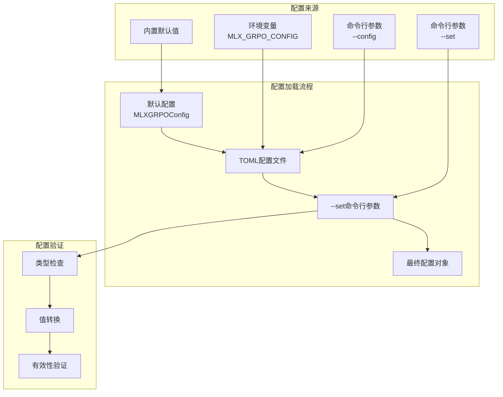
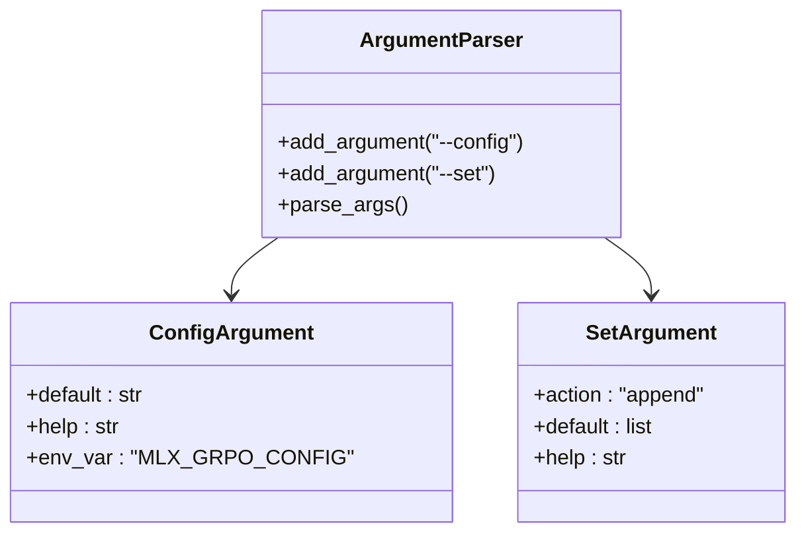
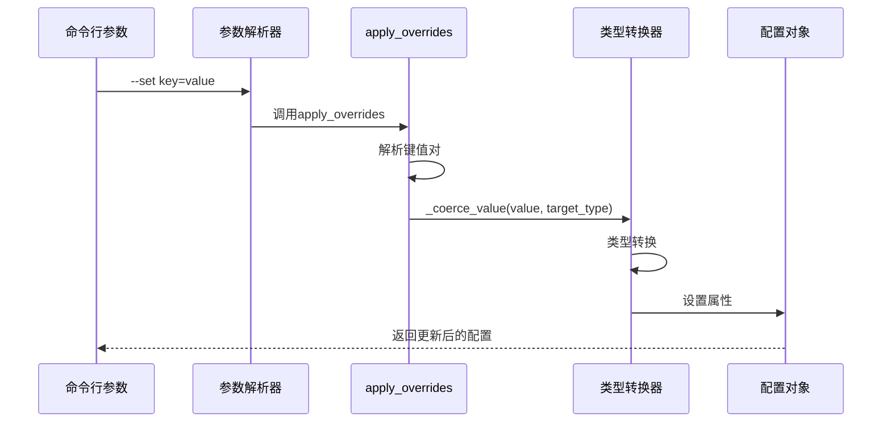
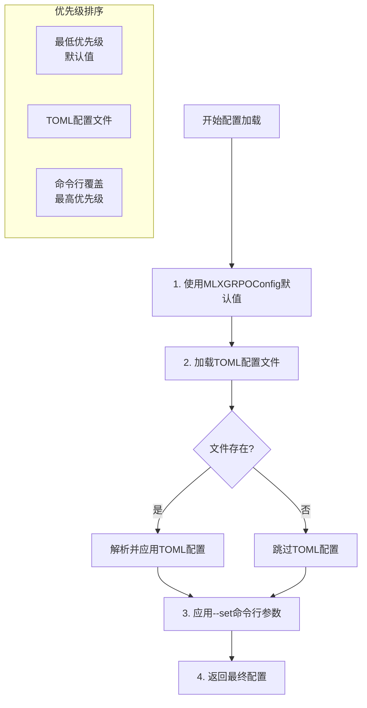
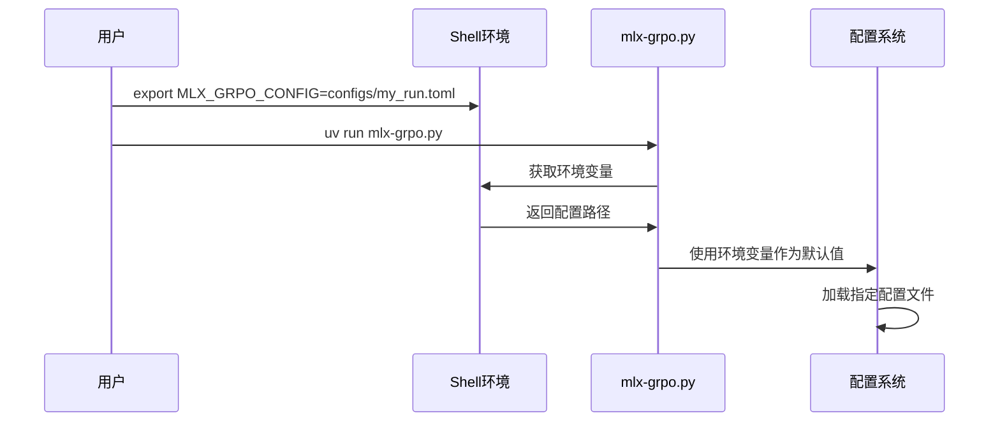

# 运行时配置覆盖

<cite>
**本文档中引用的文件**
- [mlx-grpo.py](file://mlx-grpo.py)
- [configs/smoke_test.toml](file://configs/smoke_test.toml)
- [configs/prod.toml](file://configs/prod.toml)
- [configs/medium.toml](file://configs/medium.toml)
- [configs/ultra_light.toml](file://configs/ultra_light.toml)
- [README.md](file://README.md)
- [QUICK_START.md](file://QUICK_START.md)
- [utils/README.md](file://utils/README.md)
</cite>

## 目录
1. [简介](#简介)
2. [配置系统架构](#配置系统架构)
3. [命令行参数机制](#命令行参数机制)
4. [apply_overrides函数详解](#apply_overrides函数详解)
5. [--set参数语法格式](#--set参数语法格式)
6. [支持的配置项类型](#支持的配置项类型)
7. [配置优先级体系](#配置优先级体系)
8. [环境变量MLX_GRPO_CONFIG](#环境变量mlx_grpo_config)
9. [实际使用示例](#实际使用示例)
10. [故障排除指南](#故障排除指南)
11. [最佳实践建议](#最佳实践建议)

## 简介

MLX-GRPO项目提供了一个灵活的配置系统，允许用户通过命令行参数在运行时动态覆盖配置文件中的设置。这种设计使得超参数调优、快速实验和生产部署变得更加便捷，无需修改TOML配置文件即可调整模型行为。

核心特性包括：
- 基于`apply_overrides`函数的动态配置覆盖机制
- 支持多种数据类型的自动类型转换
- 配置优先级明确的加载顺序
- 环境变量支持的外部配置注入

## 配置系统架构

MLX-GRPO的配置系统采用分层架构设计，确保配置的灵活性和可维护性：



**图表来源**
- [mlx-grpo.py](file://mlx-grpo.py#L1140-L1175)
- [mlx-grpo.py](file://mlx-grpo.py#L380-L409)

**章节来源**
- [mlx-grpo.py](file://mlx-grpo.py#L346-L378)
- [mlx-grpo.py](file://mlx-grpo.py#L1140-L1175)

## 命令行参数机制

MLX-GRPO使用Python的`argparse`模块处理命令行参数，提供了两个主要的配置入口：

### 核心参数定义



**图表来源**
- [mlx-grpo.py](file://mlx-grpo.py#L1140-L1155)

### 参数处理流程

配置系统按照以下优先级顺序处理参数：

1. **默认值**：从`MLXGRPOConfig`数据类初始化
2. **TOML配置**：从指定的配置文件加载
3. **命令行覆盖**：通过`--set`参数动态调整

**章节来源**
- [mlx-grpo.py](file://mlx-grpo.py#L1140-L1175)

## apply_overrides函数详解

`apply_overrides`函数是配置系统的核心组件，负责解析和应用命令行参数中的配置覆盖：

### 函数签名与工作原理



**图表来源**
- [mlx-grpo.py](file://mlx-grpo.py#L380-L409)

### 关键实现细节

函数的核心逻辑包括：

1. **参数验证**：检查每个`--set`参数是否包含`=`符号
2. **键值分离**：提取配置键和对应的值
3. **类型推断**：根据`MLXGRPOConfig.__annotations__`确定目标类型
4. **安全转换**：尝试类型转换并提供回退机制
5. **属性设置**：使用`setattr`更新配置对象

**章节来源**
- [mlx-grpo.py](file://mlx-grpo.py#L380-L409)

## --set参数语法格式

### 基本语法结构

`--set`参数遵循严格的语法格式，确保配置的正确性和一致性：

| 组件 | 描述 | 示例 | 必需性 |
|------|------|------|--------|
| 键名 | 配置项的名称 | `learning_rate` | 必需 |
| 等号 | 分隔符 | `=` | 必需 |
| 值 | 配置项的值 | `5e-7` | 必需 |
| 空格 | 可选的空白字符 | ` ` | 可选 |

### 有效语法示例

```bash
# 基本语法
--set learning_rate=5e-7
--set num_generations=32
--set temperature=0.8

# 多个覆盖（重复使用--set）
--set learning_rate=1e-6 --set num_generations=64 --set temperature=0.7

# 布尔值处理
--set quantize_for_rollouts=true
--set use_compile=false

# 字符串值（需要引号）
--set model_name="Qwen/Qwen2.5-1.5B-Instruct"
```

### 无效语法示例

```bash
# 缺少等号
--set learning_rate 5e-7  # 错误

# 键不存在
--set nonexistent_key=value  # 警告但接受

# 类型错误
--set num_generations="32"  # 虽然可以，但可能影响性能
```

**章节来源**
- [mlx-grpo.py](file://mlx-grpo.py#L380-L409)

## 支持的配置项类型

MLX-GRPO配置系统支持多种数据类型，每种类型都有相应的类型转换机制：

### 浮点型配置项

| 配置项 | 数据类型 | 默认值 | 用途描述 |
|--------|----------|--------|----------|
| `learning_rate` | `float` | `1e-6` | 优化器学习率 |
| `warmup_ratio` | `float` | `0.1` | 学习率预热比例 |
| `max_grad_norm` | `float` | `0.1` | 梯度裁剪阈值 |
| `clip_eps` | `float` | `0.2` | PPO裁剪参数 |
| `kl_coeff` | `float` | `0.0` | KL散度系数 |
| `adam_beta1` | `float` | `0.9` | Adam优化器β₁参数 |
| `adam_beta2` | `float` | `0.999` | Adam优化器β₂参数 |
| `weight_decay` | `float` | `0.0` | 权重衰减系数 |
| `temperature` | `float` | `0.7` | 采样温度 |

### 整型配置项

| 配置项 | 数据类型 | 默认值 | 用途描述 |
|--------|----------|--------|----------|
| `batch_size` | `int` | `1` | 批次大小 |
| `gradient_accumulation_steps` | `int` | `4` | 梯度累积步数 |
| `num_epochs` | `int` | `1` | 训练轮数 |
| `max_train_samples` | `int` | `0` | 最大训练样本数 |
| `num_generations` | `int` | `64` | 生成响应数量 |
| `max_prompt_length` | `int` | `512` | 最大提示长度 |
| `max_completion_length` | `int` | `1024` | 最大完成长度 |
| `max_new_tokens` | `int` | `512` | 最大新生成标记数 |
| `seed` | `int` | `0` | 随机种子 |

### 布尔型配置项

| 配置项 | 数据类型 | 默认值 | 有效值 |
|--------|----------|--------|--------|
| `quantize_for_rollouts` | `bool` | `True` | `true`, `false`, `1`, `0`, `yes`, `no`, `on`, `off` |
| `use_compile` | `bool` | `True` | `true`, `false`, `1`, `0`, `yes`, `no`, `on`, `off` |
| `log_jsonl` | `bool` | `True` | `true`, `false`, `1`, `0`, `yes`, `no`, `on`, `off` |

### 字符串型配置项

| 配置项 | 数据类型 | 默认值 | 用途描述 |
|--------|----------|--------|----------|
| `model_name` | `str` | `"Qwen/Qwen2.5-1.5B-Instruct"` | 模型名称或路径 |
| `output_dir` | `str` | `"outputs/Qwen-1.5B-MLX-GRPO"` | 输出目录 |
| `run_name` | `str` | `"Qwen-1.5B-MLX-GRPO-gsm8k"` | 运行名称 |
| `lr_scheduler_type` | `str` | `"cosine"` | 学习率调度器类型 |

### 高级配置项

| 配置项 | 数据类型 | 默认值 | 用途描述 |
|--------|----------|--------|----------|
| `eval_every_updates` | `int` | `25` | 评估间隔更新次数 |
| `eval_subset_size` | `int` | `200` | 评估子集大小 |
| `eval_max_new_tokens` | `int` | `128` | 评估最大新标记数 |
| `save_steps` | `int` | `100` | 保存步骤间隔 |
| `eval_steps` | `int` | `50` | 评估步骤间隔 |
| `eval_samples` | `int` | `200` | 评估样本数量 |

**章节来源**
- [mlx-grpo.py](file://mlx-grpo.py#L346-L378)
- [mlx-grpo.py](file://mlx-grpo.py#L380-L409)

## 配置优先级体系

MLX-GRPO采用明确的配置优先级体系，确保配置的可控性和可预测性：



**图表来源**
- [mlx-grpo.py](file://mlx-grpo.py#L1140-L1175)

### 优先级规则详解

1. **默认值优先级**（最低）
   - 来自`MLXGRPOConfig`数据类的初始值
   - 提供系统的最小可用配置

2. **TOML配置文件优先级**
   - 从`--config`参数指定的文件加载
   - 支持扁平键或`[mlx_grpo]`表结构
   - 文件不存在时跳过而不报错

3. **命令行覆盖优先级**（最高）
   - 通过`--set`参数逐个应用
   - 支持多次重复调用
   - 提供最精确的配置控制

### 实际应用示例

```bash
# 假设配置文件内容：
# learning_rate = 1e-6
# num_generations = 64

# 命令行执行：
# uv run mlx-grpo.py --config configs/default.toml --set learning_rate=5e-7 --set num_generations=32

# 最终配置：
# learning_rate = 5e-7  (被命令行覆盖)
# num_generations = 32  (被命令行覆盖)
# 其他配置保持TOML文件中的值
```

**章节来源**
- [mlx-grpo.py](file://mlx-grpo.py#L1140-L1175)

## 环境变量MLX_GRPO_CONFIG

### 环境变量功能

`MLX_GRPO_CONFIG`环境变量提供了配置文件路径的外部注入机制，简化了配置管理：



**图表来源**
- [mlx-grpo.py](file://mlx-grpo.py#L1140-L1155)

### 使用场景

1. **开发环境配置**
   ```bash
   export MLX_GRPO_CONFIG=configs/dev.toml
   uv run mlx-grpo.py  # 自动使用dev配置
   ```

2. **测试环境配置**
   ```bash
   export MLX_GRPO_CONFIG=configs/test.toml
   uv run mlx-grpo.py --set learning_rate=5e-7  # 在test基础上微调
   ```

3. **生产环境配置**
   ```bash
   export MLX_GRPO_CONFIG=configs/prod.toml
   uv run mlx-grpo.py --set seed=42  # 生产环境固定随机种子
   ```

### 优先级说明

环境变量仅在以下情况下生效：
- `--config`参数未在命令行中指定
- 环境变量值为非空字符串

当同时使用环境变量和命令行参数时，命令行参数具有更高优先级。

**章节来源**
- [mlx-grpo.py](file://mlx-grpo.py#L1140-L1155)
- [README.md](file://README.md#L87-L132)

## 实际使用示例

### 基础超参数调优

```bash
# 1. 尝试不同的学习率
uv run mlx-grpo.py --config configs/default.toml --set learning_rate=5e-7
uv run mlx-grpo.py --config configs/default.toml --set learning_rate=1e-6
uv run mlx-grpo.py --config configs/default.toml --set learning_rate=5e-6

# 2. 调整生成数量以平衡质量和速度
uv run mlx-grpo.py --config configs/default.toml --set num_generations=16
uv run mlx-grpo.py --config configs/default.toml --set num_generations=64
uv run mlx-grpo.py --config configs/default.toml --set num_generations=128

# 3. 修改采样温度影响输出多样性
uv run mlx-grpo.py --config configs/default.toml --set temperature=0.5
uv run mlx-grpo.py --config configs/default.toml --set temperature=0.8
uv run mlx-grpo.py --config configs/default.toml --set temperature=1.0
```

### 复杂实验设置

```bash
# 1. 参数扫描实验
for lr in 1e-6 5e-7 1e-7; do
    for gen in 16 32 64; do
        uv run mlx-grpo.py --config configs/default.toml \
            --set learning_rate=$lr \
            --set num_generations=$gen \
            --set output_dir="outputs/exp_lr${lr}_gen${gen}"
    done
done

# 2. 模型对比实验
uv run mlx-grpo.py --config configs/default.toml \
    --set model_name="mlx-community/Qwen2.5-3B-Instruct-4bit" \
    --set output_dir="outputs/qwen3b"

uv run mlx-grpo.py --config configs/default.toml \
    --set model_name="mlx-community/Mistral-7B-Instruct-4bit" \
    --set output_dir="outputs/mistral7b"

# 3. 固定随机种子的可重现实验
uv run mlx-grpo.py --config configs/default.toml \
    --set seed=42 \
    --set learning_rate=5e-7 \
    --set num_generations=32
```

### 配置文件模板

```bash
# 创建实验配置脚本
cat > run_experiments.sh << 'EOF'
#!/bin/bash

# 基础配置
BASE_CONFIG="configs/default.toml"
OUTPUT_DIR="outputs/experiments"

# 实验1：学习率扫描
echo "Running learning rate sweep..."
for lr in 1e-6 5e-7 1e-7; do
    echo "Testing learning rate: $lr"
    uv run mlx-grpo.py --config "$BASE_CONFIG" \
        --set learning_rate=$lr \
        --set output_dir="${OUTPUT_DIR}/lr_${lr}" \
        --set run_name="lr_${lr}"
done

# 实验2：生成数量影响
echo "Running generation count sweep..."
for gen in 8 16 32 64; do
    echo "Testing generation count: $gen"
    uv run mlx-grpo.py --config "$BASE_CONFIG" \
        --set num_generations=$gen \
        --set output_dir="${OUTPUT_DIR}/gen_${gen}" \
        --set run_name="gen_${gen}"
done

echo "Experiments completed!"
EOF

chmod +x run_experiments.sh
./run_experiments.sh
```

### 生产就绪配置

```bash
# 生产环境配置示例
export MLX_GRPO_CONFIG=configs/production.toml

# 启动长时间训练
uv run mlx-grpo.py \
    --set learning_rate=1e-6 \
    --set num_generations=64 \
    --set max_new_tokens=512 \
    --set temperature=0.7 \
    --set seed=42 \
    --set output_dir="outputs/final_training"

# 监控训练过程
tail -f outputs/final_training/training_log.jsonl
```

**章节来源**
- [README.md](file://README.md#L87-L132)
- [QUICK_START.md](file://QUICK_START.md#L76-L159)

## 故障排除指南

### 常见问题及解决方案

#### 1. 配置文件未找到

**问题症状：**
```
[config] file not found, using defaults: configs/nonexistent.toml
```

**解决方案：**
```bash
# 检查文件路径是否正确
ls -la configs/

# 使用绝对路径
uv run mlx-grpo.py --config /full/path/to/configs/default.toml

# 或设置环境变量
export MLX_GRPO_CONFIG=/full/path/to/configs/default.toml
uv run mlx-grpo.py
```

#### 2. 未知配置键

**问题症状：**
```
[warn] unknown config key: nonexistent_param
```

**解决方案：**
```bash
# 检查配置项拼写
# 查看MLXGRPOConfig类定义确认有效键名

# 正确的配置项示例
uv run mlx-grpo.py --config configs/default.toml --set learning_rate=5e-7
```

#### 3. 类型转换失败

**问题症状：**
```
[warn] failed to coerce 'invalid_value' to <class 'int'>; using string
```

**解决方案：**
```bash
# 检查值的类型匹配
# 数字不应加引号
uv run mlx-grpo.py --config configs/default.toml --set num_generations=32  # ✅ 正确
uv run mlx-grpo.py --config configs/default.toml --set num_generations="32"  # ❌ 错误

# 布尔值使用标准格式
uv run mlx-grpo.py --config configs/default.toml --set use_compile=true  # ✅ 正确
uv run mlx-grpo.py --config configs/default.toml --set use_compile=1  # ✅ 正确
```

#### 4. 环境变量未生效

**问题症状：**
```bash
export MLX_GRPO_CONFIG=configs/custom.toml
uv run mlx-grpo.py  # 仍然使用默认配置
```

**解决方案：**
```bash
# 检查环境变量设置
echo $MLX_GRPO_CONFIG

# 确保环境变量在当前shell中可见
export MLX_GRPO_CONFIG=configs/custom.toml

# 或直接在命令前设置
MLX_GRPO_CONFIG=configs/custom.toml uv run mlx-grpo.py
```

### 调试技巧

```bash
# 启用详细日志
uv run mlx-grpo.py --config configs/default.toml \
    --set learning_rate=5e-7 \
    --set verbose=true  # 如果有此选项

# 检查配置加载过程
uv run mlx-grpo.py --config configs/default.toml --set debug=true

# 验证配置应用
uv run mlx-grpo.py --config configs/default.toml --set dry_run=true
```

**章节来源**
- [mlx-grpo.py](file://mlx-grpo.py#L380-L409)
- [README.md](file://README.md#L130-L179)

## 最佳实践建议

### 1. 配置组织策略

```bash
# 推荐的目录结构
configs/
├── dev.toml          # 开发环境配置
├── test.toml         # 测试环境配置
├── prod.toml         # 生产环境配置
├── hyperparams/      # 超参数配置集合
│   ├── lr_1e6.toml
│   ├── lr_5e7.toml
│   └── lr_1e7.toml
└── experiments/      # 特定实验配置
    ├── baseline.toml
    ├── ablation.toml
    └── comparison.toml
```

### 2. 实验记录规范

```bash
# 创建标准化的实验配置
cat > configs/experiments/temperature_sweep.toml << EOF
# 温度参数扫描实验
# Created: $(date)
# Author: $(whoami)

model_name = "Qwen/Qwen2.5-1.5B-Instruct"
output_dir = "outputs/temperature_sweep"
run_name = "temp_sweep_$(date +%Y%m%d_%H%M%S)"

learning_rate = 1e-6
num_generations = 32
max_new_tokens = 256
temperature = 0.7  # 基准温度

# 实验参数
experiment_temperature = 0.5  # 实验温度
EOF

# 使用环境变量简化实验启动
export MLX_GRPO_CONFIG=configs/experiments/temperature_sweep.toml
uv run mlx-grpo.py --set experiment_temperature=0.8
```

### 3. 版本控制配置

```bash
# Git忽略生成的输出文件
echo "outputs/" >> .gitignore

# 但保留配置文件
echo "!configs/**/*.toml" >> .gitignore

# 创建配置文件模板
cat > configs/template.toml << EOF
# 实验配置模板
# Created: \${DATE}
# Author: \${USER}

model_name = "YOUR_MODEL_NAME"
output_dir = "outputs/\${EXPERIMENT_NAME}"
run_name = "\${EXPERIMENT_NAME}_\${DATE}"

# 基础配置
learning_rate = 1e-6
num_generations = 32
temperature = 0.7

# 实验特定参数
# experiment_param = VALUE
EOF
```

### 4. 自动化实验流程

```bash
#!/bin/bash
# automated_experiment.sh

set -e  # 遇到错误立即退出

# 实验参数配置
BASE_CONFIG="configs/base.toml"
EXPERIMENT_NAME="hyperparam_sweep"
OUTPUT_BASE="outputs/$EXPERIMENT_NAME"

# 创建输出目录
mkdir -p "$OUTPUT_BASE"

# 并行执行多个实验
parallel_experiment() {
    local lr=$1
    local gen=$2
    local temp=$3
    
    local output_dir="$OUTPUT_BASE/lr${lr}_gen${gen}_temp${temp}"
    
    echo "Starting experiment: lr=${lr}, gen=${gen}, temp=${temp}"
    
    uv run mlx-grpo.py --config "$BASE_CONFIG" \
        --set learning_rate=$lr \
        --set num_generations=$gen \
        --set temperature=$temp \
        --set output_dir="$output_dir" \
        --set run_name="${EXPERIMENT_NAME}_lr${lr}_gen${gen}_temp${temp}"
    
    echo "Completed: $output_dir"
}

# 执行实验组合
for lr in 1e-6 5e-7; do
    for gen in 16 32; do
        for temp in 0.5 0.7 0.9; do
            parallel_experiment $lr $gen $temp &
        done
    done
done

wait  # 等待所有后台进程完成
echo "All experiments completed!"
```

### 5. 性能优化建议

```bash
# 1. 使用量化模型减少内存占用
uv run mlx-grpo.py --config configs/default.toml \
    --set model_name="mlx-community/Qwen2.5-3B-Instruct-4bit"

# 2. 调整批处理大小
uv run mlx-grpo.py --config configs/default.toml \
    --set batch_size=2 \
    --set gradient_accumulation_steps=2

# 3. 控制评估频率
uv run mlx-grpo.py --config configs/default.toml \
    --set eval_steps=100 \
    --set save_steps=500

# 4. 使用编译加速训练
uv run mlx-grpo.py --config configs/default.toml \
    --set use_compile=true
```

这些最佳实践有助于建立可维护、可重现且高效的机器学习实验流程，充分利用MLX-GRPO的配置系统优势。