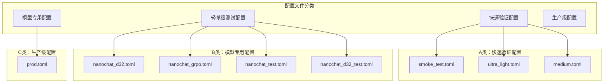
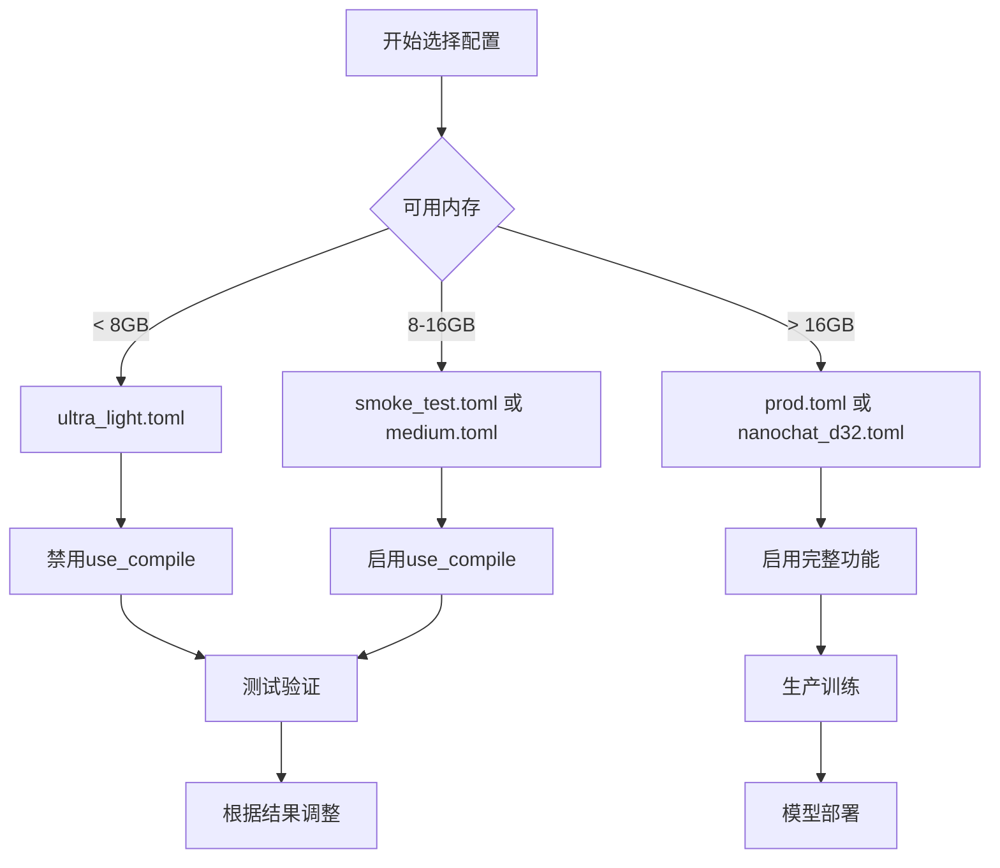
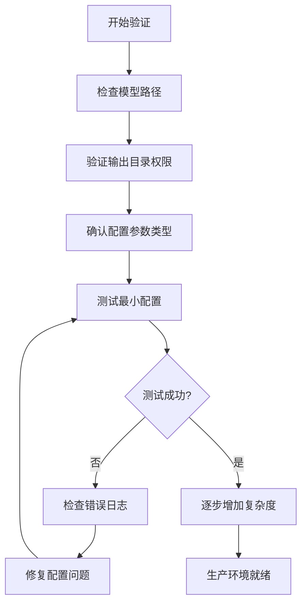

# 配置文件详解

<cite>
**本文档中引用的文件**
- [smoke_test.toml](file://configs/smoke_test.toml)
- [ultra_light.toml](file://configs/ultra_light.toml)
- [nanochat_d32.toml](file://configs/nanochat_d32.toml)
- [prod.toml](file://configs/prod.toml)
- [nanochat_d32_test.toml](file://configs/nanochat_d32_test.toml)
- [nanochat_grpo.toml](file://configs/nanochat_grpo.toml)
- [nanochat_test.toml](file://configs/nanochat_test.toml)
- [medium.toml](file://configs/medium.toml)
- [mlx-grpo.py](file://mlx-grpo.py)
- [README.md](file://README.md)
- [QUICK_START.md](file://QUICK_START.md)
</cite>

## 目录
1. [简介](#简介)
2. [配置文件架构概览](#配置文件架构概览)
3. [核心配置文件详解](#核心配置文件详解)
4. [配置参数完整对照表](#配置参数完整对照表)
5. [硬件适配与选择指南](#硬件适配与选择指南)
6. [配置文件使用最佳实践](#配置文件使用最佳实践)
7. [故障排除指南](#故障排除指南)
8. [总结](#总结)

## 简介

MLX-GRPO项目提供了多个预配置的TOML配置文件，专门针对不同的训练场景和硬件条件设计。这些配置文件涵盖了从快速调试到大规模生产训练的各种需求，每个配置都经过精心调优，以在特定场景下实现最佳性能。

配置系统的核心设计理念是：
- **场景化定制**：每个配置文件针对特定的使用场景进行了优化
- **渐进式复杂度**：从最简单的测试配置到复杂的生产配置，形成完整的训练流程
- **硬件友好性**：充分考虑不同硬件条件下的资源限制
- **可扩展性**：支持通过命令行参数进行灵活调整

## 配置文件架构概览



**图表来源**
- [smoke_test.toml](file://configs/smoke_test.toml#L1-L38)
- [ultra_light.toml](file://configs/ultra_light.toml#L1-L38)
- [nanochat_d32.toml](file://configs/nanochat_d32.toml#L1-L47)
- [prod.toml](file://configs/prod.toml#L1-L40)

## 核心配置文件详解

### 1. smoke_test.toml - 快速验证配置

**设计目的**：用于快速验证环境配置和基本功能，确保整个训练流程能够正常运行。

**适用场景**：
- 初次安装后的环境验证
- 基础功能测试
- 调试配置问题
- 快速原型验证

**关键特性**：
- 极小的数据集规模（50个样本）
- 最少的生成样本数（2个）
- 短序列长度（32个token）
- 频繁的评估和日志记录

**核心参数配置**：
```toml
max_train_samples = 50              # 仅训练50个样本
num_generations = 2                 # 每个提示生成2个响应
max_new_tokens = 32                 # 每个响应最多32个token
eval_steps = 5                      # 每5步评估一次
logging_steps = 1                   # 每步都记录日志
```

**节来源**
- [smoke_test.toml](file://configs/smoke_test.toml#L1-L38)

### 2. ultra_light.toml - 轻量级测试配置

**设计目的**：在资源受限的设备上进行测试，避免系统崩溃或过载。

**适用场景**：
- 内存有限的开发环境
- CPU密集型任务
- 快速迭代开发
- 资源监控和优化

**关键特性**：
- 保守的学习率设置
- 最小化的训练步骤
- 禁用编译优化以提高稳定性
- 适合长时间运行的稳定性测试

**核心参数配置**：
```toml
learning_rate = 1e-6                # 较低的学习率
use_compile = false                 # 禁用编译优化
max_train_samples = 50              # 仅使用50个训练样本
num_generations = 2                 # 保持少量生成样本
```

**节来源**
- [ultra_light.toml](file://configs/ultra_light.toml#L1-L38)

### 3. nanochat_d32.toml - 32层模型优化配置

**设计目的**：专门为32层的nanochat模型优化，平衡训练质量和计算效率。

**适用场景**：
- 32层大型语言模型训练
- 需要更好推理能力的场景
- 中等规模数据集训练
- 性能与质量的平衡需求

**关键特性**：
- 优化的学习率（3e-6）
- 适度的生成样本数（4个）
- 中等长度的序列（128个token）
- 特殊的量化策略

**核心参数配置**：
```toml
learning_rate = 3e-6                # 为大模型优化的学习率
num_generations = 4                 # 4个生成样本
max_new_tokens = 128                # 更长的序列长度
quantize_for_rollouts = false       # 禁用量化以保持精度
```

**节来源**
- [nanochat_d32.toml](file://configs/nanochat_d32.toml#L1-L47)

### 4. prod.toml - 生产级训练配置

**设计目的**：提供生产级别的训练设置，追求最佳的模型性能和训练效果。

**适用场景**：
- 大规模数据集训练
- 高质量模型要求
- 长时间稳定训练
- 最终模型部署准备

**关键特性**：
- 完整的训练参数设置
- 大规模数据集支持（2000个样本）
- 充分的生成多样性（16个样本）
- 综合性的评估体系

**核心参数配置**：
```toml
max_train_samples = 2000            # 使用2000个训练样本
num_generations = 16                # 16个生成样本提供更好的优势估计
max_new_tokens = 256                # 更长的完成长度
eval_samples = 200                  # 大规模评估样本
use_compile = true                  # 启用编译优化
```

**节来源**
- [prod.toml](file://configs/prod.toml#L1-L40)

### 5. nanochat_grpo.toml - nanochat模型GRPO配置

**设计目的**：针对nanochat模型的完整GRPO训练配置，平衡训练效率和模型质量。

**适用场景**：
- nanochat模型的GRPO训练
- 中等规模实验
- 模型改进和优化
- 实验性研究

**核心参数配置**：
```toml
num_generations = 4                 # 4个生成样本
max_new_tokens = 64                 # 64个token的合理长度
kl_coeff = 0.01                     # 小的KL惩罚防止漂移
gradient_accumulation_steps = 4     # 有效批量大小为4
```

**节来源**
- [nanochat_grpo.toml](file://configs/nanochat_grpo.toml#L1-L45)

### 6. nanochat_test.toml - nanochat测试配置

**设计目的**：nanochat模型的快速测试配置，用于验证模型功能和训练流程。

**适用场景**：
- nanochat模型的功能验证
- 快速原型测试
- 开发阶段的持续集成
- 故障排除

**核心参数配置**：
```toml
max_train_samples = 10              # 极少的训练样本
num_generations = 2                 # 2个生成样本
max_new_tokens = 32                 # 短序列长度
```

**节来源**
- [nanochat_test.toml](file://configs/nanochat_test.toml#L1-L39)

### 7. medium.toml - 平衡配置

**设计目的**：在smoke_test和production之间找到平衡点，提供适度的训练强度。

**适用场景**：
- 中等规模实验
- 参数调优
- 性能基准测试
- 预生产验证

**核心参数配置**：
```toml
max_train_samples = 200             # 200个训练样本
eval_samples = 10                   # 10个评估样本
save_steps = 50                     # 每50步保存检查点
```

**节来源**
- [medium.toml](file://configs/medium.toml#L1-L39)

## 配置参数完整对照表

| 参数名称 | 类型 | 默认值 | 描述 | 适用配置 |
|---------|------|--------|------|----------|
| `model_name` | string | "Qwen/Qwen2.5-1.5B-Instruct" | 模型路径或名称 | 所有配置 |
| `output_dir` | string | "outputs/Qwen-1.5B-MLX-GRPO" | 输出目录路径 | 所有配置 |
| `run_name` | string | "Qwen-1.5B-MLX-GRPO-gsm8k" | 运行名称 | 所有配置 |
| `learning_rate` | float | 1e-6 | 学习率 | 所有配置 |
| `num_epochs` | int | 1 | 训练轮数 | 所有配置 |
| `batch_size` | int | 1 | 批量大小 | 所有配置 |
| `gradient_accumulation_steps` | int | 4 | 梯度累积步数 | 所有配置 |
| `max_train_samples` | int | 0 | 最大训练样本数（0表示使用全部） | 所有配置 |
| `warmup_ratio` | float | 0.1 | 预热比例 | 所有配置 |
| `max_grad_norm` | float | 0.1 | 梯度裁剪范数 | 所有配置 |
| `logging_steps` | int | 1 | 日志记录间隔 | 所有配置 |
| `num_generations` | int | 64 | 每个提示生成的响应数量 | 所有配置 |
| `max_new_tokens` | int | 512 | 最大新token数量 | 所有配置 |
| `max_prompt_length` | int | 512 | 最大提示长度 | 所有配置 |
| `max_completion_length` | int | 1024 | 最大完成长度 | 所有配置 |
| `temperature` | float | 0.7 | 采样温度 | 所有配置 |
| `clip_eps` | float | 0.2 | PPO风格裁剪epsilon | 所有配置 |
| `kl_coeff` | float | 0.0 | KL系数 | 所有配置 |
| `adam_beta1` | float | 0.9 | Adam优化器beta1 | 所有配置 |
| `adam_beta2` | float | 0.999 | Adam优化器beta2 | 所有配置 |
| `weight_decay` | float | 0.0 | 权重衰减 | 所有配置 |
| `lr_scheduler_type` | string | "cosine" | 学习率调度器类型 | 所有配置 |
| `save_steps` | int | 100 | 保存检查点间隔 | 所有配置 |
| `eval_steps` | int | 50 | 评估间隔 | 所有配置 |
| `eval_samples` | int | 200 | 评估样本数量 | 所有配置 |
| `seed` | int | 0 | 随机种子 | 所有配置 |
| `use_compile` | bool | true | 是否启用编译优化 | 所有配置 |
| `quantize_for_rollouts` | bool | true | 是否对回放缓冲区进行4位量化 | 所有配置 |
| `eval_every_updates` | int | 25 | 每多少次更新后进行周期性评估 | 所有配置 |
| `eval_subset_size` | int | 200 | 评估子集大小 | 所有配置 |
| `eval_max_new_tokens` | int | 128 | 评估时的最大新token数量 | 所有配置 |
| `log_jsonl` | bool | true | 是否记录JSONL格式的日志 | 所有配置 |

## 硬件适配与选择指南

### 不同硬件条件下的配置选择



### 硬件推荐配置表

| 硬件规格 | 推荐配置 | 预计训练时间 | 内存使用 |
|---------|----------|-------------|----------|
| 4GB RAM | ultra_light.toml | 几分钟 | 2-3GB |
| 8GB RAM | smoke_test.toml | 10-15分钟 | 4-6GB |
| 16GB RAM | medium.toml | 1-2小时 | 8-12GB |
| 32GB RAM | prod.toml | 4-8小时 | 16-24GB |
| 64GB+ RAM | nanochat_d32.toml | 12-24小时 | 32GB+ |

### 量化策略建议

**量化_for_rollouts参数说明**：
- **true（默认）**：对旧策略和参考模型进行4位量化，加速推理但可能影响精度
- **false**：保持全精度，适合大模型（如nanochat_d32）以维持训练质量

**节来源**
- [nanochat_d32.toml](file://configs/nanochat_d32.toml#L39-L41)

## 配置文件使用最佳实践

### 1. 快速开始流程

```bash
# 步骤1：验证环境
uv run mlx-grpo.py --config configs/smoke_test.toml

# 步骤2：调整参数
uv run mlx-grpo.py --config configs/smoke_test.toml --set num_generations=8

# 步骤3：正式训练
uv run mlx-grpo.py --config configs/prod.toml
```

### 2. 参数覆盖技巧

```bash
# 单个参数覆盖
uv run mlx-grpo.py --config configs/default.toml --set learning_rate=5e-7

# 多个参数同时覆盖
uv run mlx-grpo.py --config configs/default.toml \
  --set num_generations=32 \
  --set max_new_tokens=256 \
  --set temperature=0.8
```

### 3. 环境变量配置

```bash
# 设置默认配置
export MLX_GRPO_CONFIG=configs/prod.toml

# 直接运行
uv run mlx-grpo.py

# 覆盖特定参数
uv run mlx-grpo.py --set seed=42
```

### 4. 自定义配置创建

```bash
# 复制基础配置
cp configs/default.toml configs/my_custom.toml

# 编辑配置文件
vim configs/my_custom.toml

# 使用自定义配置
uv run mlx-grpo.py --config configs/my_custom.toml
```

**节来源**
- [QUICK_START.md](file://QUICK_START.md#L160-L204)

## 故障排除指南

### 常见问题及解决方案

#### 1. 配置文件未找到
**症状**：出现"Config file not found"错误
**解决方案**：
```bash
# 使用绝对路径
uv run mlx-grpo.py --config /full/path/to/configs/smoke_test.toml

# 确保在正确目录下
cd MLX-GRPO
uv run mlx-grpo.py --config configs/smoke_test.toml
```

#### 2. 参数类型错误
**症状**：出现"Failed to coerce value"警告
**解决方案**：
```bash
# 错误示例（带引号）
uv run mlx-grpo.py --config configs/default.toml --set num_generations="32"

# 正确示例（无引号）
uv run mlx-grpo.py --config configs/default.toml --set num_generations=32
```

#### 3. 内存不足
**症状**：训练过程中出现OOM错误
**解决方案**：
- 减少`max_train_samples`
- 降低`num_generations`
- 禁用`use_compile`
- 使用`ultra_light.toml`配置

#### 4. 训练速度过慢
**症状**：训练进度异常缓慢
**解决方案**：
- 启用`use_compile = true`
- 增加`gradient_accumulation_steps`
- 使用更高效的模型

### 配置验证清单



**节来源**
- [QUICK_START.md](file://QUICK_START.md#L180-L204)

## 总结

MLX-GRPO项目的配置文件系统提供了完整的训练场景覆盖，从快速验证到大规模生产训练都有相应的优化配置。每个配置文件都针对特定的使用场景进行了精心设计：

- **smoke_test.toml**：最适合初次使用和环境验证
- **ultra_light.toml**：资源受限环境的最佳选择
- **nanochat_d32.toml**：大型模型训练的专业配置
- **prod.toml**：生产环境的完整训练方案

通过理解各个配置文件的设计理念和适用场景，用户可以根据自己的硬件条件、训练目标和时间预算选择最合适的配置。同时，灵活的参数覆盖机制允许用户在不修改原始配置文件的情况下进行个性化调整。

配置系统的模块化设计不仅提高了易用性，也为后续的功能扩展和优化奠定了良好的基础。随着项目的不断发展，新的配置文件和优化策略将会不断加入，为用户提供更加丰富和强大的训练选项。