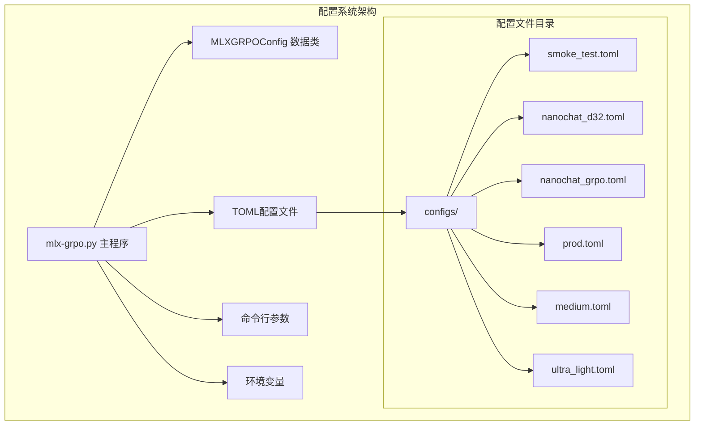
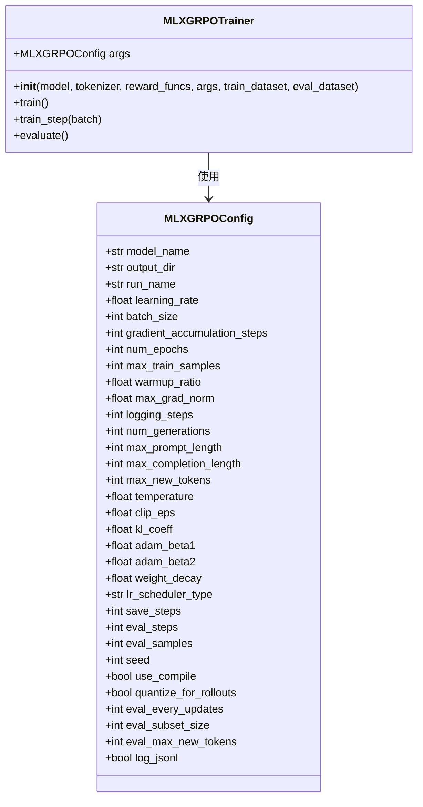
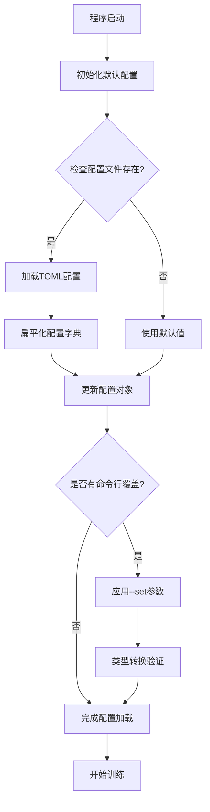
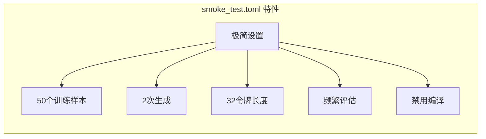
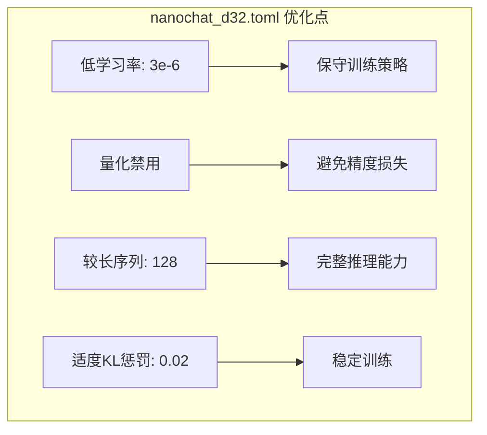
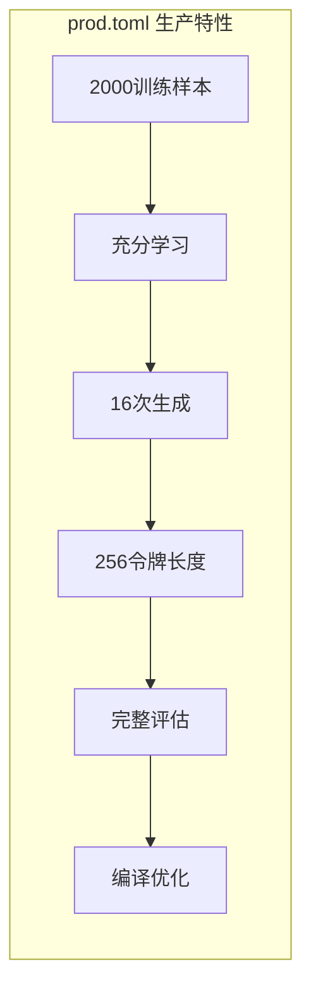
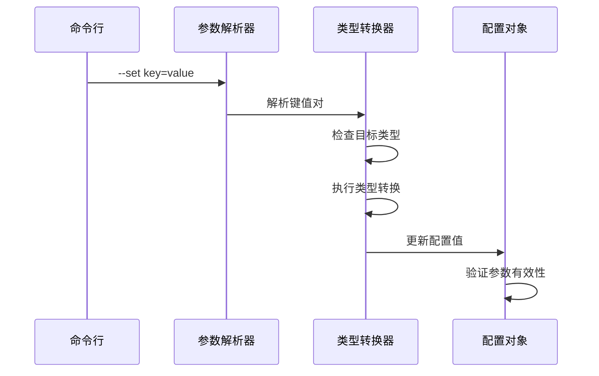
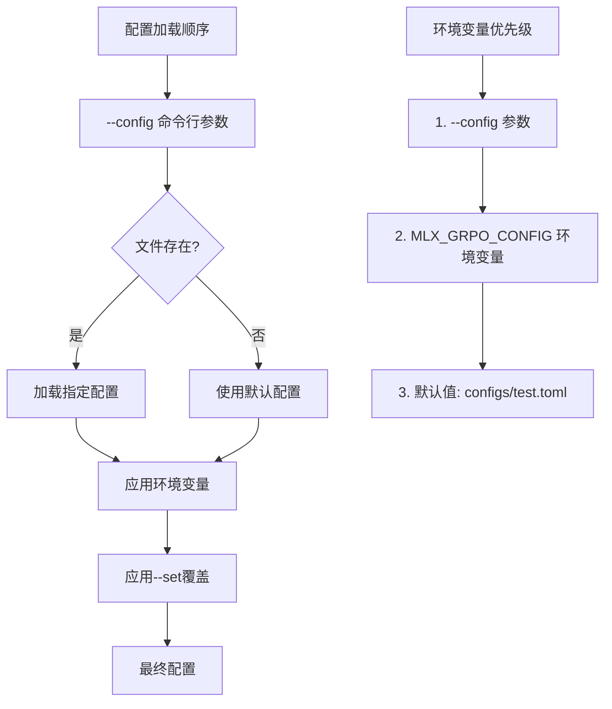
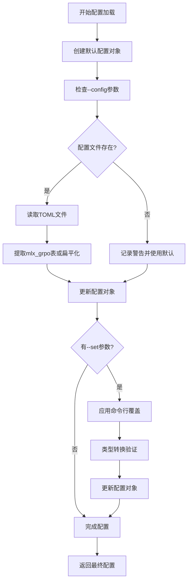
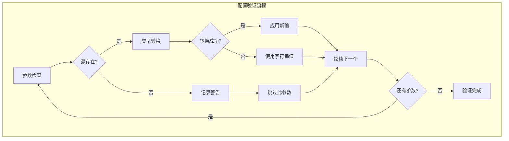

# 配置系统详解

<cite>
**本文档中引用的文件**
- [mlx-grpo.py](file://mlx-grpo.py)
- [configs/smoke_test.toml](file://configs/smoke_test.toml)
- [configs/nanochat_d32.toml](file://configs/nanochat_d32.toml)
- [configs/nanochat_grpo.toml](file://configs/nanochat_grpo.toml)
- [configs/prod.toml](file://configs/prod.toml)
- [configs/medium.toml](file://configs/medium.toml)
- [configs/ultra_light.toml](file://configs/ultra_light.toml)
- [configs/nanochat_d32_test.toml](file://configs/nanochat_d32_test.toml)
- [configs/nanochat_test.toml](file://configs/nanochat_test.toml)
- [README.md](file://README.md)
- [QUICK_START.md](file://QUICK_START.md)
</cite>

## 目录
1. [简介](#简介)
2. [项目结构概览](#项目结构概览)
3. [核心配置架构](#核心配置架构)
4. [配置文件详解](#配置文件详解)
5. [命令行配置覆盖机制](#命令行配置覆盖机制)
6. [环境变量支持](#环境变量支持)
7. [配置加载优先级](#配置加载优先级)
8. [可配置参数全览](#可配置参数全览)
9. [实际应用场景](#实际应用场景)
10. [最佳实践指南](#最佳实践指南)
11. [故障排除](#故障排除)

## 简介

MLX-GRO配置系统是一个基于TOML格式的灵活配置管理框架，专为机器学习训练实验设计。该系统通过`MLXGRPOConfig`数据类与TOML配置文件建立映射关系，提供多层次的配置控制能力，支持从快速调试到生产级训练的各种场景。

配置系统的核心优势包括：
- **层次化配置管理**：支持默认值、TOML文件配置和命令行覆盖的多层级配置
- **类型安全**：通过Python数据类确保配置参数的类型正确性
- **灵活覆盖**：允许在不修改配置文件的情况下动态调整参数
- **环境感知**：支持环境变量驱动的配置选择

## 项目结构概览



**图表来源**
- [mlx-grpo.py](file://mlx-grpo.py#L319-L354)
- [configs/smoke_test.toml](file://configs/smoke_test.toml#L1-L38)

**章节来源**
- [mlx-grpo.py](file://mlx-grpo.py#L319-L354)
- [README.md](file://README.md#L130-L179)

## 核心配置架构

### MLXGRPOConfig数据类设计

配置系统的核心是`MLXGRPOConfig`数据类，它定义了所有可配置参数及其默认值：



**图表来源**
- [mlx-grpo.py](file://mlx-grpo.py#L319-L354)
- [mlx-grpo.py](file://mlx-grpo.py#L411-L450)

### 配置加载流程



**图表来源**
- [mlx-grpo.py](file://mlx-grpo.py#L1140-L1175)

**章节来源**
- [mlx-grpo.py](file://mlx-grpo.py#L319-L354)
- [mlx-grpo.py](file://mlx-grpo.py#L370-L409)

## 配置文件详解

### configs/目录结构

配置文件按功能和性能需求分为多个预设配置：

| 配置文件 | 用途 | 训练样本数 | 生成数量 | 令牌长度 | 性能特点 |
|----------|------|------------|----------|----------|----------|
| `smoke_test.toml` | 快速调试 | 50 | 2 | 32 | 极快，适合开发测试 |
| `ultra_light.toml` | 最小测试 | 50 | 2 | 32 | 资源占用最小 |
| `medium.toml` | 平衡实验 | 200 | 2 | 32 | 中等资源消耗 |
| `nanochat_grpo.toml` | Nanochat训练 | 500 | 4 | 64 | 针对Nanochat优化 |
| `nanochat_d32.toml` | 大模型训练 | 500 | 4 | 128 | 支持32层大模型 |
| `nanochat_d32_test.toml` | 大模型测试 | 20 | 2 | 64 | 大模型快速测试 |
| `nanochat_test.toml` | Nanochat测试 | 10 | 2 | 32 | Nanochat专用测试 |
| `prod.toml` | 生产训练 | 2000 | 16 | 256 | 完整生产设置 |

### smoke_test.toml - 快速调试配置

`smoke_test.toml`是专门为快速迭代和调试设计的配置文件：



**图表来源**
- [configs/smoke_test.toml](file://configs/smoke_test.toml#L1-L38)

### nanochat_d32.toml - 大模型专用配置

针对32层Nanochat模型的专门优化配置：



**图表来源**
- [configs/nanochat_d32.toml](file://configs/nanochat_d32.toml#L1-L47)

### prod.toml - 生产级配置

生产环境的最佳实践配置：



**图表来源**
- [configs/prod.toml](file://configs/prod.toml#L1-L40)

**章节来源**
- [configs/smoke_test.toml](file://configs/smoke_test.toml#L1-L38)
- [configs/nanochat_d32.toml](file://configs/nanochat_d32.toml#L1-L47)
- [configs/prod.toml](file://configs/prod.toml#L1-L40)

## 命令行配置覆盖机制

### --set 参数系统

配置系统提供了强大的命令行覆盖功能，允许用户在不修改配置文件的情况下动态调整参数：



**图表来源**
- [mlx-grpo.py](file://mlx-grpo.py#L380-L409)

### 类型转换机制

系统实现了智能的类型转换功能：

| 目标类型 | 转换规则 | 示例输入 |
|----------|----------|----------|
| `bool` | 字符串匹配 | `"true"`, `"1"`, `"yes"` → `True` |
| `int` | 数字解析 | `"42"`, `"100"` → 整数值 |
| `float` | 浮点解析 | `"1e-6"`, `"0.5"` → 浮点值 |
| `str` | 直接赋值 | 其他类型保持原样 |

### 多重覆盖示例

```bash
# 基础覆盖
uv run mlx-grpo.py --config configs/default.toml --set learning_rate=5e-7

# 多参数覆盖
uv run mlx-grpo.py --config configs/default.toml \
  --set num_generations=32 \
  --set max_new_tokens=256 \
  --set temperature=0.8

# 复杂配置组合
uv run mlx-grpo.py --config configs/prod.toml \
  --set model_name="custom/model" \
  --set output_dir="outputs/experiment_1" \
  --set seed=12345
```

**章节来源**
- [mlx-grpo.py](file://mlx-grpo.py#L380-L409)
- [QUICK_START.md](file://QUICK_START.md#L76-L159)

## 环境变量支持

### MLX_GRPO_CONFIG 环境变量

系统支持通过环境变量指定默认配置文件：

```bash
# 设置默认配置
export MLX_GRPO_CONFIG=configs/my_experiment.toml

# 运行训练无需指定配置文件
uv run mlx-grpo.py

# 可以仍然使用命令行覆盖
uv run mlx-grpo.py --set learning_rate=5e-7
```

### 环境变量优先级



**图表来源**
- [mlx-grpo.py](file://mlx-grpo.py#L1140-L1175)

**章节来源**
- [mlx-grpo.py](file://mlx-grpo.py#L1140-L1175)
- [QUICK_START.md](file://QUICK_START.md#L120-L140)

## 配置加载优先级

### 完整加载流程

配置系统采用分层加载策略，确保灵活性和可预测性：



**图表来源**
- [mlx-grpo.py](file://mlx-grpo.py#L1140-L1175)

### 配置验证机制

系统实现了完善的配置验证功能：



**图表来源**
- [mlx-grpo.py](file://mlx-grpo.py#L380-L409)

**章节来源**
- [mlx-grpo.py](file://mlx-grpo.py#L1140-L1175)

## 可配置参数全览

### 核心训练参数

| 参数名 | 类型 | 默认值 | 描述 | 影响范围 |
|--------|------|--------|------|----------|
| `model_name` | `str` | `"Qwen/Qwen2.5-1.5B-Instruct"` | 模型名称或路径 | 模型加载 |
| `output_dir` | `str` | `"outputs/Qwen-1.5B-MLX-GRPO"` | 输出目录 | 结果存储 |
| `run_name` | `str` | `"Qwen-1.5B-MLX-GRPO-gsm8k"` | 运行标识 | 目录命名 |
| `learning_rate` | `float` | `1e-6` | 学习率 | 训练收敛速度 |
| `batch_size` | `int` | `1` | 批次大小 | 内存使用 |
| `gradient_accumulation_steps` | `int` | `4` | 梯度累积步数 | 有效批次大小 |
| `num_epochs` | `int` | `1` | 训练轮数 | 训练时长 |
| `max_train_samples` | `int` | `0` | 最大训练样本数 | 数据量限制 |

### 采样和生成参数

| 参数名 | 类型 | 默认值 | 描述 | 性能影响 |
|--------|------|--------|------|----------|
| `num_generations` | `int` | `64` | 每个提示生成的响应数量 | 内存和计算开销 |
| `max_new_tokens` | `int` | `512` | 最大生成令牌数 | 序列长度限制 |
| `max_prompt_length` | `int` | `512` | 最大提示长度 | 输入处理效率 |
| `max_completion_length` | `int` | `1024` | 最大完成长度 | 内存使用 |
| `temperature` | `float` | `0.7` | 采样温度 | 生成多样性 |
| `clip_eps` | `float` | `0.2` | PPO裁剪epsilon | 训练稳定性 |
| `kl_coeff` | `float` | `0.0` | KL散度系数 | 策略更新约束 |

### 优化和调度参数

| 参数名 | 类型 | 默认值 | 描述 | 训练质量 |
|--------|------|--------|------|----------|
| `adam_beta1` | `float` | `0.9` | Adam优化器beta1 | 动量参数 |
| `adam_beta2` | `float` | `0.999` | Adam优化器beta2 | 方差参数 |
| `weight_decay` | `float` | `0.0` | 权重衰减 | 正则化强度 |
| `lr_scheduler_type` | `str` | `'cosine'` | 学习率调度器类型 | 学习率策略 |
| `warmup_ratio` | `float` | `0.1` | 预热比例 | 初始训练稳定性 |
| `max_grad_norm` | `float` | `0.1` | 最大梯度范数 | 梯度爆炸防护 |

### 评估和日志参数

| 参数名 | 类型 | 默认值 | 描述 | 监控频率 |
|--------|------|--------|------|----------|
| `logging_steps` | `int` | `1` | 日志记录步数 | 训练监控 |
| `eval_steps` | `int` | `50` | 评估步数间隔 | 性能评估 |
| `eval_samples` | `int` | `200` | 评估样本数量 | 评估精度 |
| `eval_every_updates` | `int` | `25` | 评估更新间隔 | 自动评估 |
| `eval_subset_size` | `int` | `200` | 评估子集大小 | 评估效率 |
| `eval_max_new_tokens` | `int` | `128` | 评估最大令牌数 | 评估一致性 |
| `save_steps` | `int` | `100` | 保存步数间隔 | 模型备份 |
| `log_jsonl` | `bool` | `True` | 启用JSONL日志 | 数据持久化 |

### 系统和性能参数

| 参数名 | 类型 | 默认值 | 描述 | 系统要求 |
|--------|------|--------|------|----------|
| `seed` | `int` | `0` | 随机种子 | 可重现性 |
| `use_compile` | `bool` | `True` | 启用MX编译 | 性能优化 |
| `quantize_for_rollouts` | `bool` | `True` | 推演时量化 | 内存优化 |

**章节来源**
- [mlx-grpo.py](file://mlx-grpo.py#L319-L354)

## 实际应用场景

### 快速原型开发

```bash
# 开发阶段：快速验证想法
uv run mlx-grpo.py --config configs/smoke_test.toml --set num_generations=4

# 调试阶段：检查基本功能
uv run mlx-grpo.py --config configs/ultra_light.toml --set max_train_samples=10
```

### 实验对比研究

```bash
# 不同学习率对比
for lr in 1e-6 5e-7 1e-7; do
    uv run mlx-grpo.py --config configs/default.toml \
        --set learning_rate=$lr \
        --set output_dir="outputs/lr_${lr}" \
        --set run_name="lr_${lr}"
done
```

### 模型规模测试

```bash
# 小模型测试
uv run mlx-grpo.py --config configs/nanochat_test.toml

# 大模型测试
uv run mlx-grpo.py --config configs/nanochat_d32_test.toml \
    --set quantize_for_rollouts=false
```

### 生产环境部署

```bash
# 生产训练
export MLX_GRPO_CONFIG=configs/prod.toml
uv run mlx-grpo.py \
    --set model_name="your-production-model" \
    --set output_dir="outputs/final-training"
```

**章节来源**
- [QUICK_START.md](file://QUICK_START.md#L76-L159)
- [README.md](file://README.md#L87-L132)

## 最佳实践指南

### 配置文件组织

1. **创建专用配置文件**
```bash
# 复制基础配置进行定制
cp configs/default.toml configs/experiment_01.toml
# 编辑配置文件
vim configs/experiment_01.toml
```

2. **版本控制配置**
```bash
# 保存成功的配置
git add configs/experiment_01.toml
git commit -m "Add successful experiment configuration"
```

3. **环境特定配置**
```bash
# 开发环境
export MLX_GRPO_CONFIG=configs/dev.toml
# 生产环境
export MLX_GRPO_CONFIG=configs/prod.toml
```

### 参数调优策略

1. **渐进式参数调整**
```bash
# 从保守设置开始
uv run mlx-grpo.py --config configs/default.toml --set learning_rate=1e-6

# 逐步增加复杂度
uv run mlx-grpo.py --config configs/default.toml --set learning_rate=5e-7 --set num_generations=16
```

2. **批量实验管理**
```bash
#!/bin/bash
# 实验脚本模板
declare -a seeds=(42 123 456 789)
declare -a lrs=("1e-6" "5e-7" "1e-7")

for seed in "${seeds[@]}"; do
    for lr in "${lrs[@]}"; do
        uv run mlx-grpo.py --config configs/default.toml \
            --set learning_rate=$lr \
            --set seed=$seed \
            --set output_dir="outputs/experiment_seed${seed}_lr${lr}"
    done
done
```

### 性能优化建议

1. **内存使用优化**
```bash
# 对于大模型禁用量化
uv run mlx-grpo.py --config configs/nanochat_d32.toml --set quantize_for_rollouts=false

# 减少生成数量以节省内存
uv run mlx-grpo.py --config configs/default.toml --set num_generations=8
```

2. **训练加速技巧**
```bash
# 启用编译优化
uv run mlx-grpo.py --config configs/default.toml --set use_compile=true

# 增加批次大小（如果内存允许）
uv run mlx-grpo.py --config configs/default.toml --set batch_size=2 --set gradient_accumulation_steps=2
```

**章节来源**
- [QUICK_START.md](file://QUICK_START.md#L160-L204)

## 故障排除

### 常见配置问题

1. **配置文件未找到**
```bash
# 错误：Config file not found
uv run mlx-grpo.py --config missing.toml

# 解决方案：检查文件路径
ls configs/
uv run mlx-grpo.py --config configs/default.toml
```

2. **未知配置键**
```bash
# 错误：unknown config key: invalid_param
uv run mlx-grpo.py --config configs/default.toml --set invalid_param=42

# 解决方案：检查拼写或参数名称
uv run mlx-grpo.py --config configs/default.toml --set learning_rate=1e-6
```

3. **类型转换错误**
```bash
# 错误：failed to coerce 'invalid' to <class 'float'>
uv run mlx-grpo.py --config configs/default.toml --set learning_rate="invalid"

# 解决方案：确保类型正确
uv run mlx-grpo.py --config configs/default.toml --set learning_rate=1e-6
```

### 调试技巧

1. **查看解析后的配置**
```bash
# 训练完成后检查配置文件
cat outputs/run_name/config.resolved.json
```

2. **验证配置加载**
```bash
# 启用详细日志
uv run mlx-grpo.py --config configs/default.toml --set logging_steps=1
```

3. **环境变量调试**
```bash
# 检查环境变量设置
echo $MLX_GRPO_CONFIG

# 临时覆盖
unset MLX_GRPO_CONFIG
uv run mlx-grpo.py --config configs/custom.toml
```

### 性能问题诊断

1. **内存不足**
```bash
# 减少生成数量
uv run mlx-grpo.py --config configs/default.toml --set num_generations=4

# 禁用编译优化
uv run mlx-grpo.py --config configs/default.toml --set use_compile=false
```

2. **训练速度慢**
```bash
# 增加批次大小
uv run mlx-grpo.py --config configs/default.toml --set batch_size=2

# 启用量化
uv run mlx-grpo.py --config configs/default.toml --set quantize_for_rollouts=true
```

**章节来源**
- [mlx-grpo.py](file://mlx-grpo.py#L380-L409)
- [QUICK_START.md](file://QUICK_START.md#L180-L204)

## 结论

MLX-GRO配置系统通过精心设计的层次化架构，为机器学习训练提供了强大而灵活的配置管理能力。从简单的快速调试到复杂的生产训练，系统都能提供合适的配置选项和覆盖机制。

关键优势总结：
- **类型安全**：通过数据类确保配置参数的正确性
- **灵活覆盖**：支持多种方式的参数调整
- **环境感知**：适应不同开发和生产环境
- **性能优化**：提供多种优化选项和最佳实践

通过合理使用配置系统，研究人员和开发者可以高效地管理复杂的训练实验，确保结果的可重现性和实验的可重复性。