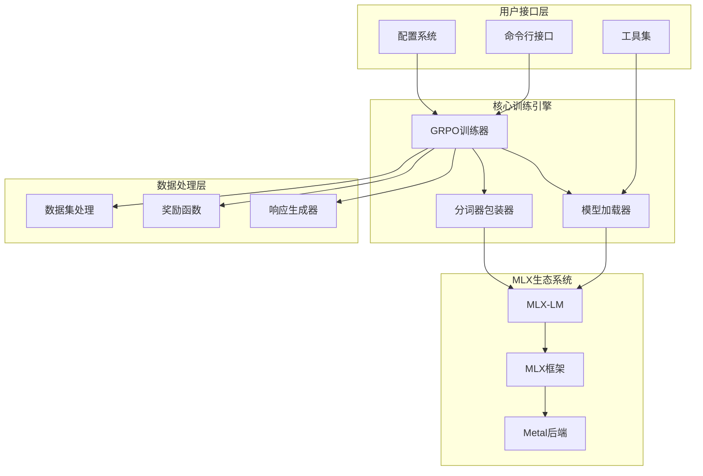
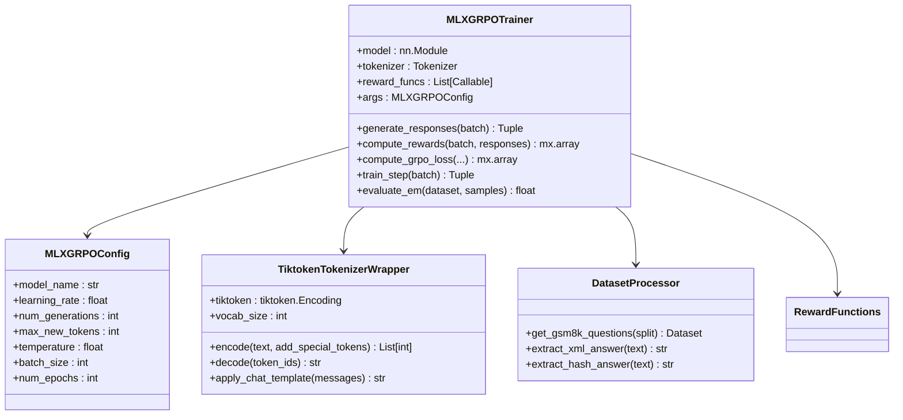
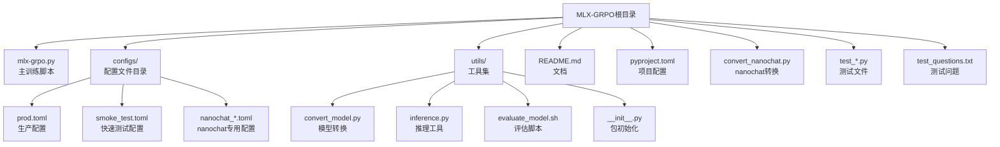
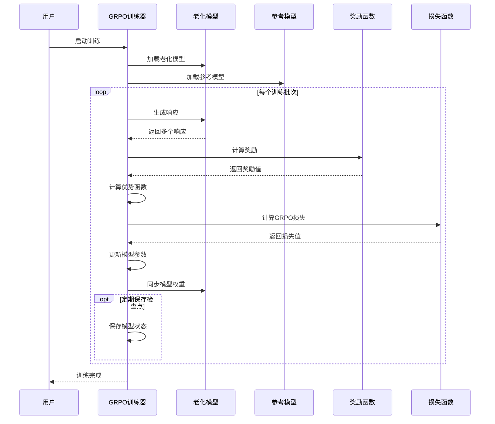
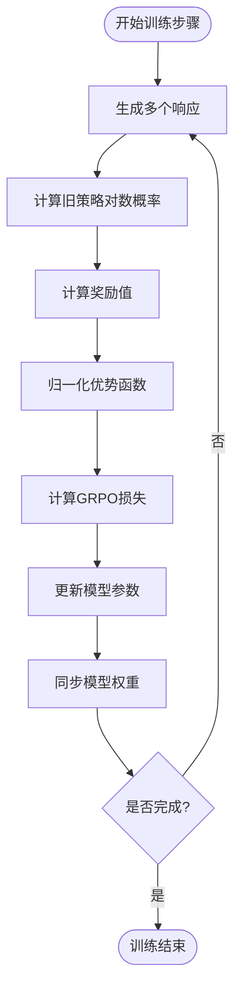
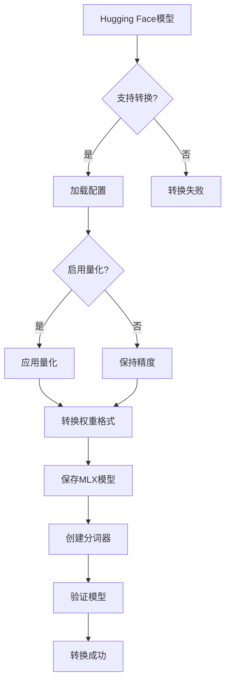
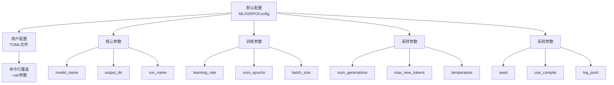
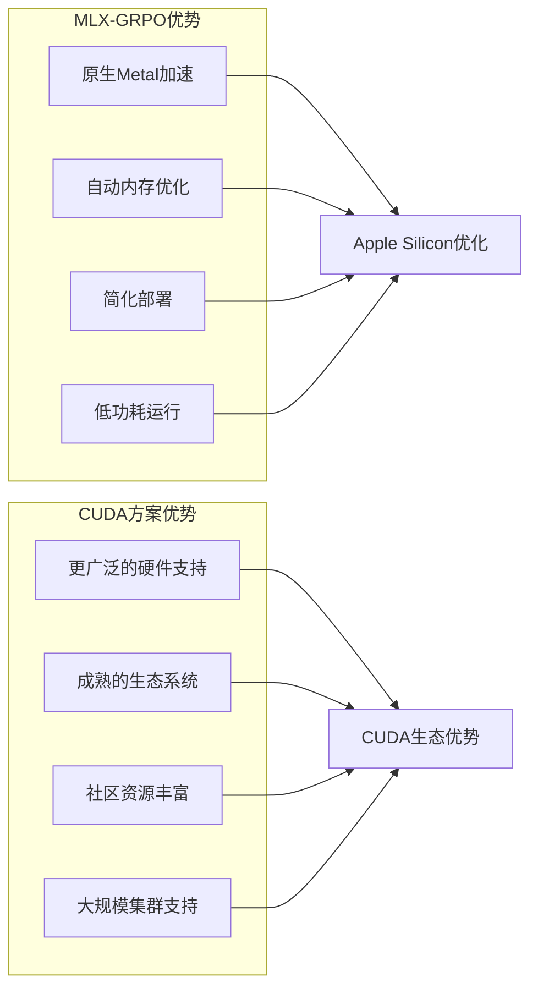

# MLX-GRPO项目概述

<cite>
**本文档中引用的文件**
- [README.md](file://README.md)
- [mlx-grpo.py](file://mlx-grpo.py)
- [pyproject.toml](file://pyproject.toml)
- [QUICK_START.md](file://QUICK_START.md)
- [NANOCHAT_GRPO_GUIDE.md](file://NANOCHAT_GRPO_GUIDE.md)
- [utils/README.md](file://utils/README.md)
- [utils/convert_model.py](file://utils/convert_model.py)
- [utils/inference.py](file://utils/inference.py)
- [configs/prod.toml](file://configs/prod.toml)
- [configs/smoke_test.toml](file://configs/smoke_test.toml)
- [convert_nanochat.py](file://convert_nanochat.py)
</cite>

## 目录
1. [项目简介](#项目简介)
2. [核心特性](#核心特性)
3. [技术架构](#技术架构)
4. [项目结构](#项目结构)
5. [GRPO训练管道](#grpo训练管道)
6. [模型转换与推理](#模型转换与推理)
7. [配置管理系统](#配置管理系统)
8. [与CUDA方案的对比](#与cuda方案的对比)
9. [使用指南](#使用指南)
10. [总结](#总结)

## 项目简介

MLX-GRPO是一个基于Apple MLX框架的大型语言模型训练系统，专为Apple Silicon设备设计。该项目实现了组相对策略优化（Group-based Relative Policy Optimization, GRPO）算法，支持在纯MLX环境下进行大型语言模型的微调训练。

### 设计理念

MLX-GRPO的核心设计理念是：
- **纯MLX环境**：完全基于Apple的MLX框架，无需CUDA支持
- **Metal后端原生运行**：充分利用Apple Silicon的Metal计算能力
- **思维链提示结构**：支持复杂的多步推理任务
- **通用性**：兼容任何Hugging Face模型的转换和使用

**章节来源**
- [README.md](file://README.md#L1-L20)
- [mlx-grpo.py](file://mlx-grpo.py#L1-L50)

## 核心特性

### 纯MLX集成
- 仅在Apple Silicon上运行，通过MLX-LM使用Metal后端
- 完全避免CUDA依赖，简化部署和维护
- 利用Apple Silicon的硬件加速优势

### GRPO训练管道
- 实现多个奖励函数（正确性、格式检查、XML计数）
- 优化思维链响应的质量
- 支持多种采样策略和生成参数

### 通用模型支持
- 内置转换工具，可转换任意Hugging Face模型
- 支持文本和视觉-语言模型
- 提供灵活的量化选项

### 数据集预处理
- 使用GSM8K数据集测试多步推理能力
- 自动格式化和标准化数据输入
- 支持自定义数据集扩展

### 现代Python打包
- 基于`pyproject.toml`的依赖管理
- 使用`uv` CLI运行器启动
- 模块化的代码组织结构

**章节来源**
- [README.md](file://README.md#L6-L18)
- [mlx-grpo.py](file://mlx-grpo.py#L1-L100)

## 技术架构

### 系统架构图



**图表来源**
- [mlx-grpo.py](file://mlx-grpo.py#L1-L50)
- [pyproject.toml](file://pyproject.toml#L1-L13)

### 核心组件关系



**图表来源**
- [mlx-grpo.py](file://mlx-grpo.py#L300-L400)
- [mlx-grpo.py](file://mlx-grpo.py#L250-L300)

**章节来源**
- [mlx-grpo.py](file://mlx-grpo.py#L250-L500)

## 项目结构

### 目录结构概览



**图表来源**
- [README.md](file://README.md#L150-L180)
- [pyproject.toml](file://pyproject.toml#L1-L13)

### 主要模块说明

| 文件/目录 | 功能描述 | 核心作用 |
|-----------|----------|----------|
| `mlx-grpo.py` | 主训练脚本 | 协调整个训练流程，包含GRPO算法实现 |
| `configs/` | 配置文件集合 | 提供不同场景的预设配置参数 |
| `utils/` | 工具集 | 模型转换、推理、评估等辅助功能 |
| `pyproject.toml` | 项目配置 | 依赖管理和项目元数据 |
| `convert_nanochat.py` | nanochat转换脚本 | 特殊模型的转换工具 |

**章节来源**
- [README.md](file://README.md#L150-L180)

## GRPO训练管道

### 训练流程架构



**图表来源**
- [mlx-grpo.py](file://mlx-grpo.py#L933-L1092)

### 关键算法实现

#### 响应生成机制

GRPO算法的核心是通过老化模型生成多个候选响应，然后根据奖励函数选择最优策略：



**图表来源**
- [mlx-grpo.py](file://mlx-grpo.py#L550-L650)

#### 多奖励函数机制

系统支持多种奖励函数组合：

| 奖励函数 | 功能描述 | 权重贡献 |
|----------|----------|----------|
| `correctness_reward_func` | 正确性奖励 | 基础准确性评估 |
| `int_reward_func` | 整数格式奖励 | 数值输出验证 |
| `strict_format_reward_func` | 严格格式奖励 | XML结构完整性 |
| `soft_format_reward_func` | 软格式奖励 | 基本格式匹配 |
| `xmlcount_reward_func` | XML计数奖励 | 标签完整性评分 |

**章节来源**
- [mlx-grpo.py](file://mlx-grpo.py#L60-L120)
- [mlx-grpo.py](file://mlx-grpo.py#L958-L984)

## 模型转换与推理

### 模型转换流程



**图表来源**
- [utils/convert_model.py](file://utils/convert_model.py#L50-L150)

### 推理模式支持

系统提供多种推理模式以满足不同需求：

| 模式 | 描述 | 适用场景 |
|------|------|----------|
| 单次生成 | 对单个提示进行文本生成 | 快速测试、简单问答 |
| 交互聊天 | 支持多轮对话的REPL界面 | 应用开发、用户体验测试 |
| 批量生成 | 并行处理多个提示 | 数据标注、批量处理 |
| 流式生成 | 实时显示生成的token | 实时应用、用户体验 |

**章节来源**
- [utils/inference.py](file://utils/inference.py#L1-L100)
- [utils/README.md](file://utils/README.md#L50-L150)

## 配置管理系统

### 配置层次结构



**图表来源**
- [mlx-grpo.py](file://mlx-grpo.py#L300-L400)

### 配置文件示例

#### 生产级配置（prod.toml）
```toml
model_name = "utils/mlx_model"
output_dir = "outputs/production-run"
run_name = "qwen-1.5b-production"

learning_rate = 1e-6
num_epochs = 1
batch_size = 1
gradient_accumulation_steps = 4
max_train_samples = 2000

num_generations = 16
max_new_tokens = 256
temperature = 0.7
```

#### 快速测试配置（smoke_test.toml）
```toml
model_name = "utils/mlx_model"
output_dir = "outputs/smoke-test"
run_name = "smoke-test-run"

learning_rate = 1e-6
num_epochs = 1
max_train_samples = 50
num_generations = 2
max_new_tokens = 32
```

**章节来源**
- [configs/prod.toml](file://configs/prod.toml#L1-L40)
- [configs/smoke_test.toml](file://configs/smoke_test.toml#L1-L38)

## 与CUDA方案的对比

### 技术优势对比

| 方面 | MLX-GRPO | CUDA方案 |
|------|----------|----------|
| **硬件要求** | Apple Silicon (M1/M2/M3/M4) | NVIDIA GPU |
| **安装复杂度** | 简单，无CUDA依赖 | 复杂，需要驱动和库 |
| **能耗效率** | 低功耗，适合长时间训练 | 高功耗，散热要求高 |
| **内存管理** | 自动优化，无需手动管理 | 需要手动优化GPU内存 |
| **开发体验** | 原生Metal支持，性能优异 | 需要CUDA编程经验 |
| **生态系统** | 新兴但快速增长 | 成熟稳定，生态丰富 |

### 性能特征



### 适用场景建议

| 场景 | 推荐方案 | 理由 |
|------|----------|------|
| 个人研究 | MLX-GRPO | 成本低，易于部署 |
| 小团队开发 | MLX-GRPO | 快速原型，降低门槛 |
| 大规模训练 | CUDA方案 | 更强的计算能力和生态支持 |
| 移动设备部署 | MLX-GRPO | 原生优化，功耗更低 |
| 学术实验 | MLX-GRPO | 易于理解和修改 |

## 使用指南

### 快速开始

#### 1. 环境准备
```bash
# 克隆项目
git clone https://github.com/Doriandarko/MLX-GRPO.git
cd MLX-GRPO

# 创建虚拟环境
python3 -m venv venv
source venv/bin/activate

# 安装依赖
pip install uv
pip install "mlx>=0.29.3" "mlx-lm>=0.28.3" "datasets>=4.2.0" "transformers>=4.56.2" "uv>=0.0.1"
```

#### 2. 模型转换
```bash
# 转换模型到MLX格式
uv run python utils/convert_model.py \
    --hf-path Qwen/Qwen2.5-1.5B-Instruct \
    --quantize

# 测试转换后的模型
uv run python utils/inference.py \
    --model mlx_model \
    --prompt "解释量子计算"
```

#### 3. 开始训练
```bash
# 使用默认配置训练
uv run mlx-grpo.py --config configs/default.toml

# 快速测试
uv run mlx-grpo.py --config configs/smoke_test.toml

# 自定义参数
uv run mlx-grpo.py --config configs/default.toml \
    --set num_generations=32 \
    --set learning_rate=5e-7
```

### 高级使用

#### 自定义奖励函数
```python
def custom_reward_func(completions, **kwargs):
    """自定义奖励函数示例"""
    responses = [completion[0]['content'] for completion in completions]
    scores = []
    
    for response in responses:
        # 实现自定义逻辑
        score = calculate_custom_metric(response)
        scores.append(score)
    
    return scores
```

#### 分布式训练设置
```toml
# 多GPU配置（如果可用）
batch_size = 4
gradient_accumulation_steps = 1
max_grad_norm = 1.0
```

**章节来源**
- [QUICK_START.md](file://QUICK_START.md#L1-L100)
- [README.md](file://README.md#L20-L80)

## 总结

MLX-GRPO代表了大型语言模型训练领域的一个重要创新方向，它成功地将先进的GRPO算法与Apple Silicon的原生优化相结合。该项目的主要价值体现在：

### 技术创新
- **纯MLX实现**：完全避免了CUDA依赖，简化了部署和维护
- **原生Metal优化**：充分利用Apple Silicon的硬件加速能力
- **思维链支持**：专门针对复杂推理任务进行了优化

### 实用价值
- **易用性**：简洁的命令行接口和丰富的工具集
- **灵活性**：支持多种模型格式和训练配置
- **可扩展性**：模块化设计便于功能扩展和定制

### 发展前景
MLX-GRPO不仅为Apple Silicon用户提供了强大的LLM训练解决方案，更重要的是展示了纯MLX生态系统的巨大潜力。随着MLX框架的持续发展和Apple硬件的不断进步，这个项目有望成为LLM训练领域的重要选择之一。

对于初学者而言，MLX-GRPO提供了一个学习和实践大型语言模型训练的绝佳平台；对于高级用户，它则提供了足够的灵活性和性能来支持复杂的科研和工业应用。无论是学术研究还是商业应用，MLX-GRPO都展现出了其独特的价值和广阔的应用前景。