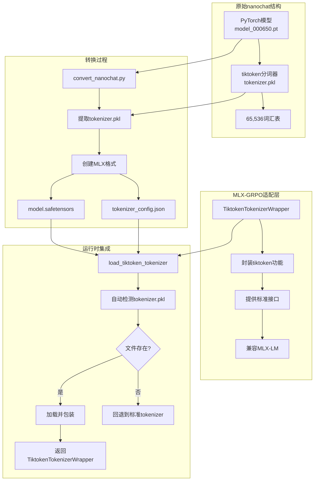
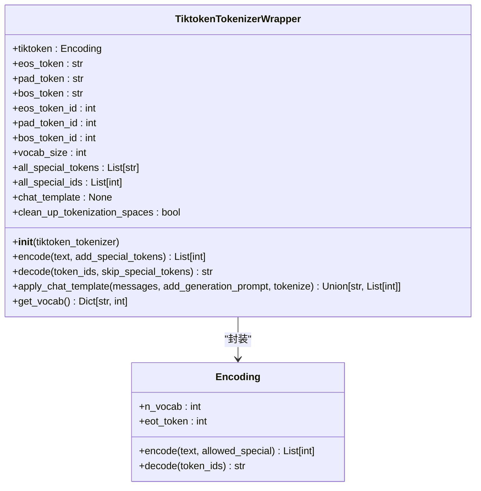
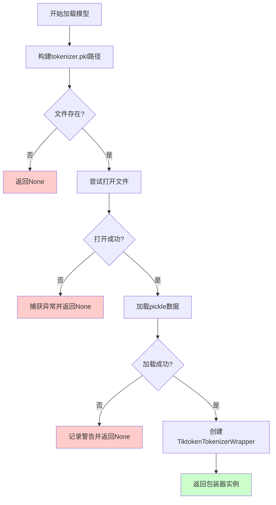
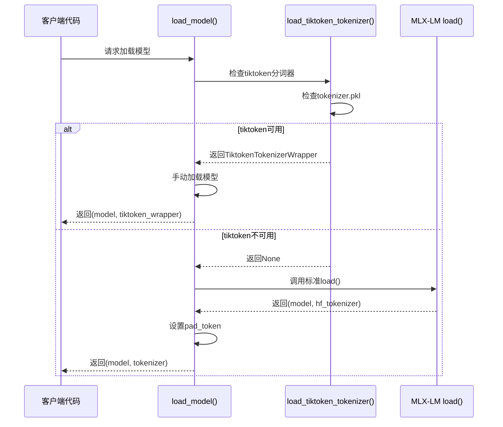
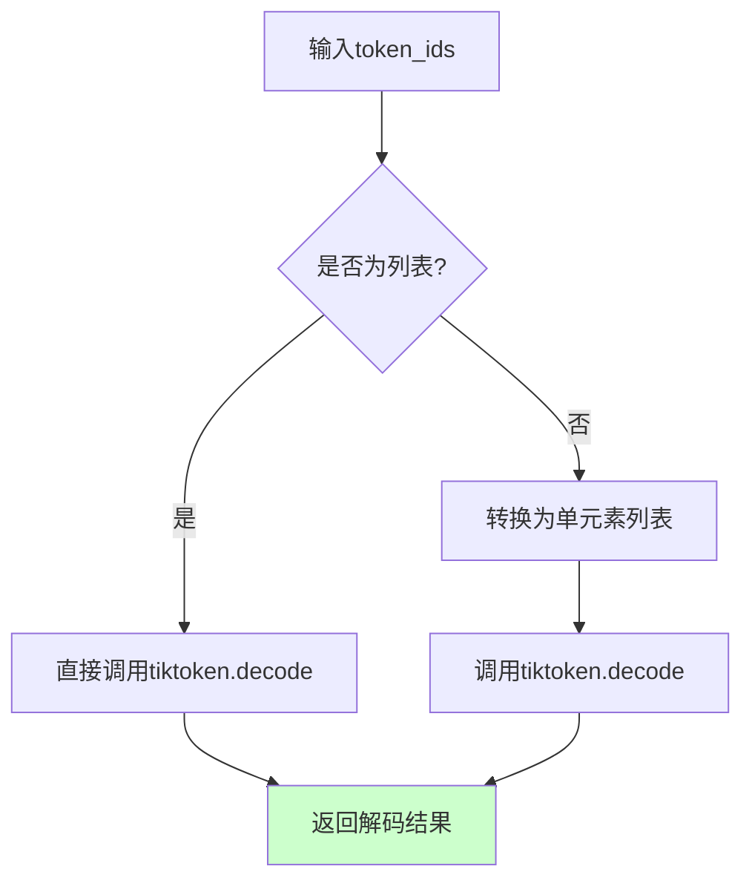
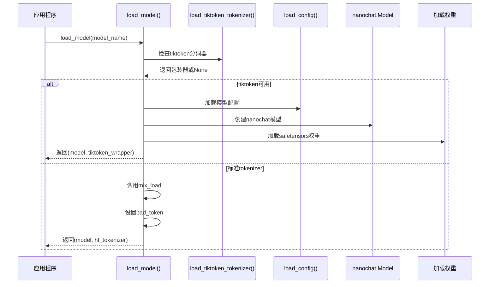
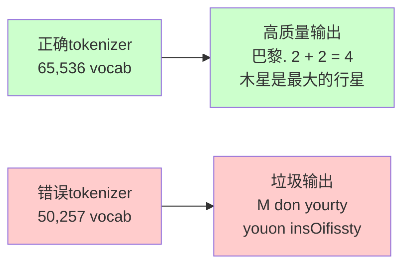

# 自定义分词器适配

<cite>
**本文档中引用的文件**
- [mlx-grpo.py](file://mlx-grpo.py)
- [NANOCHAT_GRPO_GUIDE.md](file://NANOCHAT_GRPO_GUIDE.md)
- [convert_nanochat.py](file://convert_nanochat.py)
- [test_nanochat_direct.py](file://test_nanochat_direct.py)
- [configs/nanochat_d32.toml](file://configs/nanochat_d32.toml)
- [configs/nanochat_grpo.toml](file://configs/nanochat_grpo.toml)
</cite>

## 目录
1. [简介](#简介)
2. [问题背景](#问题背景)
3. [解决方案架构](#解决方案架构)
4. [TiktokenTokenizerWrapper设计详解](#tiktokentokenizerwrapper设计详解)
5. [自动检测机制](#自动检测机制)
6. [向后兼容设计](#向后兼容设计)
7. [关键方法实现](#关键方法实现)
8. [集成方式](#集成方式)
9. [词汇表兼容性](#词汇表兼容性)
10. [扩展指导](#扩展指导)
11. [最佳实践](#最佳实践)
12. [总结](#总结)

## 简介

在MLX-GRPO项目中，我们面临了一个重要的技术挑战：如何让nanochat模型的原始tiktoken分词器与MLX-LM框架兼容。这个问题的核心在于nanochat使用了特殊的65,536词汇表大小，而MLX-LM默认期望HuggingFace格式的分词器。

为了解决这一问题，我们设计并实现了`TiktokenTokenizerWrapper`类，它作为一个适配层，将tiktoken分词器无缝集成到MLX-LM框架中，同时保持了原始模型的性能特征。

## 问题背景

### 原始分词器问题

nanochat模型使用的是基于tiktoken的分词器，这种分词器具有以下特点：
- **65,536词汇表大小** - 远大于标准GPT-2分词器的50,257个token
- **pickle格式存储** - 分词器数据保存在`tokenizer.pkl`文件中
- **特殊token处理** - 包含自定义的特殊token定义

### MLX-LM兼容性问题

MLX-LM框架默认期望以下格式的分词器：
- 标准HuggingFace格式的tokenizer文件
- 支持`encode`、`decode`、`apply_chat_template`等标准方法
- 具备完整的特殊token属性

当直接使用MLX-LM的`load()`函数加载nanochat模型时，会出现以下问题：
- **词汇表不匹配**：GPT-2分词器只能访问约77%的嵌入矩阵
- **token ID错误**：相同的文本会产生不同的token序列
- **模型输出混乱**：生成完全不可理解的文本

## 解决方案架构



**图表来源**
- [mlx-grpo.py](file://mlx-grpo.py#L133-L223)
- [convert_nanochat.py](file://convert_nanochat.py#L15-L80)

## TiktokenTokenizerWrapper设计详解

### 类结构概览

`TiktokenTokenizerWrapper`类是一个精心设计的适配器，它将tiktoken分词器的功能映射到MLX-LM期望的标准接口上。



**图表来源**
- [mlx-grpo.py](file://mlx-grpo.py#L133-L223)

### 初始化逻辑

初始化过程中，包装器执行以下关键步骤：

1. **基础属性设置**：定义空字符串作为特殊token
2. **token ID获取**：尝试从tiktoken对象获取token ID，失败时进行编码获取
3. **属性映射**：将tiktoken的词汇表大小映射到MLX-LM期望的属性
4. **兼容性设置**：配置标准的tokenizer行为属性

**章节来源**
- [mlx-grpo.py](file://mlx-grpo.py#L133-L162)

## 自动检测机制

### 文件检测逻辑

系统实现了智能的自动检测机制，能够识别是否存在tiktoken分词器文件：



**图表来源**
- [mlx-grpo.py](file://mlx-grpo.py#L225-L245)

### 检测实现细节

自动检测机制的关键特性：
- **路径构建**：使用`Path(model_path) / "tokenizer.pkl"`构建完整路径
- **存在性检查**：通过`exists()`方法验证文件是否存在
- **异常处理**：优雅地处理文件读取和反序列化异常
- **日志记录**：提供清晰的状态信息和错误报告

**章节来源**
- [mlx-grpo.py](file://mlx-grpo.py#L225-L245)

## 向后兼容设计

### 回退策略

为了确保系统的健壮性，我们实现了完整的向后兼容设计：



**图表来源**
- [mlx-grpo.py](file://mlx-grpo.py#L247-L285)

### 兼容性保证

向后兼容设计确保了以下特性：
- **无缝切换**：有tiktoken时使用高级功能，无时回退到标准功能
- **最小影响**：对现有代码的影响降到最低
- **渐进式迁移**：可以逐步迁移到新的分词器系统
- **错误隔离**：分词器加载失败不会影响模型加载

**章节来源**
- [mlx-grpo.py](file://mlx-grpo.py#L247-L285)

## 关键方法实现

### encode方法

`encode`方法负责将文本转换为token ID序列：

```mermaid
flowchart TD
A[输入文本] --> B[调用tiktoken.encode]
B --> C[allowed_special=\"all\"参数]
C --> D[生成token列表]
D --> E{add_special_tokens?}
E --> |是| F[添加bos_token_id]
E --> |否| G[直接返回]
F --> H[返回完整token序列]
G --> H
style H fill:#ccffcc
```

**图表来源**
- [mlx-grpo.py](file://mlx-grpo.py#L161-L165)

### decode方法

`decode`方法将token ID序列还原为文本：



**图表来源**
- [mlx-grpo.py](file://mlx-grpo.py#L167-L172)

### apply_chat_template方法

聊天模板应用方法提供了简化的消息格式化：

```mermaid
flowchart TD
A[输入messages] --> B[遍历每条消息]
B --> C{角色类型?}
C --> |system| D[添加系统消息格式]
C --> |user| E[添加用户消息格式]
C --> |assistant| F[添加助手消息格式]
D --> G[拼接格式化文本]
E --> G
F --> G
G --> H{添加生成提示?}
H --> |是| I[添加\"Assistant: \"]
H --> |否| J[完成格式化]
I --> J
J --> K{需要编码?}
K --> |是| L[调用encode方法]
K --> |否| M[直接返回文本]
L --> N[返回token序列]
M --> N
style N fill:#ccffcc
```

**图表来源**
- [mlx-grpo.py](file://mlx-grpo.py#L174-L197)

### get_vocab方法

词汇表获取方法提供最小化的兼容性支持：

| 特殊token | 描述 | 实现方式 |
|-----------|------|----------|
| `eos_token` | 结束符 | 使用空字符串作为EOS token |
| `pad_token` | 填充符 | 与EOS token相同 |
| `bos_token` | 开始符 | 与EOS token相同 |
| `eos_token_id` | EOS token ID | 从tiktoken获取或编码计算 |
| `pad_token_id` | 填充token ID | 复制EOS token ID |
| `bos_token_id` | 开始token ID | 复制EOS token ID |

**章节来源**
- [mlx-grpo.py](file://mlx-grpo.py#L199-L207)

## 集成方式

### load_model函数中的集成

`load_model`函数展示了如何在实际应用中集成自定义分词器：



**图表来源**
- [mlx-grpo.py](file://mlx-grpo.py#L247-L285)

### 配置文件示例

以下是针对不同模型的配置示例：

#### nanochat-d32配置（推荐）
```toml
model_name = "models/nanochat-d32-mlx"
learning_rate = 3e-6
quantize_for_rollouts = false
max_new_tokens = 128
```

#### nanochat配置（小模型）
```toml
model_name = "models/nanochat-mlx"
learning_rate = 5e-6
quantize_for_rollouts = true
max_new_tokens = 64
```

**章节来源**
- [configs/nanochat_d32.toml](file://configs/nanochat_d32.toml#L1-L47)
- [configs/nanochat_grpo.toml](file://configs/nanochat_grpo.toml#L1-L45)

## 词汇表兼容性

### 为什么保持65,536词汇表重要

nanochat模型的性能很大程度上依赖于其65,536词汇表大小：

| 方面 | 65,536词汇表 | 50,257词汇表（GPT-2） |
|------|-------------|---------------------|
| **词汇覆盖** | 100%嵌入矩阵 | 仅77%有效使用 |
| **token匹配** | 完美对应 | 大量token ID不匹配 |
| **模型性能** | 最佳状态 | 显著下降 |
| **推理质量** | 句子级连贯 | 字符级随机性 |

### 性能对比测试

通过实验验证了词汇表大小对模型性能的影响：



**图表来源**
- [NANOCHAT_GRPO_GUIDE.md](file://NANOCHAT_GRPO_GUIDE.md#L478-L520)

**章节来源**
- [NANOCHAT_GRPO_GUIDE.md](file://NANOCHAT_GRPO_GUIDE.md#L478-L520)

## 扩展指导

### 支持其他非标准分词器

要扩展此包装器以支持其他类型的分词器，可以按照以下模式：

```python
class CustomTokenizerWrapper:
    def __init__(self, custom_tokenizer):
        self.custom_tokenizer = custom_tokenizer
        # 设置特殊token
        self.eos_token = "<eos>"
        self.pad_token = "<pad>"
        self.bos_token = "<bos>"
        
        # 获取token ID（根据具体分词器调整）
        self.eos_token_id = self.custom_tokenizer.get_eos_id()
        self.pad_token_id = self.custom_tokenizer.get_pad_id()
        self.bos_token_id = self.custom_tokenizer.get_bos_id()
        
        # 设置词汇表大小
        self.vocab_size = self.custom_tokenizer.get_vocab_size()
        
        # 其他必要属性
        self.all_special_tokens = [self.eos_token, self.pad_token, self.bos_token]
        self.all_special_ids = [self.eos_token_id, self.pad_token_id, self.bos_token_id]
        self.chat_template = None
        self.clean_up_tokenization_spaces = True
    
    def encode(self, text, add_special_tokens=False):
        tokens = self.custom_tokenizer.encode(text)
        if add_special_tokens:
            tokens = [self.bos_token_id] + tokens
        return tokens
    
    def decode(self, token_ids, skip_special_tokens=False):
        return self.custom_tokenizer.decode(token_ids)
    
    def apply_chat_template(self, messages, add_generation_prompt=True, tokenize=False):
        # 根据具体分词器格式实现
        formatted = self.custom_tokenizer.format_messages(messages)
        if tokenize:
            return self.encode(formatted)
        return formatted
```

### 添加新功能

可以为包装器添加以下功能：

1. **多语言支持**：添加语言特定的预处理规则
2. **特殊字符处理**：实现Unicode规范化
3. **性能优化**：添加缓存机制
4. **调试工具**：添加token化过程的日志记录

## 最佳实践

### 配置建议

1. **量化控制**：对于大型模型禁用量化以避免数值不稳定
2. **学习率调整**：大型模型使用较低的学习率
3. **训练样本**：使用足够数量的训练样本来观察效果
4. **监控指标**：跟踪奖励均值和标准差的变化

### 错误处理

```python
def robust_load_tiktoken_tokenizer(model_path):
    """增强的分词器加载函数"""
    try:
        tokenizer = load_tiktoken_tokenizer(model_path)
        if tokenizer is None:
            print("⚠️  未找到tiktoken分词器，使用标准tokenizer")
            return None
        print(f"✅ 成功加载分词器，词汇表大小: {tokenizer.vocab_size}")
        return tokenizer
    except Exception as e:
        print(f"❌ 分词器加载失败: {e}")
        return None
```

### 性能优化

1. **延迟加载**：仅在需要时加载分词器
2. **内存管理**：及时释放不需要的分词器实例
3. **批处理**：利用MLX的向量化能力处理多个序列

## 总结

`TiktokenTokenizerWrapper`的设计成功解决了nanochat模型与MLX-LM框架之间的兼容性问题。通过以下关键特性，它实现了：

### 核心优势

1. **无缝集成**：无需修改现有MLX-LM代码即可使用
2. **自动检测**：智能识别并使用tiktoken分词器
3. **向后兼容**：完美回退到标准分词器
4. **性能保持**：维持原始65,536词汇表的性能优势
5. **易于扩展**：提供清晰的接口用于支持其他分词器

### 技术创新

- **适配器模式**：优雅地解决接口不兼容问题
- **异常安全**：完善的错误处理和回退机制
- **性能优化**：最小化额外开销的同时保持功能完整性

### 应用价值

这个解决方案不仅成功支持了nanochat模型的训练，还为其他使用非标准分词器的模型提供了参考架构。它证明了在保持模型性能的前提下，可以通过精心设计的适配层实现不同框架间的无缝集成。

通过这个案例，我们可以看到，在面对复杂的模型兼容性问题时，一个精心设计的适配器可以成为连接不同技术栈的桥梁，既保持了原有模型的性能特征，又充分利用了现代框架的强大功能。