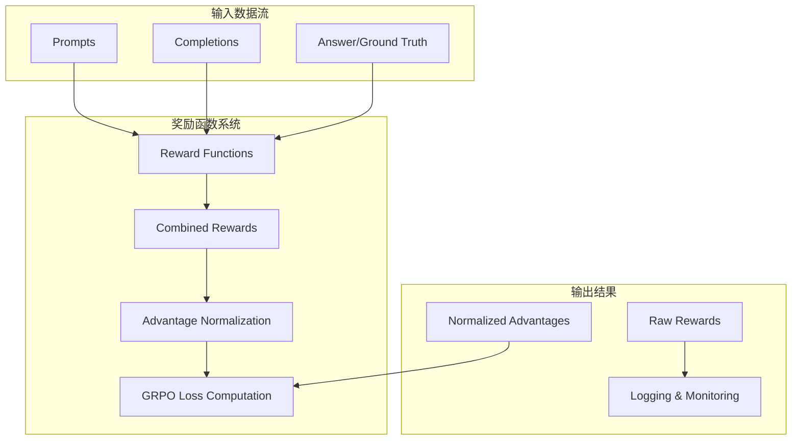
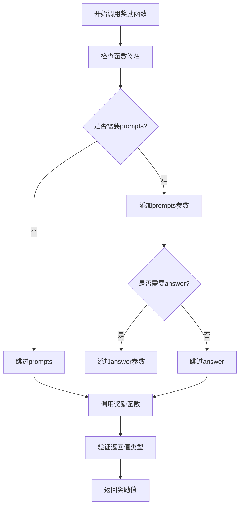
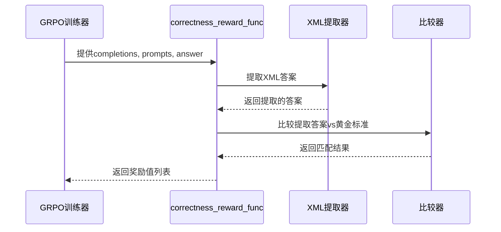
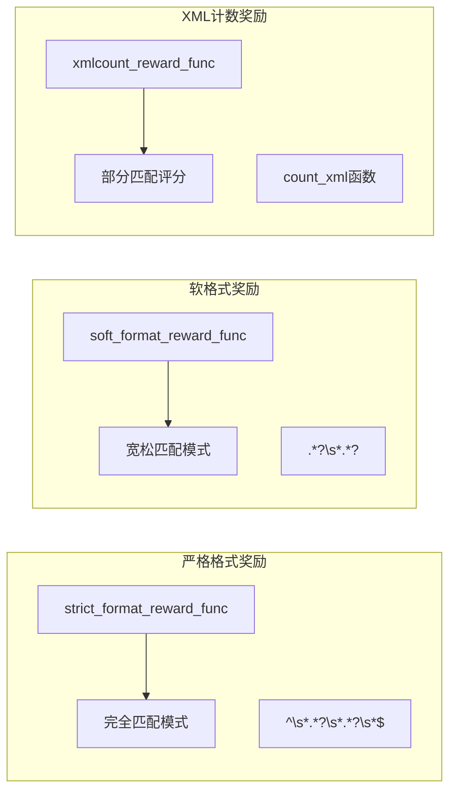
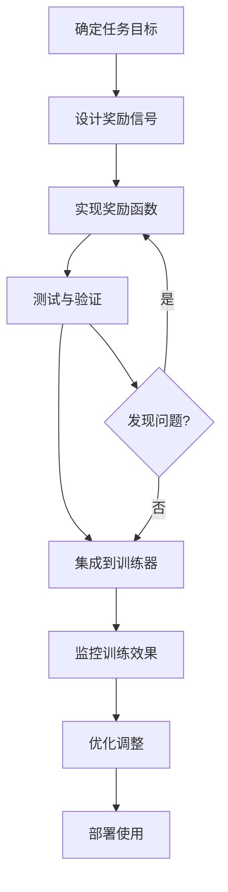
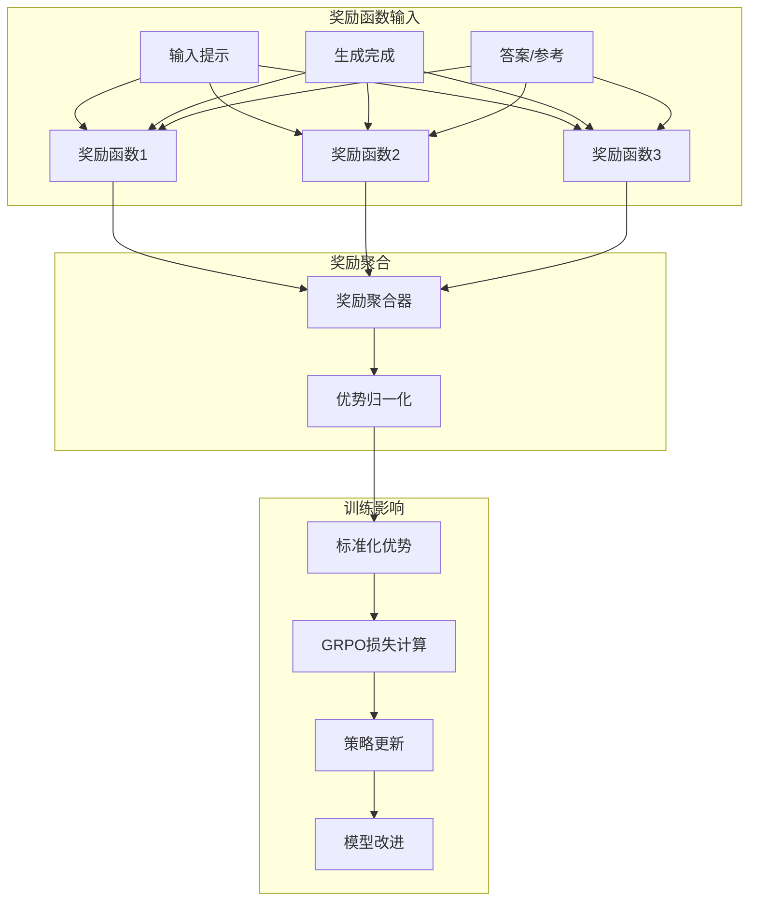

# 自定义奖励函数

<cite>
**本文档引用的文件**
- [mlx-grpo.py](file://mlx-grpo.py)
- [configs/nanochat_grpo.toml](file://configs/nanochat_grpo.toml)
- [configs/smoke_test.toml](file://configs/smoke_test.toml)
- [configs/prod.toml](file://configs/prod.toml)
- [configs/medium.toml](file://configs/medium.toml)
- [utils/README.md](file://utils/README.md)
</cite>

## 目录
1. [简介](#简介)
2. [奖励函数架构概述](#奖励函数架构概述)
3. [奖励函数接口规范](#奖励函数接口规范)
4. [现有奖励函数分析](#现有奖励函数分析)
5. [自定义奖励函数开发指南](#自定义奖励函数开发指南)
6. [具体实现示例](#具体实现示例)
7. [集成与配置](#集成与配置)
8. [训练动态影响](#训练动态影响)
9. [监控与调试](#监控与调试)
10. [最佳实践](#最佳实践)
11. [未来发展方向](#未来发展方向)

## 简介

MLX-GRPO框架提供了一个灵活且强大的奖励函数系统，允许研究人员和开发者根据特定任务需求设计和实现自定义奖励信号。该系统基于Group-based Relative Policy Optimization (GRPO)理论，通过多个奖励函数的组合来引导模型学习特定的行为模式。

奖励函数在GRPO训练过程中扮演着关键角色，它们为策略梯度提供了信号强度，同时通过优势归一化机制确保训练稳定性。本指南将详细介绍如何扩展框架以实现特定任务的优化目标。

## 奖励函数架构概述

MLX-GRPO的奖励函数系统采用模块化设计，支持多个奖励函数的组合使用。整个架构围绕以下核心组件构建：



**图表来源**
- [mlx-grpo.py](file://mlx-grpo.py#L573-L674)
- [mlx-grpo.py](file://mlx-grpo.py#L810-L869)

**章节来源**
- [mlx-grpo.py](file://mlx-grpo.py#L573-L674)
- [mlx-grpo.py](file://mlx-grpo.py#L810-L869)

## 奖励函数接口规范

### 标准接口定义

所有奖励函数必须遵循统一的接口规范，确保与GRPO训练器的兼容性：

```python
def custom_reward_function(completions, **kwargs) -> list[float]:
    """
    自定义奖励函数的标准接口
    
    参数:
        completions (List[List[Dict]]): 完成文本列表，格式为
            [[{"content": "response1"}], [{"content": "response2"}], ...]
        **kwargs: 可选参数，通常包含：
            - prompts (List[List[Dict]]): 输入提示
            - answer (List[Any]): 答案或参考信息
    
    返回:
        List[float]: 每个完成对应的奖励值列表
    """
    # 实现逻辑
    pass
```

### 接口特性说明

| 特性 | 描述 | 必需性 | 示例 |
|------|------|--------|------|
| 输入格式 | `completions`参数必须是嵌套字典列表 | 必需 | `[{"content": "text"}]` |
| 参数灵活性 | 支持可变关键字参数 | 可选 | `prompts`, `answer`等 |
| 返回类型 | 必须返回浮点数列表 | 必需 | `[0.5, 1.0, 0.0]` |
| 异常处理 | 需要适当的错误处理 | 推荐 | 防止训练中断 |

### 函数签名检查机制

框架会自动检查奖励函数的签名，确保向后兼容性：



**图表来源**
- [mlx-grpo.py](file://mlx-grpo.py#L606-L635)

**章节来源**
- [mlx-grpo.py](file://mlx-grpo.py#L606-L635)

## 现有奖励函数分析

### 内置奖励函数概览

MLX-GRPO框架提供了多种内置奖励函数，展示了不同类型的奖励信号设计：

| 奖励函数 | 类型 | 信号强度 | 应用场景 | 优势 |
|----------|------|----------|----------|------|
| `correctness_reward_func` | 正确性奖励 | 高(2.0) | 数学问题解决 | 明确的目标导向 |
| `xmlcount_reward_func` | 格式奖励 | 中等(0.25-0.5) | 结构化输出 | 促进格式一致性 |
| `strict_format_reward_func` | 严格格式奖励 | 中等(0.5) | XML格式要求 | 强制格式规范 |
| `soft_format_reward_func` | 软格式奖励 | 中等(0.5) | 灵活格式 | 平衡灵活性 |
| `int_reward_func` | 整数验证奖励 | 低(0.5) | 数据类型验证 | 辅助性奖励 |

### 正确性奖励函数详解



**图表来源**
- [mlx-grpo.py](file://mlx-grpo.py#L72-L95)

### 格式奖励函数对比



**图表来源**
- [mlx-grpo.py](file://mlx-grpo.py#L97-L131)

**章节来源**
- [mlx-grpo.py](file://mlx-grpo.py#L72-L131)

## 自定义奖励函数开发指南

### 开发步骤流程



### 奖励信号设计原则

1. **明确的目标导向**: 奖励信号应该清晰地反映任务目标
2. **适当的信号强度**: 避免过于强烈或过于微弱的信号
3. **计算效率**: 确保奖励函数计算快速高效
4. **鲁棒性**: 处理各种边缘情况和异常输入
5. **可解释性**: 奖励信号应该具有合理的解释性

### 常见奖励信号类型

| 类型 | 设计思路 | 计算方法 | 示例 |
|------|----------|----------|------|
| 目标导向奖励 | 基于任务目标的直接匹配 | 精确匹配或相似度计算 | 数学答案正确性 |
| 格式约束奖励 | 基于输出格式的约束 | 正则表达式匹配 | XML标签完整性 |
| 质量评估奖励 | 基于输出质量的评估 | 语言模型评分 | 连贯性和流畅性 |
| 多模态奖励 | 基于多模态信息的奖励 | 组合多种信号 | 视觉-文本一致性 |

## 具体实现示例

### 示例1：基于正则表达式的数学答案精确匹配奖励函数

```python
def math_answer_exact_match_reward(completions, **kwargs) -> list[float]:
    """
    基于正则表达式的数学答案精确匹配奖励函数
    
    适用于数学问题求解任务，奖励精确的数值答案匹配
    """
    import re
    import sympy as sp
    
    responses = [completion[0]['content'] for completion in completions]
    gold_answers = kwargs.get('answer', [])
    
    rewards = []
    for response, gold in zip(responses, gold_answers):
        try:
            # 提取响应中的数字
            extracted_numbers = re.findall(r'[-+]?\d*\.\d+|\d+', response)
            
            # 将黄金标准转换为数值
            if isinstance(gold, str):
                try:
                    gold_numeric = float(gold)
                except ValueError:
                    # 尝试使用sympy解析复杂表达式
                    gold_numeric = float(sp.sympify(gold))
            else:
                gold_numeric = float(gold)
            
            # 计算匹配分数
            if extracted_numbers:
                best_match = min(
                    abs(float(num) - gold_numeric) for num in extracted_numbers
                )
                # 使用倒数作为奖励，越接近0越好
                reward = 1.0 / (1.0 + best_match) if best_match < 0.1 else 0.0
            else:
                reward = 0.0
                
            rewards.append(reward)
            
        except Exception as e:
            print(f"数学奖励计算错误: {e}")
            rewards.append(0.0)
    
    return rewards
```

### 示例2：评估响应连贯性的语言模型打分奖励

```python
def coherence_score_reward(completions, **kwargs) -> list[float]:
    """
    基于语言模型的响应连贯性评分奖励函数
    
    使用预训练的语言模型评估生成文本的连贯性
    """
    import torch
    from transformers import AutoTokenizer, AutoModelForSequenceClassification
    
    responses = [completion[0]['content'] for completion in completions]
    
    # 加载连贯性评估模型（需要预先下载）
    try:
        tokenizer = AutoTokenizer.from_pretrained("bert-large-cased")
        model = AutoModelForSequenceClassification.from_pretrained(
            "bert-large-cased", 
            num_labels=1
        )
        device = torch.device("cuda" if torch.cuda.is_available() else "cpu")
        model.to(device)
        model.eval()
    except Exception as e:
        print(f"加载连贯性模型失败: {e}")
        return [0.1] * len(responses)  # 默认低奖励
    
    coherence_scores = []
    for response in responses:
        try:
            # 分段评估连贯性
            paragraphs = [p.strip() for p in response.split('\n') if p.strip()]
            
            if len(paragraphs) <= 1:
                # 单段落默认高连贯性
                coherence_scores.append(0.8)
                continue
            
            # 计算相邻段落间的连贯性
            segment_scores = []
            for i in range(len(paragraphs) - 1):
                paragraph1 = paragraphs[i]
                paragraph2 = paragraphs[i + 1]
                
                # 构造上下文对
                context_pair = f"{paragraph1} [SEP] {paragraph2}"
                
                # 编码并预测
                inputs = tokenizer(context_pair, return_tensors="pt", truncation=True, max_length=512)
                inputs = {k: v.to(device) for k, v in inputs.items()}
                
                with torch.no_grad():
                    outputs = model(**inputs)
                    score = torch.sigmoid(outputs.logits).item()
                    segment_scores.append(score)
            
            if segment_scores:
                avg_coherence = sum(segment_scores) / len(segment_scores)
                coherence_scores.append(avg_coherence)
            else:
                coherence_scores.append(0.5)
                
        except Exception as e:
            print(f"连贯性评分错误: {e}")
            coherence_scores.append(0.3)  # 默认中等奖励
    
    return coherence_scores
```

### 示例3：多模态一致性奖励函数

```python
def multimodal_consistency_reward(completions, **kwargs) -> list[float]:
    """
    多模态一致性奖励函数，评估文本描述与视觉内容的一致性
    
    适用于视觉问答或图像描述任务
    """
    import torch
    from PIL import Image
    from transformers import CLIPProcessor, CLIPModel
    
    responses = [completion[0]['content'] for completion in completions]
    images = kwargs.get('images', [])  # 图像数据
    
    rewards = []
    
    try:
        # 加载CLIP模型进行一致性评估
        processor = CLIPProcessor.from_pretrained("openai/clip-vit-base-patch32")
        model = CLIPModel.from_pretrained("openai/clip-vit-base-patch32")
        device = torch.device("cuda" if torch.cuda.is_available() else "cpu")
        model.to(device)
        
        for response, image in zip(responses, images):
            try:
                # 处理图像
                if isinstance(image, str):
                    # 文件路径
                    image = Image.open(image).convert("RGB")
                elif isinstance(image, bytes):
                    # 字节数据
                    image = Image.open(io.BytesIO(image)).convert("RGB")
                
                # 准备文本和图像输入
                inputs = processor(text=response, images=image, return_tensors="pt", padding=True)
                inputs = {k: v.to(device) for k, v in inputs.items()}
                
                # 计算相似度
                with torch.no_grad():
                    outputs = model(**inputs)
                    similarity = outputs.text_projector @ outputs.visual_projector.t()
                    similarity_score = similarity.item() / 100.0  # 归一化到0-1范围
                    
                # 根据相似度计算奖励
                if similarity_score > 0.7:
                    reward = 1.0
                elif similarity_score > 0.5:
                    reward = 0.7
                elif similarity_score > 0.3:
                    reward = 0.4
                else:
                    reward = 0.1
                
                rewards.append(reward)
                
            except Exception as e:
                print(f"多模态一致性评估错误: {e}")
                rewards.append(0.2)  # 默认低奖励
                
    except Exception as e:
        print(f"加载多模态模型失败: {e}")
        rewards = [0.2] * len(responses)  # 默认低奖励
    
    return rewards
```

**章节来源**
- [mlx-grpo.py](file://mlx-grpo.py#L72-L131)

## 集成与配置

### 添加自定义奖励函数到训练器

```python
# 在MLXGRPOTrainer初始化时添加自定义奖励函数
trainer = MLXGRPOTrainer(
    model=model,
    tokenizer=tokenizer,
    reward_funcs=[
        correctness_reward_func,      # 内置奖励函数
        xmlcount_reward_func,         # 内置奖励函数
        math_answer_exact_match_reward,  # 自定义奖励函数1
        coherence_score_reward,       # 自定义奖励函数2
        multimodal_consistency_reward,   # 自定义奖励函数3
    ],
    args=config,
    train_dataset=train_dataset,
    eval_dataset=eval_dataset
)
```

### 配置文件集成

```toml
# 在配置文件中设置奖励函数权重（如果需要）
[reward_functions]
correctness_weight = 2.0
format_weight = 0.5
coherence_weight = 0.3
multimodal_weight = 0.4

# 训练参数调整
learning_rate = 1e-6
num_generations = 16
max_new_tokens = 512
temperature = 0.7
```

### 动态奖励函数管理

```python
class RewardFunctionManager:
    """奖励函数管理器，支持动态添加和配置奖励函数"""
    
    def __init__(self):
        self.functions = {}
        self.weights = {}
    
    def register_function(self, name, func, weight=1.0):
        """注册新的奖励函数"""
        self.functions[name] = func
        self.weights[name] = weight
    
    def compute_combined_rewards(self, completions, **kwargs):
        """计算组合奖励"""
        total_rewards = None
        
        for name, func in self.functions.items():
            rewards = func(completions, **kwargs)
            weighted_rewards = [r * self.weights[name] for r in rewards]
            
            if total_rewards is None:
                total_rewards = weighted_rewards
            else:
                total_rewards = [r1 + r2 for r1, r2 in zip(total_rewards, weighted_rewards)]
        
        return total_rewards
```

**章节来源**
- [mlx-grpo.py](file://mlx-grpo.py#L437-L457)
- [mlx-grpo.py](file://mlx-grpo.py#L1210-L1245)

## 训练动态影响

### 奖励函数对GRPO训练的影响机制



**图表来源**
- [mlx-grpo.py](file://mlx-grpo.py#L606-L674)
- [mlx-grpo.py](file://mlx-grpo.py#L810-L869)

### 信号强度与训练稳定性平衡

| 奖励信号强度 | 对应奖励值 | 训练稳定性 | 适用场景 | 注意事项 |
|--------------|------------|------------|----------|----------|
| 高强度信号 | 1.0-2.0 | 中等 | 关键任务目标 | 可能导致训练不稳定 |
| 中等信号 | 0.3-0.7 | 良好 | 辅助性目标 | 平衡信号与稳定性 |
| 低强度信号 | 0.1-0.3 | 优秀 | 微调和优化 | 需要多个信号组合 |

### 优势归一化机制

```mermaid
flowchart TD
RAW_REWARDS[原始奖励值] --> MEAN_CALC[计算均值μ]
RAW_REWARDS --> STD_CALC[计算标准差σ]
MEAN_CALC --> SUB_MEAN[减去均值]
STD_CALC --> DIV_STD[除以标准差]
SUB_MEAN --> ADVANTAGE[优势值 A_i = (R_i - μ) / σ]
DIV_STD --> ADVANTAGE
ADVANTAGE --> STABLE_TRAINING[稳定训练]
```

**图表来源**
- [mlx-grpo.py](file://mlx-grpo.py#L650-L674)

**章节来源**
- [mlx-grpo.py](file://mlx-grpo.py#L606-L674)
- [mlx-grpo.py](file://mlx-grpo.py#L810-L869)

## 监控与调试

### 奖励值监控系统

```python
class RewardMonitor:
    """奖励函数监控系统"""
    
    def __init__(self):
        self.history = {
            'reward_values': [],
            'advantage_values': [],
            'reward_distribution': {},
            'training_steps': []
        }
    
    def log_reward_stats(self, rewards, advantages, step):
        """记录奖励统计信息"""
        if len(rewards) > 0:
            self.history['reward_values'].append({
                'mean': float(np.mean(rewards)),
                'std': float(np.std(rewards)),
                'min': float(np.min(rewards)),
                'max': float(np.max(rewards)),
                'step': step
            })
        
        if len(advantages) > 0:
            self.history['advantage_values'].append({
                'mean': float(np.mean(advantages)),
                'std': float(np.std(advantages)),
                'min': float(np.min(advantages)),
                'max': float(np.max(advantages)),
                'step': step
            })
        
        # 更新训练步数
        self.history['training_steps'].append(step)
    
    def plot_reward_dynamics(self):
        """绘制奖励动态变化图"""
        import matplotlib.pyplot as plt
        
        fig, (ax1, ax2) = plt.subplots(2, 1, figsize=(12, 8))
        
        # 奖励值变化
        rewards_df = pd.DataFrame(self.history['reward_values'])
        ax1.plot(rewards_df['step'], rewards_df['mean'], label='Mean Reward')
        ax1.fill_between(
            rewards_df['step'],
            rewards_df['mean'] - rewards_df['std'],
            rewards_df['mean'] + rewards_df['std'],
            alpha=0.3
        )
        ax1.set_ylabel('Reward Value')
        ax1.legend()
        ax1.grid(True)
        
        # 优势值变化
        advantages_df = pd.DataFrame(self.history['advantage_values'])
        ax2.plot(advantages_df['step'], advantages_df['mean'], label='Mean Advantage')
        ax2.fill_between(
            advantages_df['step'],
            advantages_df['mean'] - advantages_df['std'],
            advantages_df['mean'] + advantages_df['std'],
            alpha=0.3
        )
        ax2.set_ylabel('Advantage Value')
        ax2.set_xlabel('Training Step')
        ax2.legend()
        ax2.grid(True)
        
        plt.tight_layout()
        return fig
```

### eval_steps监控配置

```python
# 在配置文件中设置奖励监控频率
eval_steps = 25  # 每25个训练步骤监控一次奖励值
eval_every_updates = 25  # 每25次优化更新执行评估
eval_subset_size = 100  # 使用100个样本进行评估

# 监控指标阈值
reward_threshold = 0.1  # 奖励值低于此阈值时发出警告
advantage_stability_threshold = 0.5  # 优势值标准差超过此值时需要关注
```

### 调试工具和技巧

```python
def debug_reward_function(func, test_completions, **kwargs):
    """调试奖励函数的工具"""
    print(f"=== 调试奖励函数: {func.__name__} ===")
    
    try:
        rewards = func(test_completions, **kwargs)
        print(f"奖励值: {rewards}")
        print(f"平均值: {np.mean(rewards):.3f}")
        print(f"标准差: {np.std(rewards):.3f}")
        print(f"最小值: {np.min(rewards):.3f}")
        print(f"最大值: {np.max(rewards):.3f}")
        
        # 检查异常值
        outliers = [r for r in rewards if r > np.mean(rewards) + 2 * np.std(rewards)]
        if outliers:
            print(f"检测到异常值: {outliers}")
        
        return rewards
        
    except Exception as e:
        print(f"奖励函数执行错误: {e}")
        import traceback
        traceback.print_exc()
        return None

# 使用示例
test_completions = [[{"content": "测试响应1"}], [{"content": "测试响应2"}]]
debug_reward_function(math_answer_exact_match_reward, test_completions, answer=["10"])
```

**章节来源**
- [mlx-grpo.py](file://mlx-grpo.py#L1031-L1060)
- [mlx-grpo.py](file://mlx-grpo.py#L1111-L1138)

## 最佳实践

### 奖励函数设计最佳实践

1. **渐进式增强策略**
   - 从简单的奖励函数开始
   - 逐步添加更复杂的奖励信号
   - 监控训练稳定性

2. **信号强度控制**
   - 避免单一高强度奖励信号
   - 使用多个中等强度信号组合
   - 通过权重调节信号贡献

3. **鲁棒性设计**
   - 处理各种异常输入
   - 提供合理的默认值
   - 实现适当的错误恢复

4. **性能优化**
   - 避免复杂的计算操作
   - 使用缓存机制
   - 批量处理提高效率

### 常见陷阱与解决方案

| 陷阱 | 症状 | 解决方案 |
|------|------|----------|
| 奖励信号过强 | 训练不稳定，损失震荡 | 降低信号强度，增加归一化 |
| 奖励信号过弱 | 学习缓慢，收敛困难 | 增加信号强度，调整权重 |
| 异常值过多 | 训练过程异常 | 实现异常值检测和过滤 |
| 计算开销过大 | 训练速度慢 | 优化算法，使用缓存 |

### 测试和验证策略

```python
def comprehensive_reward_test(reward_func, test_cases):
    """综合奖励函数测试"""
    results = []
    
    for i, case in enumerate(test_cases):
        print(f"\n=== 测试案例 {i+1} ===")
        print(f"输入: {case['input']}")
        print(f"期望输出: {case['expected']}")
        
        try:
            rewards = reward_func(case['input'], **case.get('kwargs', {}))
            print(f"实际输出: {rewards}")
            
            # 性能指标
            accuracy = sum(1 for r, e in zip(rewards, case['expected']) if abs(r - e) < 0.1) / len(rewards)
            print(f"准确率: {accuracy:.2%}")
            
            # 边界条件测试
            boundary_tests = [
                {"input": [{"content": ""}], "expected": [0.0]},
                {"input": [{"content": " "*1000}], "expected": [0.0]},
                {"input": [], "expected": []}
            ]
            
            for bt in boundary_tests:
                bt_rewards = reward_func(bt['input'], **case.get('kwargs', {}))
                print(f"边界测试: {bt_rewards}")
            
            results.append({
                'case': i,
                'accuracy': accuracy,
                'rewards': rewards
            })
            
        except Exception as e:
            print(f"测试失败: {e}")
            results.append({'case': i, 'error': str(e)})
    
    return results
```

**章节来源**
- [mlx-grpo.py](file://mlx-grpo.py#L634-L674)

## 未来发展方向

### 格式奖励的扩展

基于当前框架，格式奖励系统可以进一步发展：

```python
def enhanced_format_reward(completions, **kwargs) -> list[float]:
    """
    增强版格式奖励函数，支持更复杂的格式验证
    """
    responses = [completion[0]['content'] for completion in completions]
    
    # 多层次格式验证
    format_scores = []
    for response in responses:
        score = 0.0
        
        # 1. 基础结构验证
        if re.search(r"<reasoning>.*?</reasoning>", response, re.DOTALL):
            score += 0.3
        if re.search(r"<answer>.*?</answer>", response, re.DOTALL):
            score += 0.3
        
        # 2. 语法和语义验证
        try:
            # 使用语言模型验证语义连贯性
            coherence_score = semantic_coherence_check(response)
            score += coherence_score * 0.2
        except:
            pass
        
        # 3. 长度和完整性检查
        word_count = len(response.split())
        if 50 <= word_count <= 500:
            score += 0.2
        
        format_scores.append(min(score, 1.0))
    
    return format_scores
```

### 推理奖励的发展方向

推理奖励可以通过以下方式进一步完善：

```python
def reasoning_quality_reward(completions, **kwargs) -> list[float]:
    """
    基于推理质量的奖励函数
    """
    responses = [completion[0]['content'] for completion in completions]
    
    # 多维度推理质量评估
    reasoning_scores = []
    for response in responses:
        score = 0.0
        
        # 1. 推理链完整性
        reasoning_segments = extract_reasoning_segments(response)
        if len(reasoning_segments) >= 2:
            score += 0.4
        
        # 2. 逻辑一致性检查
        consistency_score = check_logical_consistency(reasoning_segments)
        score += consistency_score * 0.3
        
        # 3. 结论准确性验证
        conclusion_accuracy = verify_conclusion(response)
        score += conclusion_accuracy * 0.3
        
        reasoning_scores.append(score)
    
    return reasoning_scores
```

### 多模态奖励系统的演进

随着视觉-语言模型的发展，多模态奖励系统将成为重要方向：

```python
def multimodal_enhanced_reward(completions, **kwargs) -> list[float]:
    """
    增强的多模态奖励函数
    """
    responses = [completion[0]['content'] for completion in completions]
    multimodal_data = kwargs.get('multimodal_data', [])
    
    rewards = []
    for response, data in zip(responses, multimodal_data):
        # 组合文本和视觉信息的奖励
        text_reward = basic_text_reward(response)
        vision_reward = visual_consistency_reward(response, data)
        
        # 加权组合
        combined_reward = 0.7 * text_reward + 0.3 * vision_reward
        rewards.append(combined_reward)
    
    return rewards
```

### 自适应奖励函数

未来的奖励函数可能具备自适应能力：

```python
class AdaptiveRewardFunction:
    """自适应奖励函数类"""
    
    def __init__(self, base_function, adaptation_strategy):
        self.base_function = base_function
        self.adaptation_strategy = adaptation_strategy
        self.performance_history = []
    
    def compute_reward(self, completions, **kwargs):
        """计算适应性奖励"""
        raw_rewards = self.base_function(completions, **kwargs)
        
        # 根据历史性能调整奖励
        adjusted_rewards = self.adaptation_strategy.adjust(
            raw_rewards, 
            self.performance_history
        )
        
        # 记录性能历史
        self.performance_history.append({
            'rewards': raw_rewards,
            'adjusted_rewards': adjusted_rewards,
            'timestamp': time.time()
        })
        
        return adjusted_rewards
```

**章节来源**
- [mlx-grpo.py](file://mlx-grpo.py#L97-L131)
- [mlx-grpo.py](file://mlx-grpo.py#L72-L95)

## 结论

MLX-GRPO框架提供了一个强大而灵活的奖励函数系统，为研究人员和开发者提供了丰富的扩展可能性。通过合理设计和实现自定义奖励函数，可以显著提升模型在特定任务上的表现。

关键要点总结：

1. **接口规范**：遵循统一的奖励函数接口，确保与框架的兼容性
2. **信号平衡**：在信号强度和训练稳定性之间找到合适的平衡点
3. **监控调试**：建立完善的监控体系，及时发现和解决问题
4. **迭代优化**：采用渐进式的方法，逐步完善奖励函数设计
5. **未来发展**：关注格式奖励、推理奖励和多模态奖励的发展趋势

通过本指南提供的理论基础和实践示例，开发者可以有效地扩展MLX-GRPO框架，实现特定任务的优化目标，推动大语言模型在各种应用场景中的性能提升。