# 高级功能与自定义

<cite>
**本文档中引用的文件**
- [NANOCHAT_GRPO_GUIDE.md](file://NANOCHAT_GRPO_GUIDE.md)
- [mlx-grpo.py](file://mlx-grpo.py)
- [convert_nanochat.py](file://convert_nanochat.py)
- [utils/inference.py](file://utils/inference.py)
- [utils/convert_model.py](file://utils/convert_model.py)
- [configs/nanochat_grpo.toml](file://configs/nanochat_grpo.toml)
- [configs/nanochat_d32.toml](file://configs/nanochat_d32.toml)
</cite>

## 目录
1. [简介](#简介)
2. [专家级特性概览](#专家级特性概览)
3. [TiktokenTokenizerWrapper详解](#tiktokentokenizerwrapper详解)
4. [量化配置与数值稳定性](#量化配置与数值稳定性)
5. [自定义奖励函数系统](#自定义奖励函数系统)
6. [模型转换与扩展框架](#模型转换与扩展框架)
7. [高级推理与部署](#高级推理与部署)
8. [前沿研究与扩展](#前沿研究与扩展)
9. [故障排除与最佳实践](#故障排除与最佳实践)
10. [总结](#总结)

## 简介

MLX-GRPO是一个专为Apple Silicon设计的纯MLX训练框架，实现了基于组的相对策略优化（GRPO）。本指南深入探讨了项目中的高级功能和自定义能力，帮助高级用户充分利用框架的前沿特性进行深度研究和定制开发。

## 专家级特性概览

### 核心架构特点

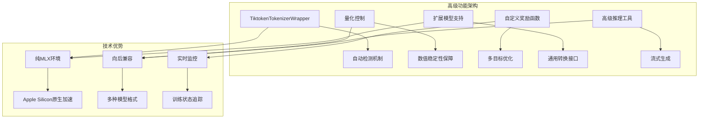

**图表来源**
- [mlx-grpo.py](file://mlx-grpo.py#L133-L223)
- [configs/nanochat_d32.toml](file://configs/nanochat_d32.toml#L35-L40)

### 主要专家级特性

| 特性类别 | 具体功能 | 技术亮点 | 应用场景 |
|---------|----------|----------|----------|
| 分词器集成 | Tiktoken自动检测 | 原始嵌入保持 | 大模型微调 |
| 数值稳定性 | 量化参数控制 | 动态配置管理 | 训练稳定性 |
| 奖励优化 | 多维度奖励函数 | 可插拔设计 | 任务定制化 |
| 模型扩展 | 通用转换接口 | 支持多种格式 | 研究验证 |
| 推理增强 | 流式生成支持 | 实时响应 | 生产部署 |

## TiktokenTokenizerWrapper详解

### 自动检测机制

TiktokenTokenizerWrapper是解决nanochat模型分词器不兼容问题的核心组件，实现了智能的自动检测和适配机制。

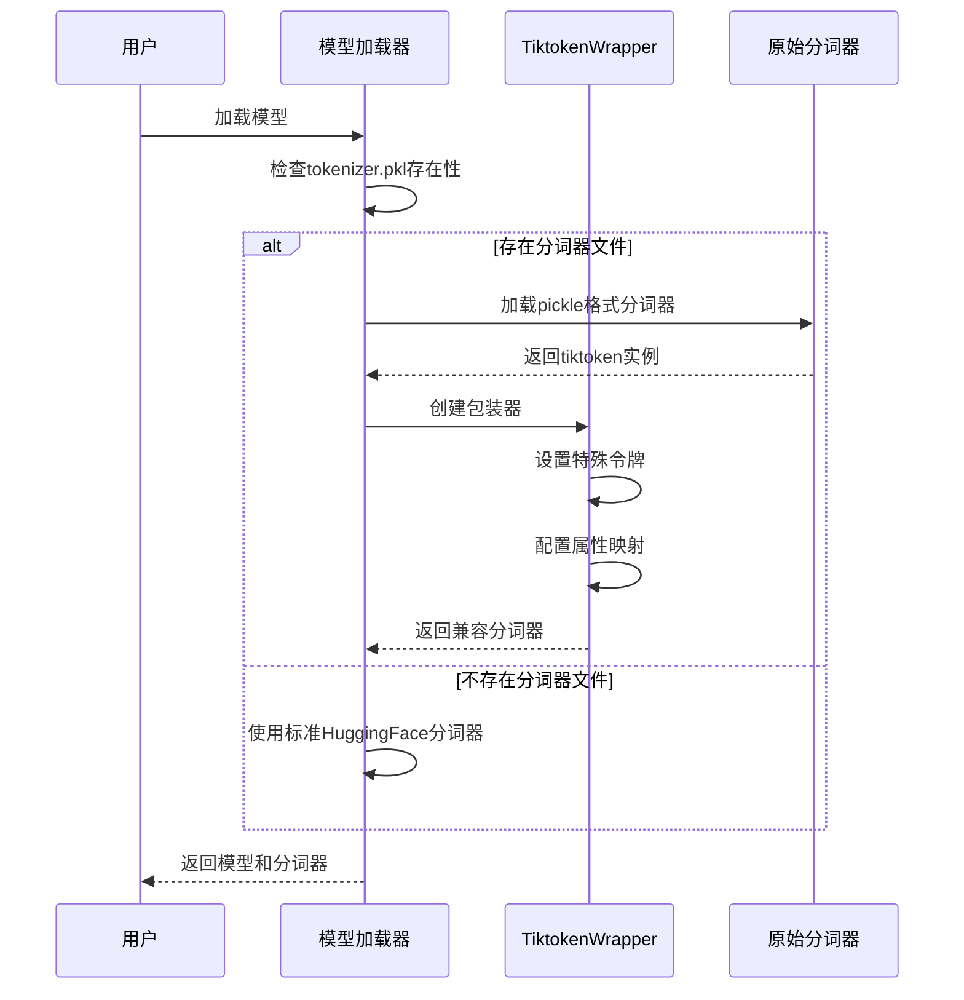

**图表来源**
- [mlx-grpo.py](file://mlx-grpo.py#L225-L254)
- [NANOCHAT_GRPO_GUIDE.md](file://NANOCHAT_GRPO_GUIDE.md#L418-L477)

### 向后兼容设计

#### 核心实现原理

TiktokenTokenizerWrapper通过以下机制确保向后兼容：

1. **属性映射**: 将tiktoken的内部表示映射到MLX-LM期望的接口
2. **特殊令牌处理**: 统一处理EOS、PAD、BOS等特殊标记
3. **方法适配**: 提供encode、decode、apply_chat_template等核心方法

#### 关键配置参数

| 参数 | 类型 | 默认值 | 说明 |
|------|------|--------|------|
| `eos_token` | str | "" | 结束标记符 |
| `pad_token` | str | "" | 填充标记符 |
| `bos_token` | str | "" | 开始标记符 |
| `vocab_size` | int | tiktoken.n_vocab | 词汇表大小 |
| `allowed_special` | str | "all" | 允许的特殊字符 |

**章节来源**
- [mlx-grpo.py](file://mlx-grpo.py#L133-L223)
- [NANOCHAT_GRPO_GUIDE.md](file://NANOCHAT_GRPO_GUIDE.md#L344-L416)

### 扩展功能实现

#### 聊天模板支持

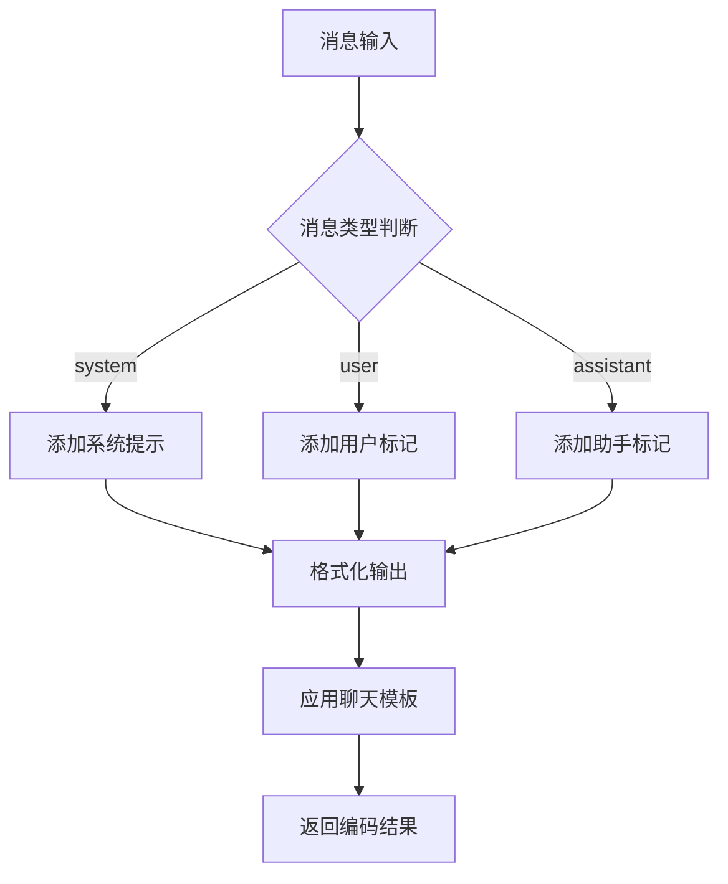

**图表来源**
- [mlx-grpo.py](file://mlx-grpo.py#L180-L200)

#### 词汇表管理

TiktokenTokenizerWrapper提供了最小化的词汇表接口，确保与现有代码的兼容性：

- **特殊令牌映射**: eos_token、pad_token、bos_token的ID映射
- **动态查询**: 运行时访问特殊令牌信息
- **兼容性保证**: 符合MLX-LM的分词器接口规范

**章节来源**
- [mlx-grpo.py](file://mlx-grpo.py#L201-L223)

## 量化配置与数值稳定性

### quantize_for_rollouts配置机制

`quantize_for_rollouts`是nanochat-d32模型训练中的关键配置项，用于控制rollout阶段的模型量化，避免数值不稳定问题。

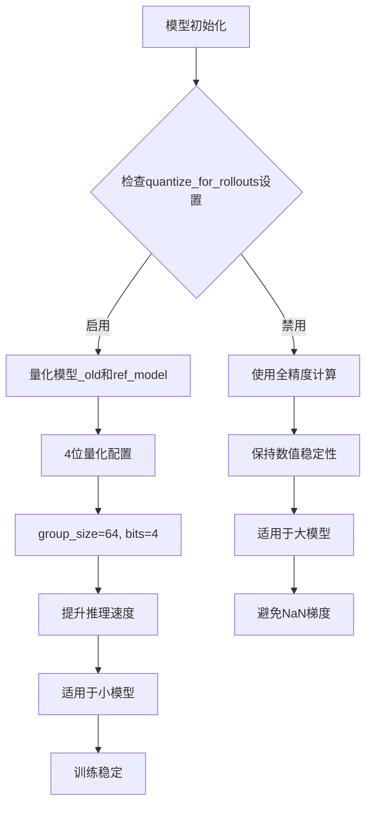

**图表来源**
- [mlx-grpo.py](file://mlx-grpo.py#L411-L435)
- [configs/nanochat_d32.toml](file://configs/nanochat_d32.toml#L35-L40)

### 数值稳定性策略

#### 大模型量化风险

对于32层的大模型（nanochat-d32），量化可能导致以下问题：

1. **梯度爆炸**: 4位量化导致数值溢出
2. **精度损失**: 低比特权重影响模型性能
3. **训练中断**: NaN值传播到整个网络

#### 配置最佳实践

| 模型规模 | quantize_for_rollouts | 学习率 | max_new_tokens |
|----------|----------------------|--------|----------------|
| 20层小模型 | true | 5e-6 | 64 |
| 32层大模型 | false | 3e-6 | 128 |

**章节来源**
- [configs/nanochat_d32.toml](file://configs/nanochat_d32.toml#L35-L40)
- [configs/nanochat_grpo.toml](file://configs/nanochat_grpo.toml#L10-L15)

### 动态量化控制

框架实现了智能的量化控制机制：

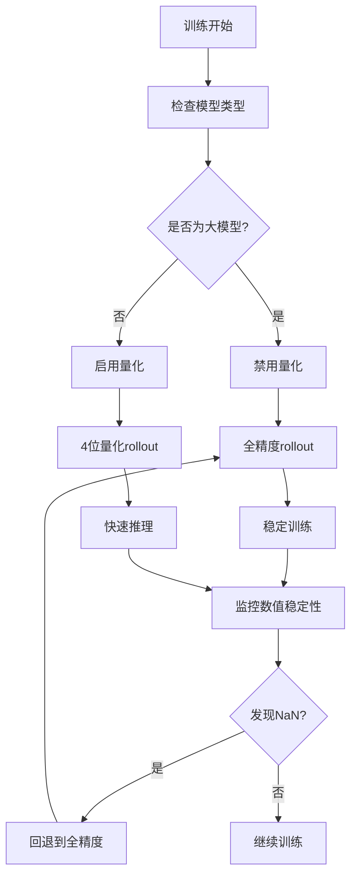

**图表来源**
- [mlx-grpo.py](file://mlx-grpo.py#L411-L435)

## 自定义奖励函数系统

### 奖励函数架构

MLX-GRPO提供了灵活的奖励函数系统，支持多维度的任务优化。

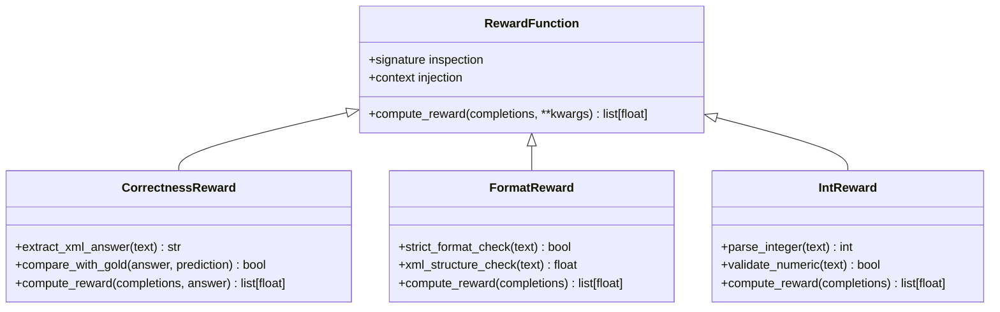

**图表来源**
- [mlx-grpo.py](file://mlx-grpo.py#L50-L130)

### 核心奖励函数实现

#### 正确性奖励函数

正确性奖励函数是最基础也是最重要的奖励机制：

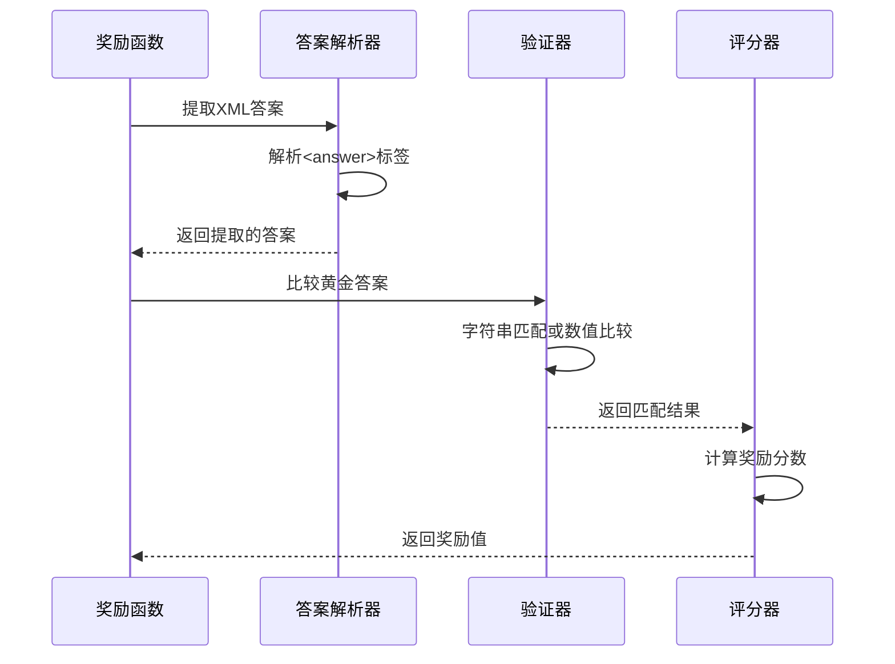

**图表来源**
- [mlx-grpo.py](file://mlx-grpo.py#L50-L65)

#### 格式奖励函数系列

| 函数名 | 功能描述 | 奖励范围 | 适用场景 |
|--------|----------|----------|----------|
| `strict_format_reward_func` | 严格XML格式检查 | 0.5/0.0 | 完整格式要求 |
| `soft_format_reward_func` | 松散格式检查 | 0.5/0.0 | 渐进式格式 |
| `xmlcount_reward_func` | XML结构评分 | 0.0-0.5 | 结构质量评估 |

#### 数值验证奖励

数值验证奖励专门处理数学和逻辑推理任务：

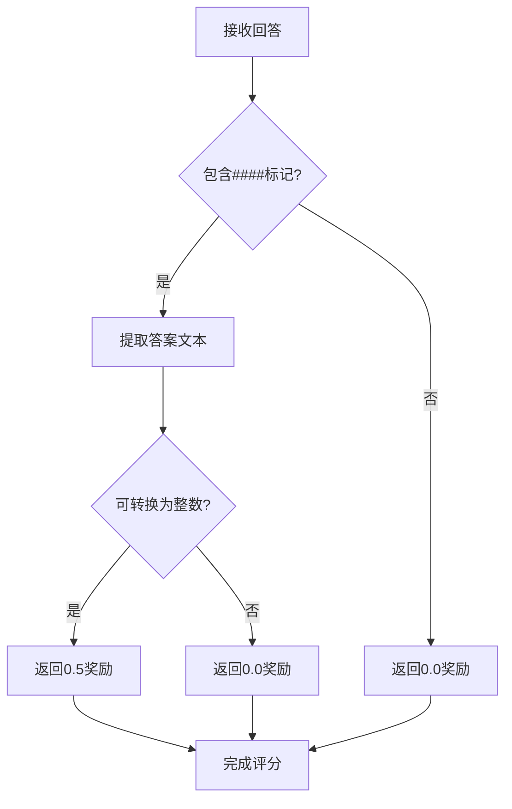

**图表来源**
- [mlx-grpo.py](file://mlx-grpo.py#L75-L95)

### 自定义奖励函数开发

#### 开发指南

创建自定义奖励函数需要遵循以下模式：

1. **函数签名**: 接受completions参数，可选prompts和answer
2. **输入格式**: completions为[{"content": text}]格式列表
3. **输出格式**: 返回对应长度的浮点数列表
4. **错误处理**: 包装异常以确保训练连续性

#### 示例：数学推理奖励

```python
def math_reasoning_reward_func(completions, **kwargs):
    """为数学推理任务设计的奖励函数"""
    responses = [completion[0]['content'] for completion in completions]
    scores = []
    
    for response in responses:
        # 检查推理步骤完整性
        steps = parse_math_steps(response)
        if len(steps) >= 3:  # 至少3个推理步骤
            scores.append(1.0)
        else:
            scores.append(0.0)
    
    return scores
```

**章节来源**
- [mlx-grpo.py](file://mlx-grpo.py#L50-L130)

## 模型转换与扩展框架

### 通用模型转换系统

MLX-GRPO提供了强大的模型转换框架，支持任意Hugging Face模型的MLX格式转换。

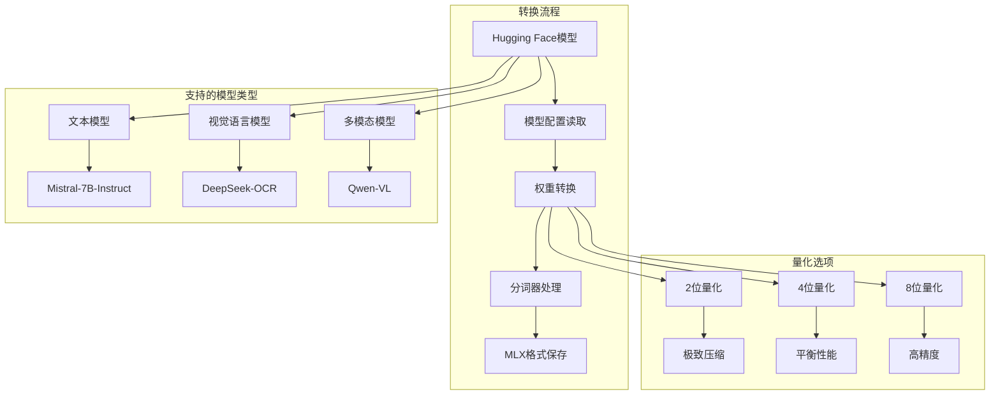

**图表来源**
- [utils/convert_model.py](file://utils/convert_model.py#L50-L100)
- [convert_nanochat.py](file://convert_nanochat.py#L15-L50)

### 扩展模型支持

#### 自定义模型加载器

框架支持通过自定义加载器扩展对新模型类型的支持：

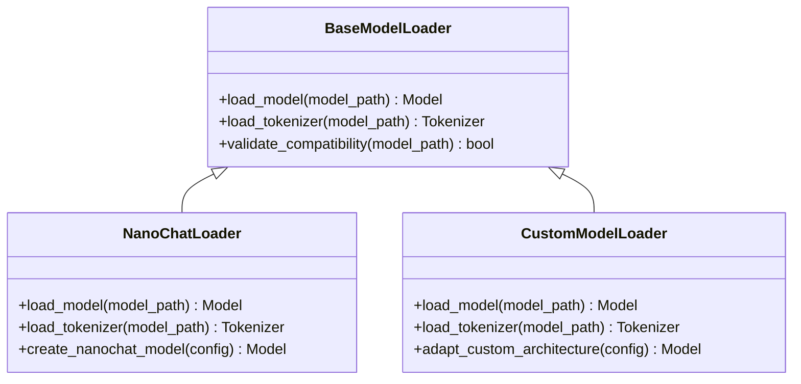

**图表来源**
- [mlx-grpo.py](file://mlx-grpo.py#L225-L254)

#### 模型架构适配

不同模型架构需要特定的适配策略：

| 架构类型 | 适配要点 | 注意事项 |
|----------|----------|----------|
| Transformer | 注意头数和隐藏维度 | 确保注意力机制兼容 |
| GPT风格 | 处理因果掩码 | 保持生成一致性 |
| BERT风格 | 处理双向注意力 | 适应对话场景 |
| 混合架构 | 统一接口映射 | 保持语义连贯性 |

**章节来源**
- [convert_nanochat.py](file://convert_nanochat.py#L50-L100)
- [utils/convert_model.py](file://utils/convert_model.py#L150-L200)

### 视觉语言模型支持

框架还支持视觉语言模型的转换和推理：

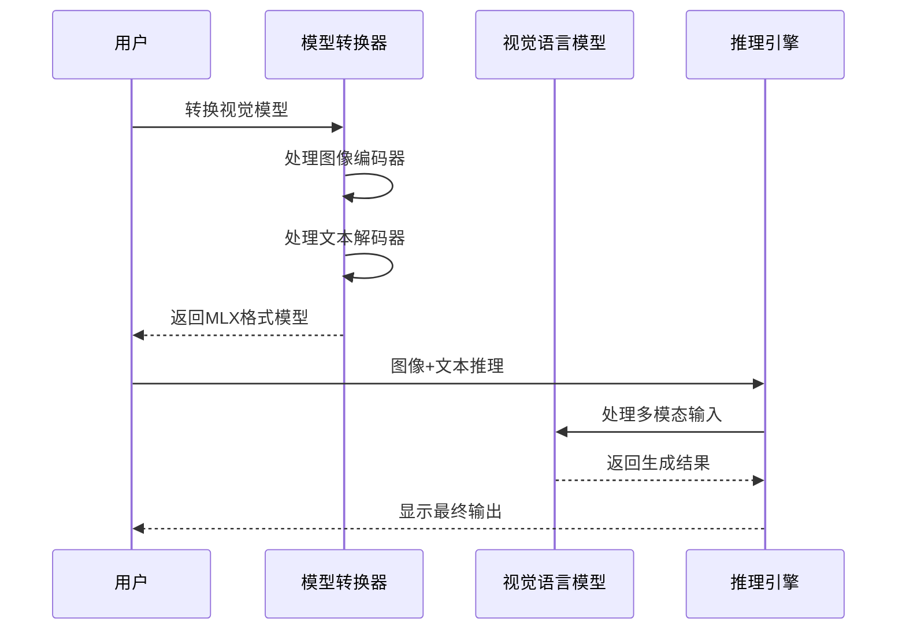

**图表来源**
- [utils/README.md](file://utils/README.md#L10-L30)

## 高级推理与部署

### 流式生成系统

MLX-GRPO提供了先进的流式生成功能，支持实时响应和更好的用户体验。

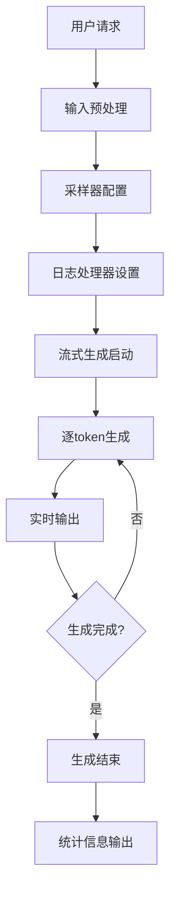

**图表来源**
- [utils/inference.py](file://utils/inference.py#L100-L150)

### 推理参数优化

#### 采样策略配置

| 参数 | 默认值 | 推荐范围 | 用途说明 |
|------|--------|----------|----------|
| `temperature` | 0.7 | 0.0-1.0 | 控制生成随机性 |
| `top_p` | 0.95 | 0.1-1.0 | 核采样阈值 |
| `repetition_penalty` | 1.0 | 1.0-2.0 | 避免重复生成 |
| `max_tokens` | 512 | 64-2048 | 最大生成长度 |

#### 高级推理功能

1. **交互式聊天**: 支持多轮对话和上下文管理
2. **批量处理**: 并行处理多个推理请求
3. **流式输出**: 实时显示生成过程
4. **系统提示**: 引导模型行为和风格

**章节来源**
- [utils/inference.py](file://utils/inference.py#L200-L250)

### 模型部署优化

#### 内存管理策略

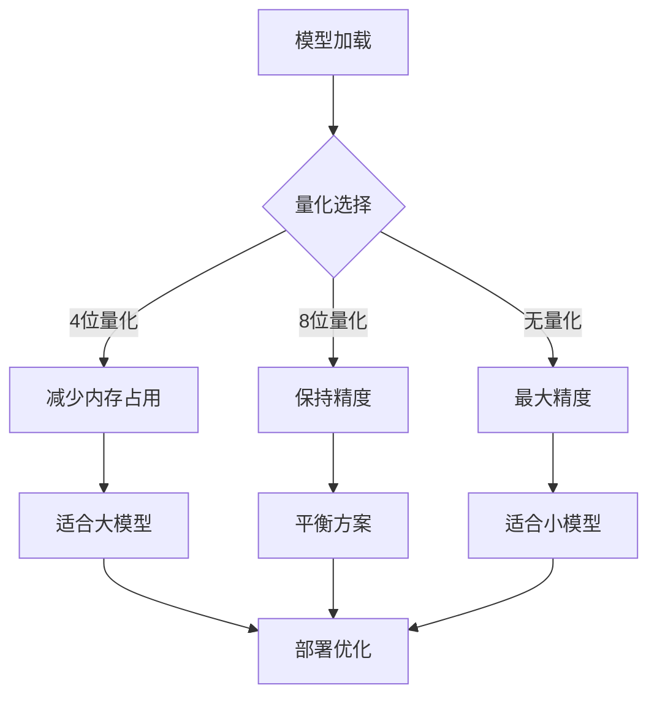

#### 性能监控

框架提供了全面的性能监控功能：

- **生成速度**: tokens/秒指标
- **内存使用**: 峰值内存跟踪
- **延迟分析**: 请求响应时间
- **吞吐量统计**: 并发处理能力

**章节来源**
- [utils/inference.py](file://utils/inference.py#L300-L347)

## 前沿研究与扩展

### 研究框架支持

MLX-GRPO为前沿研究提供了丰富的扩展能力：

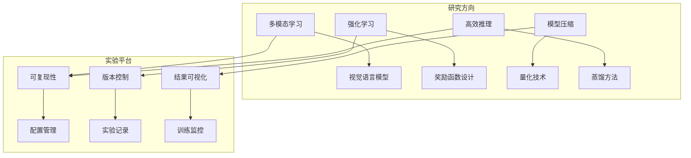

### 自定义训练循环

#### 研究需求适配

研究人员可以通过修改训练循环来实现特定的研究目标：

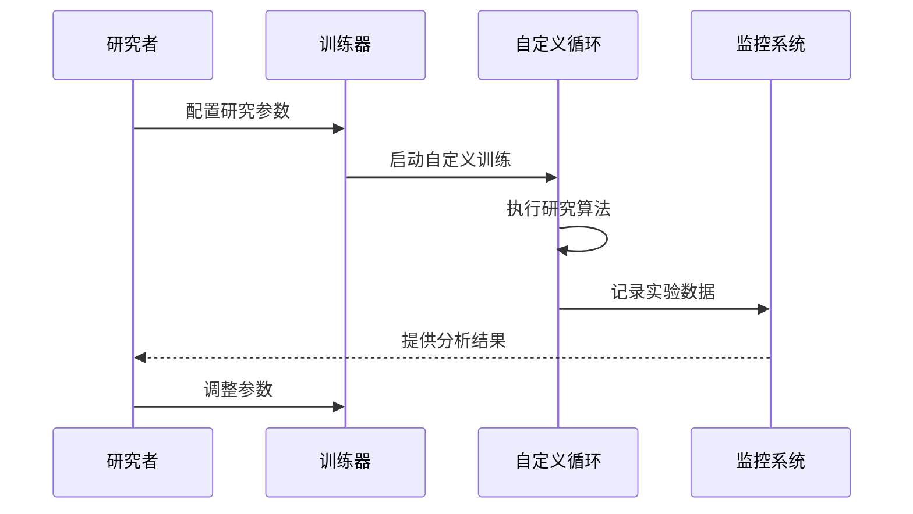

#### 扩展点识别

| 扩展点 | 描述 | 实现难度 | 应用场景 |
|--------|------|----------|----------|
| 损失函数 | 自定义优化目标 | 中等 | 新任务适配 |
| 优化器 | 不同的参数更新策略 | 困难 | 算法研究 |
| 数据增强 | 输入变换和噪声注入 | 简单 | 泛化提升 |
| 梯度处理 | 自定义梯度操作 | 中等 | 稳定性改进 |

### 前沿技术集成

#### 量子化技术

框架支持最新的量化技术：

1. **动态量化**: 运行时调整量化精度
2. **混合精度**: 关键层使用更高精度
3. **结构化量化**: 利用模型结构特征
4. **知识蒸馏**: 从大模型到小模型的知识传递

#### 在线学习支持

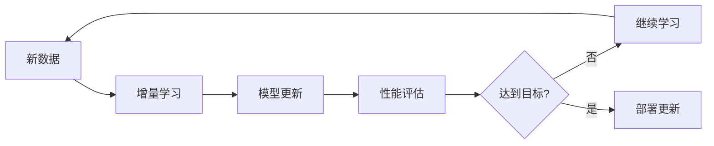

**章节来源**
- [mlx-grpo.py](file://mlx-grpo.py#L411-L435)

## 故障排除与最佳实践

### 常见问题诊断

#### 数值稳定性问题

| 问题症状 | 可能原因 | 解决方案 |
|----------|----------|----------|
| 梯度爆炸 | 学习率过高 | 降低学习率至3e-6 |
| NaN值出现 | 量化过大 | 禁用quantize_for_rollouts |
| 训练停滞 | KL系数过大 | 调整KL_coeff参数 |
| 内存溢出 | 批次过大 | 减少batch_size或gradient_accumulation_steps |

#### 分词器兼容性

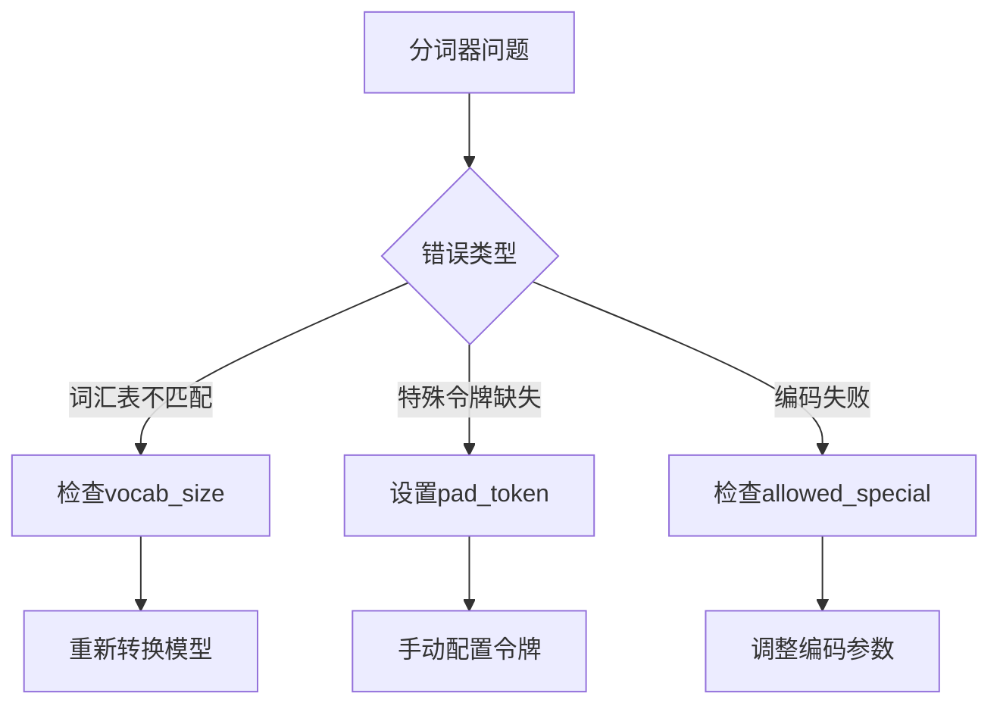

### 性能优化建议

#### 训练效率优化

1. **硬件利用**: 充分利用Apple Silicon的Metal性能
2. **内存管理**: 合理配置量化参数和批次大小
3. **数据流水线**: 优化数据加载和预处理
4. **并行计算**: 利用多核CPU和GPU协同

#### 部署性能调优

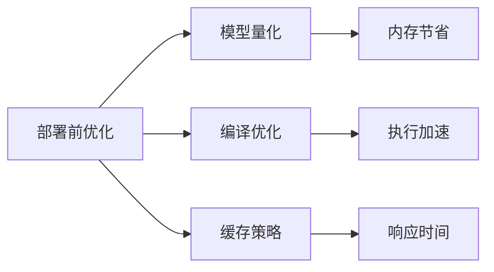

### 最佳实践指南

#### 配置管理

1. **版本控制**: 使用TOML配置文件管理实验设置
2. **参数扫描**: 系统性地探索超参数空间
3. **实验记录**: 详细记录每次实验的配置和结果
4. **复现性**: 确保实验结果的可复现性

#### 研究工作流

1. **原型验证**: 快速验证想法的可行性
2. **渐进式改进**: 从简单到复杂的逐步优化
3. **跨学科合作**: 结合领域知识改进模型
4. **社区贡献**: 分享研究成果和代码

**章节来源**
- [configs/nanochat_d32.toml](file://configs/nanochat_d32.toml#L1-L47)
- [configs/nanochat_grpo.toml](file://configs/nanochat_grpo.toml#L1-L45)

## 总结

MLX-GRPO作为一个专为Apple Silicon设计的先进训练框架，在专家级功能方面展现了卓越的能力。通过TiktokenTokenizerWrapper的智能分词器集成、量化配置的数值稳定性保障、灵活的奖励函数系统、以及强大的模型扩展能力，该框架为高级用户和研究人员提供了完整的解决方案。

### 核心价值

1. **技术创新**: 纯MLX环境下的原生Apple Silicon优化
2. **实用性强**: 从研究原型到生产部署的完整支持
3. **扩展性好**: 模块化设计便于功能扩展和定制
4. **社区友好**: 开源框架促进学术和工业界的协作

### 发展前景

随着Apple Silicon生态系统的不断发展和机器学习技术的进步，MLX-GRPO将继续在以下几个方面演进：

- **性能优化**: 更高效的算法和硬件利用
- **功能扩展**: 支持更多模型架构和任务类型
- **易用性提升**: 更直观的用户界面和文档
- **生态建设**: 更丰富的工具链和社区资源

对于希望在Apple Silicon平台上进行前沿AI研究和开发的用户来说，MLX-GRPO无疑是一个值得深入探索的强大工具。